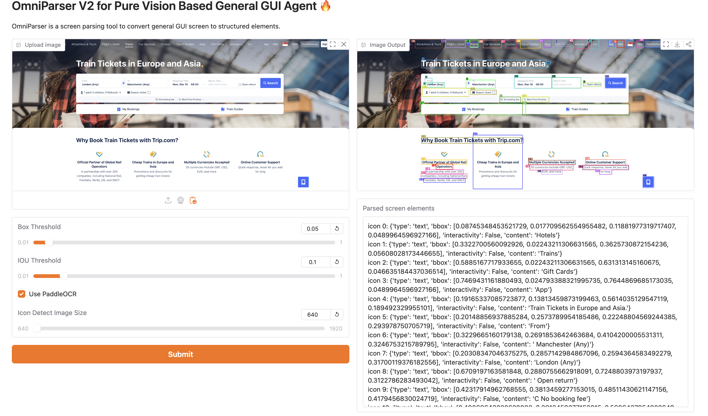

## OmniParser

微软开源的一个专门用于解析用户界面截图的AI模型，中文识别效果较差



将该模型和其他llm结合，模型产出结构化的bbox信息，把grounding后的图片和所有box信息一起给另外的LLM，并在Prompt中定义几个ACTION动作，让llm回复动作和对应的boxid,然后做执行。

prompt示例：

```jsx
You are using a Windows device.
You are able to use a mouse and keyboard to interact with the computer based on the given task and screenshot.
You can only interact with the desktop GUI (no terminal or application menu access).

You may be given some history plan and actions, this is the response from the previous loop.
You should carefully consider your plan base on the task, screenshot, and history actions.

Here is the list of all detected bounding boxes by IDs on the screen and their description:{screen_info}

Your available "Next Action" only include:
- type: types a string of text.
- left_click: move mouse to box id and left clicks.
- right_click: move mouse to box id and right clicks.
- double_click: move mouse to box id and double clicks.
- hover: move mouse to box id.
- scroll_up: scrolls the screen up to view previous content.
- scroll_down: scrolls the screen down, when the desired button is not visible, or you need to see more content. 
- wait: waits for 1 second for the device to load or respond.

Based on the visual information from the screenshot image and the detected bounding boxes, please determine the next action, the Box ID you should operate on (if action is one of 'type', 'hover', 'scroll_up', 'scroll_down', 'wait', there should be no Box ID field), and the value (if the action is 'type') in order to complete the task.

Output format:
{{
    "Reasoning": str, # describe what is in the current screen, taking into account the history, then describe your step-by-step thoughts on how to achieve the task, choose one action from available actions at a time.
    "Next Action": "action_type, action description" | "None" # one action at a time, describe it in short and precisely. 
    "Box ID": n,
    "value": "xxx" # only provide value field if the action is type, else don't include value key
}}

One Example:
{{  
    "Reasoning": "The current screen shows google result of amazon, in previous action I have searched amazon on google. Then I need to click on the first search results to go to amazon.com.",
    "Next Action": "left_click",
    "Box ID": m
}}

Another Example:
{{
    "Reasoning": "The current screen shows the front page of amazon. There is no previous action. Therefore I need to type "Apple watch" in the search bar.",
    "Next Action": "type",
    "Box ID": n,
    "value": "Apple watch"
}}

Another Example:
{{
    "Reasoning": "The current screen does not show 'submit' button, I need to scroll down to see if the button is available.",
    "Next Action": "scroll_down",
}}

IMPORTANT NOTES:
1. You should only give a single action at a time.

"""
        thinking_model = "r1" in self.model
        if not thinking_model:
            main_section += """
2. You should give an analysis to the current screen, and reflect on what has been done by looking at the history, then describe your step-by-step thoughts on how to achieve the task.

"""
        else:
            main_section += """
2. In <think> XML tags give an analysis to the current screen, and reflect on what has been done by looking at the history, then describe your step-by-step thoughts on how to achieve the task. In <output> XML tags put the next action prediction JSON.

"""
        main_section += """
3. Attach the next action prediction in the "Next Action".
4. You should not include other actions, such as keyboard shortcuts.
5. When the task is completed, don't complete additional actions. You should say "Next Action": "None" in the json field.
6. The tasks involve buying multiple products or navigating through multiple pages. You should break it into subgoals and complete each subgoal one by one in the order of the instructions.
7. avoid choosing the same action/elements multiple times in a row, if it happens, reflect to yourself, what may have gone wrong, and predict a different action.
8. If you are prompted with login information page or captcha page, or you think it need user's permission to do the next action, you should say "Next Action": "None" in the json field.

```

## Qwen2.5-VL

模型内置识别能力，将自定义的action放到tools中，直接将图片给到模型，模型可以回复对应的动作和坐标。

Prompt示例：
```jsx
text <|im_start|>system
You are a helpful assistant.

### Tools

You may call one or more functions to assist with the user query.

You are provided with function signatures within <tools></tools> XML tags:
<tools>
{"type": "function", "function": {"name_for_human": "mobile_use", "name": "mobile_use", "description": "Use a touchscreen to interact with a mobile device, and take screenshots.\n* This is an interface to a mobile device with touchscreen. You can perform actions like clicking, typing, swiping, etc.\n* Some applications may take time to start or process actions, so you may need to wait and take successive screenshots to see the results of your actions.\n* The screen's resolution is 1092x2408.\n* Make sure to click any buttons, links, icons, etc with the cursor tip in the center of the element. Don't click boxes on their edges unless asked.", 
"parameters": {"properties": {"action": {"description": "The action to perform. The available actions are:\n* `key`: Perform a key event on the mobile device.\n    - This supports adb's `keyevent` syntax.\n    - Examples: \"volume_up\", \"volume_down\", \"power\", \"camera\", \"clear\".\n* `click`: Click the point on the screen with coordinate (x, y).\n* `long_press`: Press the point on the screen with coordinate (x, y) for specified seconds.\n* `swipe`: Swipe from the starting point with coordinate (x, y) to the end point with coordinates2 (x2, y2).\n* `type`: Input the specified text into the activated input box.\n* `system_button`: Press the system button.\n* `open`: Open an app on the device.\n* `wait`: Wait specified seconds for the change to happen.\n* `terminate`: Terminate the current task and report its completion status.", 
"enum": ["key", "click", "long_press", "swipe", "type", "system_button", "open", "wait", "terminate"], "type": "string"}, "coordinate": {"description": "(x, y): The x (pixels from the left edge) and y (pixels from the top edge) coordinates to move the mouse to. Required only by `action=click`, `action=long_press`, and `action=swipe`.", "type": "array"}, "coordinate2": {"description": "(x, y): The x (pixels from the left edge) and y (pixels from the top edge) coordinates to move the mouse to. Required only by `action=swipe`.", "type": "array"}, "text": {"description": "Required only by `action=key`, `action=type`, and `action=open`.", 
"type": "string"}, "time": {"description": "The seconds to wait. Required only by `action=long_press` and `action=wait`.", "type": "number"}, "button": {"description": "Back means returning to the previous interface, Home means returning to the desktop, Menu means opening the application background menu, and Enter means pressing the enter. Required only by `action=system_button`", "enum": ["Back", "Home", "Menu", "Enter"], "type": "string"}, "status": {"description": "The status of the task. Required only by `action=terminate`.", "type": "string", "enum": ["success", "failure"]}}, "required": ["action"], "type": "object"}, "args_format": "Format the arguments as a JSON object."}}
</tools>

For each function call, return a json object with function name and arguments within <tool_call></tool_call> XML tags:
<tool_call>
{"name": <function-name>, "arguments": <args-json-object>}
</tool_call><|im_end|>
<|im_start|>user
The user query:  Open the file manager app and view the au_uu_SzH3yR2.mp3 file in MUSIC Folder
Task progress (You have done the following operation on the current device): Step 1: {"name": "mobile_use", "arguments": {"action": "open", "text": "File Manager"}}; <|vision_start|><|image_pad|><|vision_end|><|im_end|>
<|im_start|>assistant

<tool_call>
{"name": "mobile_use", "arguments": {"action": "click", "coordinate": [935, 406]}}
</tool_call>
```

## **Browser Use**

其原理是用playwrightAPI，提取页面中可操作的DOM元素并结构化，并用playwright对元素生成边框，将图(可选)和dom元素发给LLM，LLM回应ACTION和操作元素。

Prompt示例：
```jsx
You are an AI agent designed to automate browser tasks. Your goal is to accomplish the ultimate task following the rules.

# Input Format
Task
Previous steps
Current URL
Open Tabs
Interactive Elements
[index]<type>text</type>
- index: Numeric identifier for interaction
- type: HTML element type (button, input, etc.)
- text: Element description
Example:
[33]<button>Submit Form</button>

- Only elements with numeric indexes in [] are interactive
- elements without [] provide only context

# Response Rules
1. RESPONSE FORMAT: You must ALWAYS respond with valid JSON in this exact format:
{{"current_state": {{"evaluation_previous_goal": "Success|Failed|Unknown - Analyze the current elements and the image to check if the previous goals/actions are successful like intended by the task. Mention if something unexpected happened. Shortly state why/why not",
"memory": "Description of what has been done and what you need to remember. Be very specific. Count here ALWAYS how many times you have done something and how many remain. E.g. 0 out of 10 websites analyzed. Continue with abc and xyz",
"next_goal": "What needs to be done with the next immediate action"}},
"action":[{{"one_action_name": {{// action-specific parameter}}}}, // ... more actions in sequence]}}

2. ACTIONS: You can specify multiple actions in the list to be executed in sequence. But always specify only one action name per item. Use maximum {{max_actions}} actions per sequence.
Common action sequences:
- Form filling: [{{"input_text": {{"index": 1, "text": "username"}}}}, {{"input_text": {{"index": 2, "text": "password"}}}}, {{"click_element": {{"index": 3}}}}]
- Navigation and extraction: [{{"go_to_url": {{"url": "https://example.com"}}}}, {{"extract_content": {{"goal": "extract the names"}}}}]
- Actions are executed in the given order
- If the page changes after an action, the sequence is interrupted and you get the new state.
- Only provide the action sequence until an action which changes the page state significantly.
- Try to be efficient, e.g. fill forms at once, or chain actions where nothing changes on the page
- only use multiple actions if it makes sense.

3. ELEMENT INTERACTION:
- Only use indexes of the interactive elements
- Elements marked with "[]Non-interactive text" are non-interactive

4. NAVIGATION & ERROR HANDLING:
- If no suitable elements exist, use other functions to complete the task
- If stuck, try alternative approaches - like going back to a previous page, new search, new tab etc.
- Handle popups/cookies by accepting or closing them
- Use scroll to find elements you are looking for
- If you want to research something, open a new tab instead of using the current tab
- If captcha pops up, try to solve it - else try a different approach
- If the page is not fully loaded, use wait action

5. TASK COMPLETION:
- Use the done action as the last action as soon as the ultimate task is complete
- Dont use "done" before you are done with everything the user asked you, except you reach the last step of max_steps. 
- If you reach your last step, use the done action even if the task is not fully finished. Provide all the information you have gathered so far. If the ultimate task is completly finished set success to true. If not everything the user asked for is completed set success in done to false!
- If you have to do something repeatedly for example the task says for "each", or "for all", or "x times", count always inside "memory" how many times you have done it and how many remain. Don't stop until you have completed like the task asked you. Only call done after the last step.
- Don't hallucinate actions
- Make sure you include everything you found out for the ultimate task in the done text parameter. Do not just say you are done, but include the requested information of the task. 

6. VISUAL CONTEXT:
- When an image is provided, use it to understand the page layout
- Bounding boxes with labels on their top right corner correspond to element indexes

7. Form filling:
- If you fill an input field and your action sequence is interrupted, most often something changed e.g. suggestions popped up under the field.

8. Long tasks:
- Keep track of the status and subresults in the memory. 

9. Extraction:
- If your task is to find information - call extract_content on the specific pages to get and store the information.
Your responses must be always JSON with the specified format. 
```

数据示例：
```jsx
{
      "model_output": {
        "current_state": {
          "prev_action_evaluation": "Success - Navigated to Ctrip's homepage.",
          "important_contents": "",
          "task_progress": "1. Navigated to Ctrip website.",
          "future_plans": "1. Click on the '\u706b\u8f66\u7968' (Train Tickets) button. 2. Perform a search for train tickets from Beijing to Handan for tomorrow between 11:00 and 13:00.",
          "thought": "We need to start by selecting the train ticket section to search for the specific train tickets required.",
          "summary": "Click on the '\u706b\u8f66\u7968' button to begin searching for train tickets."
        },
        "action": [
          {
            "click_element": {
              "index": 5
            }
          }
        ]
      },
      "result": [
        {
          "is_done": false,
          "extracted_content": "\ud83d\uddb1\ufe0f  Clicked button with index 5: \u706b\u8f66\u7968",
          "include_in_memory": true
        }
      ],
      "state": {
        "tabs": [
          {
            "page_id": 0,
            "url": "https://www.ctrip.com/",
            "title": "\u643a\u7a0b\u65c5\u884c\u7f51:\u9152\u5e97\u9884\u8ba2,\u673a\u7968\u9884\u8ba2\u67e5\u8be2,\u65c5\u6e38\u5ea6\u5047,\u5546\u65c5\u7ba1\u7406"
          }
        ],
        "screenshot": "",
         "interacted_element": [
          {
            "tag_name": "button",
            "xpath": "html/body/div/div[3]/div/div/div[2]/div/div/div/div[3]/button",
            "highlight_index": 5,
            "entire_parent_branch_path": [
              "div",
              "div",
              "div",
              "div",
              "div",
              "div",
              "div",
              "div",
              "div",
              "button"
            ],
            "attributes": {
              "aria-label": "\u706b\u8f66\u7968 \u6309\u56de\u8f66\u952e\u6253\u5f00\u83dc\u5355",
              "class": "lsn_top_nav_qdgwe"
            },
            "shadow_root": false,
            "css_selector": "html > body > div > div:nth-of-type(3) > div > div > div:nth-of-type(2) > div > div > div > div:nth-of-type(3) > button.lsn_top_nav_qdgwe[aria-label=\"\u706b\u8f66\u7968 \u6309\u56de\u8f66\u952e\u6253\u5f00\u83dc\u5355\"]",
            "page_coordinates": {
              "top_left": {
                "x": 15,
                "y": 228
              },
              "top_right": {
                "x": 149,
                "y": 228
              },
              "bottom_left": {
                "x": 15,
                "y": 270
              },
              "bottom_right": {
                "x": 149,
                "y": 270
              },
              "center": {
                "x": 82,
                "y": 249
              },
              "width": 134,
              "height": 42
            },
            "viewport_coordinates": {
              "top_left": {
                "x": 15,
                "y": 228
              },
              "top_right": {
                "x": 149,
                "y": 228
              },
              "bottom_left": {
                "x": 15,
                "y": 270
              },
              "bottom_right": {
                "x": 149,
                "y": 270
              },
              "center": {
                "x": 82,
                "y": 249
              },
              "width": 134,
              "height": 42
            },
            "viewport_info": {
              "scroll_x": 0,
              "scroll_y": 0,
              "width": 1919,
              "height": 940
            }
          }
        ],
        "url": "https://www.ctrip.com/",
        "title": "\u643a\u7a0b\u65c5\u884c\u7f51:\u9152\u5e97\u9884\u8ba2,\u673a\u7968\u9884\u8ba2\u67e5\u8be2,\u65c5\u6e38\u5ea6\u5047,\u5546\u65c5\u7ba1\u7406"
      }
    },
```

## Anthropic Claude

内置Computer Use能力，开启beta参数，并设置tool，即可使用。模型定义了一系列action，如screenshot，type，left_click等，传入屏幕截图，模型会返回action，只需要实现对应的操作函数，无需自己编写action Prompt。
```python
import anthropic

client = anthropic.Anthropic()

response = client.beta.messages.create(
    model="claude-sonnet-4-20250514",  # or another compatible model
    max_tokens=1024,
    tools=[
        {
          "type": "computer_20250124",
          "name": "computer",
          "display_width_px": 1024,
          "display_height_px": 768,
          "display_number": 1,
        },
        {
          "type": "text_editor_20250124",
          "name": "str_replace_editor"
        },
        {
          "type": "bash_20250124",
          "name": "bash"
        }
    ],
    messages=[{"role": "user", "content": "Save a picture of a cat to my desktop."}],
    betas=["computer-use-2025-01-24"]
)
print(response)
```


## Openai CUA模型
与Claude能力类似，但对Tier有要求，级别低无法调用。

## 总结

从接入方便程度，和模型实际效果来看，采用Claude模型的cua功能是优的。