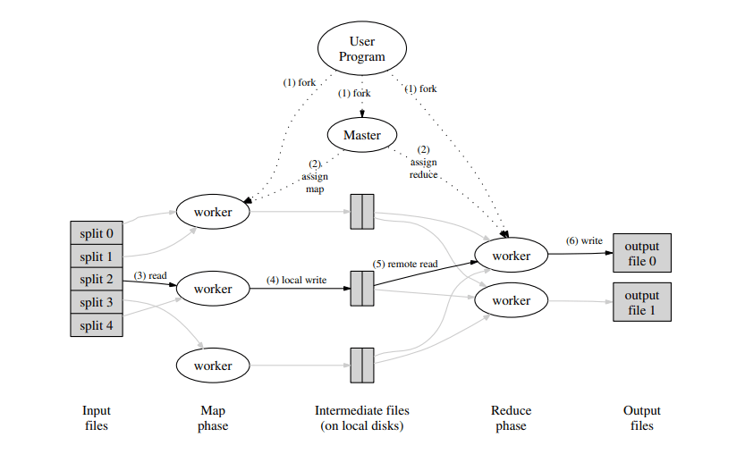

MIT6.824是公认的分布式系统经典课程，这篇文章主要介绍Lab1 MapReduce的实现。

<!-- more -->

## MapReduce简介



这是来自MapReduce论文中的图片，描述了整个MapReduce的过程。其本质就是将一个大数据量的任务首先切分给多个mapper，每个mapper再用用户定义的map策略进行分类，分类后每个reducer负责一部分数据的计算。

## Part I

part I的任务是完成doMap和doReduce函数，代码中的注释写的非常非常清楚，基本上翻译一下就行了...

```go
func doMap(
	jobName string, // the name of the MapReduce job
	mapTask int, // which map task this is
	inFile string,
	nReduce int, // the number of reduce task that will be run ("R" in the paper)
	mapF func(filename string, contents string) []KeyValue,
) {}
```
看一下doMap函数的定义，很好实现，我就不放代码了，这个函数从inFile中读取数据，调用用户定义的mapF函数，把数据切分为kv对，然后创建nReduce个中间文件，通过一个hash函数对key进行hash将kv对写到不同的中间文件中。

```go
func doReduce(
	jobName string, // the name of the whole MapReduce job
	reduceTask int, // which reduce task this is
	outFile string, // write the output here
	nMap int, // the number of map tasks that were run ("M" in the paper)
	reduceF func(key string, values []string) string,
) {}
```

doReduce函数将各个mapper生成的对应自己的reduce中间文件中的kv对读到内存中，然后按key排序，将相同的key的value放在一起调用用户定义的reduceF函数，将返回值作为value写入最终的结果文件。

## Part II

这部分是用MapReduce来解决一个经典问题：wordcount，利用part I中我们写好的框架，只需要实现mapF和reduceF函数就可以了，我们既然要统计单词的次数，那key就是单词，value其实随意，这里我们就设成1，因为在reduce中我们有values的长度就知道出现的次数了。mapF实现如下：
```go
func mapF(filename string, contents string) []mapreduce.KeyValue {
	// Your code here (Part II).
	var kv  []mapreduce.KeyValue
	kstring := strings.FieldsFunc(contents, func(c rune) bool { return !unicode.IsLetter(c) && !unicode.IsNumber(c) })
	for _, v := range kstring {
		kv = append(kv, mapreduce.KeyValue{v, "1"})
	}
	return kv
}
```
reduceF中我们直接计算切片长度就知道次数了：
```go
func reduceF(key string, values []string) string {
	// Your code here (Part II).
	return strconv.Itoa(len(values))
}
```
就是这么简单，通过MapReduce我们就可以完成大数据下的统计任务。

## Part III & Part IV

这两部分是实现master的schedule函数，来实现master通过rpc向worker节点派发任务。

我们建立一个保存worker信息的channel，派发任务时从workers或者registerchan中取worker，起一个goroutine执行完后再放入workers中，对于调用返回失败派发到其他worker中直到成功为止。
```go
    // Your code here (Part III, Part IV).
	//
	workers := make(chan string, 5)
	var wg sync.WaitGroup
	var worker string
	for i := 0; i < ntasks; i++ {
		select {
		case worker = <-workers:
		case worker = <-registerChan:
		}
		go func(j int, worker string) {
			wg.Add(1)
			args := &DoTaskArgs{jobName, mapFiles[j], phase, j, n_other}
			for {
				if call(worker, "Worker.DoTask", args, nil) {
					workers <- worker
					wg.Done()
					break
				} else {
					select {
					case worker = <-workers:
					case worker = <-registerChan:
					}
				}
			}
		}(i, worker)
	}
	wg.Wait()
```

## Part V

这部分是用MapReduce实现倒排索引，还是实现mapF和reduceF函数。

倒排索引我们需要通过key找到对应的文件，所以切分的时候value就是文件名：
```go
func mapF(document string, value string) (res []mapreduce.KeyValue) {
	// Your code here (Part V).
	var kv []mapreduce.KeyValue
	kstring := strings.FieldsFunc(value, func(c rune) bool { return !unicode.IsLetter(c) })
	for _, v := range kstring {
		kv = append(kv, mapreduce.KeyValue{v, document})
	}
	return kv
}
```
在reduce中我们只需要对value去重就可以了：
```go
func reduceF(key string, values []string) string {
	// Your code here (Part V).
	sort.Strings(values)
	var s string
	tmp := values[0]
	num := 1
	for _, v := range values {
		if tmp == v {
			continue
		} else {
			s += tmp
			s += ","
			tmp = v
			num++
		}
	}
	s += values[len(values)-1]
	s = strconv.Itoa(num) + " " + s
	return s
}
```

MapReduce的思想确实牛逼，大数据处理的利器。

## 参考

> http://nil.csail.mit.edu/6.824/2018/labs/lab-1.html