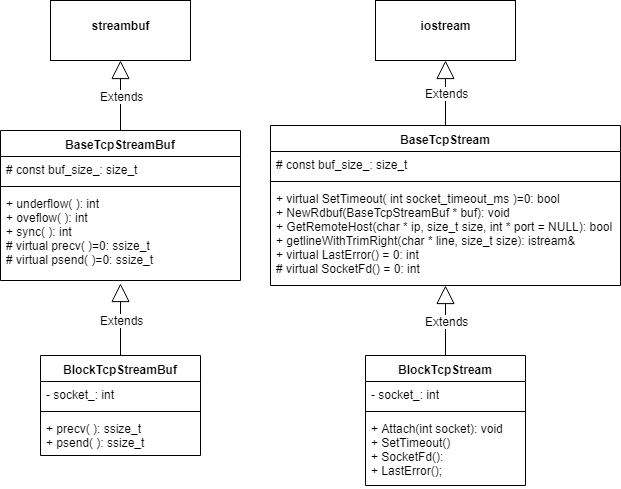

## phxrpc简介

phxrpc是微信开源的轻量级rpc框架，支持协程模式，代码量不大，很适合拿来学习一个。这个框架用了流式操作，很有特点。之前总听人说iostream操作慢，没有研究过流操作底层的实现，今天就来分析一下。
<!-- more -->

## 定制输入输出流

phxrpc使用标准输入输出的方式封装了socket，使用`<<`和`>>`来实现读写。
实现类图如下：


## streambuf

`streambuf`是一个流缓冲区，包含输入和输出缓冲区。向`ostream`写入时，数据会放到输出缓冲区中，从`istream`读取时，数据从输入缓冲区中读出。


## streambuf输出缓冲区

输出缓冲区由三个指针维护，`pbase`指向起始位置，`epptr`指向末尾（类似迭代器，前闭后开），`pptr`指向当前可放置的位置。向输出缓冲区写入数据的函数是`sputc`和`sputn`，第一个写入一个字符并将`pptr`向后移动一位。第二个写入多个字符。当缓冲区满时，会调用`overflow()`函数将所有数据发送并清空缓冲区，调用`pbump(0)`重置pptr指针到起始位置。
```cpp
int BaseTcpStreamBuf::sync() { //缓冲区已满，将数据发送
    int sent = 0;
    int total = pptr() - pbase();
    while (sent < total) {
        int ret = psend(pbase() + sent, total - sent, 0);
        if (ret > 0) {
            sent += ret;
        } else {
            //phxrpc::log(LOG_ERR, "sync ret %d errno %d,%s", ret, errno, strerror(errno));
            return -1;
        }
    }

    setp(pbase(), pbase() + buf_size_);
    pbump(0);  

    return 0;
}
int BaseTcpStreamBuf::overflow(int c) {
    if (-1 == sync()) {
        return traits_type::eof();
    } else {  //数据已发送，放入c
        if (!traits_type::eq_int_type(c, traits_type::eof())) {
            sputc(traits_type::to_char_type(c));
        }

        return traits_type::not_eof(c);
    }
}
```
## streambuf输入缓冲区

输入缓冲区同样由三个指针维护，分别是`eback`，`gptr`，`egptr`。`gptr`指向当前可读的位置，如果`gptr()==egptr()`说明数据已读完，此时会调用`underflow()`从socket中接受数据并重置指针。
```cpp
int BaseTcpStreamBuf::underflow() {
    int ret = precv(eback(), buf_size_, 0);
    if (ret > 0) {
        setg(eback(), eback(), eback() + ret);  //重置指针
        return traits_type::to_int_type(*gptr());
    } else {
        //phxrpc::log(LOG_ERR, "ret %d errno %d,%s", ret, errno, strerror(errno));
        return traits_type::eof();
    }
```
## BlockTcpStream

这个类实现了一个阻塞TCP流，使用`Attach()`调用父类的`NewRdBuf()`绑定一个`streambuf`。网络IO交给`BlockTcpStreamBuf`来做。

## BlockTcpUtils

`BlockTcpUtils`这个工具类封装了网络连接的操作。`Open()`由客户端调用，`Listen()`由服务端调用。

在`Open()`函数中调用`connect()`之前将socketfd设为非阻塞。为了验证非阻塞connect是否成功，需要`select()`或`poll()`一下看是否可写然后调用`getsockopt()`检查（man connect 中提到）。完成连接后再将sockfd设为阻塞。