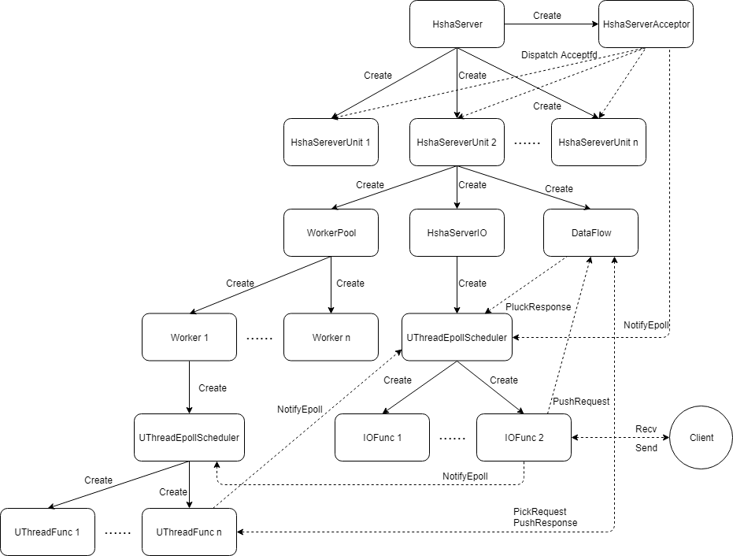
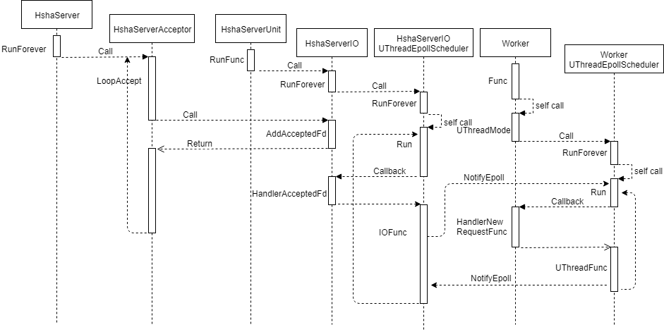

## RPC

最后这篇文章分析一下整体消息收发处理的逻辑。
<!-- more -->

整个RPC的定义基本都在`hsha_server`这个文件。主要有一下几个类：

- `DataFlow` ：数据流，所有请求和应答分别保存在两个线程安全的队列中。
- `HshaServerStat` `HshaServerQos`： 统计运行状态，独立线程。
- `Worker` ：独立的工作线程，如果是协程模式，每个`worker`会有多个协程。
- `WorkerPool`：工作池，管理`Worker`。
- `HshaServerUnit`：独立线程的工作单元，每个单元都有一个`WorkerPool` ,`UThreadEpollScheduler`和 `DataFlow`。
- `HshaServerIO`：在`HshaServerUnit`线程处理IO事件。
- `HshaServer`：server对象，有多个工作单元。
- `HshaServerAcceptor`：接受连接，工作在主线程。

运行起来有一个accept线程，每个unit有一个IO线程，多个worker线程。

各个模块之间的关系如下




## DataFlow
`DataFlow`包含request和response队列，并附加了时间戳和参数指针。

## HshaServerStat HshaServerQos
独立线程负责统计运行信息，线程绑定为`CallFunc`函数，使用了设置超时时间的条件变量，超时时间为1s，这样如果没有通知则每秒统计一次。

## Worker
独立工作线程，绑定为`Worker::Func`
```cpp
void Worker::Func() {
    if (uthread_count_ == 0) {  //如果没有设置协程数量
        ThreadMode();  //线程模式
     } else {
        UThreadMode();  //协程模式
    }
}
```
线程模式直接从`DataFlow`中拉一个request然后执行`WorkerLogic`。
协程模式创建一个调度器并设置处理新请求的函数。
```cpp
void Worker::UThreadMode() {
    worker_scheduler_ = new UThreadEpollScheduler(utherad_stack_size_, uthread_count_, true);
    assert(worker_scheduler_ != nullptr);
    worker_scheduler_->SetHandlerNewRequestFunc(bind(&Worker::HandlerNewRequestFunc, this));
    worker_scheduler_->RunForever();
}
```
`HandlerNewRequestFunc`会将`WorkerLogic`的包装`UThreadFunc`加入调度器的任务队列。
`WorkerLogic`是真正处理逻辑的函数，对没有超时的请求，会分发到具体的函数处理，最后将结果push到response队列中。

## WorkPool
`WorkPool`负责创建`Worker`。

## HshaServerIO

```cpp
void HshaServerIO::RunForever() {
    scheduler_->SetHandlerAcceptedFdFunc(bind(&HshaServerIO::HandlerAcceptedFd, this));
    scheduler_->SetActiveSocketFunc(bind(&HshaServerIO::ActiveSocketFunc, this));
    scheduler_->RunForever();
}
```
`RunForever`设置`Run`中执行的两个回调函数分别处理新建连接和写response

`AddAcceptedFd`函数负责将已连接的fd放入`accepted_fd_list_`中。

`HandlerAcceptedFd`函数从队列中取出已连接的fd，并绑定`IOFunc`函数加入协程调度器的任务队列。

`IOFunc`函数新建一个关联socketfd的`UThreadTcpStream`，然后判断请求协议的类型并解析请求，将解析完成的request push到`DataFlow`中，
然后调用
```cpp
worker_pool_->Notify();
```
这一步针对`UThreadMode`，worker_pool的`Notify`函数会调用worker的`Notify`来通知worker的`UThreadEpollScheduler`，接下来`IOFunc`调用`UThreadWait`设置一个超时时间`Yield`出去。

此时worker的`UThreadEpollScheduler`在`Run`函数处轮询，接下来会执行开启`UThreadMode`时绑定的`handler_new_request_func_`也就是`Worker::HandlerNewRequestFunc`，这个函数将从`DataFlow`中拉取request然后将`WorkerLogic`加入`worker_scheduler_`的任务队列。这样开始执行`WorkerLogic`，执行完逻辑后`WorkerLogic`将response加入`DataFlow`的队列中。最后执行
```cpp
    pool_->scheduler_->NotifyEpoll();
```
这一步调用worker_pool_的`UThreadEpollScheduler`的`NotifyEpoll`，接下来流程回到pool_->scheduler_的`Run`中，此时执行`active_socket_func_`从`DataFlow`中取出response，将其包装为该socket的args并返回，最后`Resume`到此socket的协程也就是之前的`IOFunc`，将response `send`出去。

这个应该是整个流程最复杂的一个函数了，主要是worker线程和workpool的`UThreadEpollScheduler`的互相唤醒。一次完整的收发数据流程如下：



## HshaServerUnit

`HshaServerUnit`是IO线程，其`RunFunc` `AddAcceptedFd`调用的都是成员`HshaServerIO`的相应函数。

## HshaServerAcceptor

`HshaServerAcceptor`的`LoopAccept`函数负责accept新连接，`idx_`变量通过每次取余的方式来确定将accept的fd放到哪个`HshaServerUnit`。

## HshaServer

`HshaServer`获取配置文件中的IO线程数量创建相同数量的`HshaServerUnit`，根据配置文件的工作线程数量初始化其参数，然后push到`server_unit_list_`中。