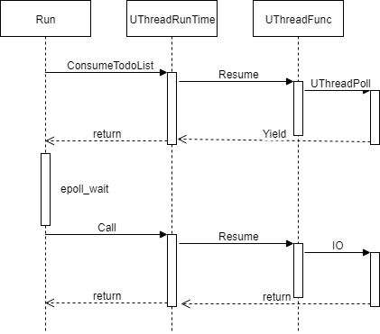

## uthread

协程的概念在[coroutine源码分析](http://blog.csdn.net/LMFQYJ/article/details/79211084)中有介绍。phxrpc默认使用ucontext作实现，同时还有boost优化版本。

<!-- more -->

## UThreadContext

`UThreadContext`是定义了协程接口的基类，并且有一个静态函数对象，用来创建协程上下文，其应该是子类的`DoCreate`函数，

## UThreaStackMemory

`UThreaStackMemory`是每个协程的私有栈，这里并没有实现共享栈模式，节省了拷贝，而且内存分配也没有使用`malloc`，而是使用的`mmap`，这里设置了一个标志变量`need_protect_`来选择是否开启保护模式，开启保护模式会在栈两端各多分配一页，并将这两页设置`PROT_NONE`属性禁止访问。调用`mmap`时同时设置了`MAP_ANONYMOUS | MAP_PRIVATE`,`MAP_ANONYMOUS`表示这段内存是匿名的，不需要读写fd。`MAP_PRIVATE`建立一个私有映射，不与其他进程共享。

## UThreadContextSystem

`UThreadContextSystem`是默认的使用ucontext作实现的协程上下文。每个上下文维护一个`context_`表示协程的上下文，同时还有一个`static __thread`修饰的`main_context_`,表示每个线程只有一个，协程`yield`的时候会切换到这个上下文。
`Resume`函数切换到一个协程，`Yield`函数切出当前协程。
`UThreadFuncWrapper`包装了协程的执行函数，协程运行时会切换到这个函数，函数的参数就是this指针，之后调用绑定的执行函数`UThreadFunc_t`和回调函数`UThreadDoneCallback_t`。
这里之所以将指针拆成两个32位是因为`setcontext`接受的是`int`类型的参数。

## UThreadRuntime
`UThreadRuntime`封装了协程的调度，`context_list_`保存所有协程上下文，这里把每个上下文封装成一个`ContextSlot`，其中的`next_done_item`保存下一个可用的slot下标。
`first_done_item_`可以看做始终保存一个已经完成的上下文的下标。`Create`函数创建一个上下文，首先检查`first_done_item_`是否大于0 ，如果是说明此时有执行完的协程，更新`first_done_item_`的值然后直接更换此协程的上下文。`UThreadDoneCallback`回调将当前`first_done_item_`保存到`next_done_item`，然后将其更新为自身。这样实现了上下文的复用。
`Yield`和`Resume`封装了`UThreadContext`对应的操作。

## UThreadEpollScheduler
`UThreadEpollScheduler`封装了epoll驱动的协程调度，`UThreadSocket_t`封装了socket及其他相关资源。
我们主要分析一下`RunForever`函数的执行过程。
`RunForever`首先会调用`EpollNotifier`的`Run`函数，`Run`函数会将其`Func`函数加入调度器的任务队列，`Func`函数会去读管道，这样做是为了唤醒epoll。
接下来调用`ConsumeTodoList`函数，会将任务队列中的函数创建为协程，并`Resume`切换到协程，协程中会将fd相应的操作在epoll中注册然后`Yield`回到`Run`。之后`Run`函数调用`epoll_wait`检查活动的fd，并`Resume`到活动fd的协程进行IO操作。这样实现了异步操作。
处理完活动的事件后，还会不断调用`active_socket_func_()`继续`Resume`。
最后执行新建连接的回调并处理超时事件。
主要的执行流程如下：

## UTreadPoll
`UTreadPoll`有两个版本，分别poll一个和一组socket，主要功能就是epoll_ctl注册对应事件后`Yield`，`Resume`回来后删除注册。

当poll一组socket时的实现比较特殊，首先`epoll_create`一个新的`epollfd`，将所有的socket注册到新的`epollfd`中，然后新建一个`UThreadSocket_t`将其中的`socketfd`设为刚才新建的`epollfd`，并注册到调度器的`epoll`中，这样新建的`epoll`有活动事件时会触发调度器的`epoll` `Resume`回来，注意此时对新建的`epollfd`执行`epoll_wait`的超时参数设为0，因为一定有活动的事件。
`UThreadAccept`，`UThreadRead`等函数都是利用UThreadPoll改造的IO函数，比较简单。

## __uthread

`__uthread`重载了`-`操作符，来实现使用`uthread_t`将协程加入调度器任务队列。

`uthread_begin`, `uthread_end`, `uthread_s`, `uthread_t`这几个自定义的宏，分别表示协程的准备，结束，协程调度器以及协程的创建。