## 背景

2023年10月，ZeroSync 项目负责人 [Robin linus](https://twitter.com/robin_linus) 发布了一篇名为《[BitVM: Compute Anything on Bitcoin](https://bitvm.org/bitvm.pdf)》的文章，引起了广泛关注。他提出了一种比特币上的新的计算范式bitvm，在不改变比特币网络共识规则的情况下表达图灵完备的比特币合约，证明者通过提交计算过程的承诺，验证者可以进行欺诈验证并惩罚证明者，通过这种机制，任何可计算的函数都可以在比特币上验证。

BitVM可以说是比特币脚本最革命性的创新，长期以来，由于缺乏智能合约，比特币一直被视为数字黄金，而bitvm为比特币提供了可编程性，并且无需进行硬分叉，不会破坏比特币的稳定性和安全性，如果比特币能够实现可编程性，那么可以在其基础上建立以太坊那样的智能合约繁荣生态，为比特币的应用释放了巨大的想象空间。

## 发展现状

BitVM在短时间内经历了快速发展，目前主要有4个版本：

1. robin linus最先提出bitvm实现白皮书，就是基于门电路的方法，被称为bitvm0。
2. robin linus在后面几次演讲和采访中又非正式介绍的BitVM CPU（目前称为BitVM1），其类似于op的cannon，用bitvm实现一个通用的cpu。
3. robin linus还提出了BitVM2，一个可以多方参与的单步挑战协议。
4. Rootstock Labs和Fairgate Labs的成员发布了BitVMX白皮书，与bitvm1类似，他们希望在bitcoin上实现通用计算cpu。

## 应用场景

通过bitvm，理论上我们可以实现Trust-Minimized的跨链桥，利用其链上验证和结算的能力，可以像以太坊layer2生态一样，在btc上实现op rollup或者zk rollup。除此之外，可能还有很多创新点未被挖掘。

## BitVM0

BitVM0使用比特币脚本在BTC上构建NAND门来执行简单计算。通过将高级语言编写的程序编译成中间表示，最后转换成BTC脚本中的二进制电路，然后prover和verifier通过预签名交易，双方质押资产，prover承诺该电路的计算，verifier通过欺诈证明挑战机制来验证正确性。

验证的关键在于找到错误的NAND门承诺脚本，每个程序可能包含数十亿个电路中的NAND门。verifer通过二分的方式要求prover揭示特定NAND门及的输入及输出，每次挑战一个NAND门都需要一笔BTC交易。

整个过程可以分为两个主要步骤，生成taproot承诺和交互式挑战-响应：

- 生成taproot承诺的过程中，高级语言的程序编译为二进制nand电路后，prover为每个nand门（包括输入/输出和nand运算）创建承诺。整个电路被压缩成一个Taproot树，每个tapleaf包含一个门和脚本来在链上运行它，Taproot树中的叶子数量对应于电路中的门数量，可能达到数十亿。
- 在交互式挑战-响应中，如果verifier希望发起挑战，那么prover和verifier需要各自生成挑战和响应taptree，双方都质押一笔资金，如果verifier不挑战，在固定时间后prover可以取回存款，如果prover确实作弊，verifier将获得prover的存款，如果verifier找不到错误的nand门，他们的存款将被销毁。

## 门电路

我们知道现在计算机硬件的实现是大规模集成电路，集成电路最基本的构成就是逻辑门电路，**以高、低电平分别代表逻辑上的“真”与“假”（或二进制当中的“1”和“0” ），从而实现逻辑运算**。高级编程语言编写的代码由编译器转换为二进制代码（一系列0和1），处理器执行二进制代码并使用逻辑门电路执行指令。

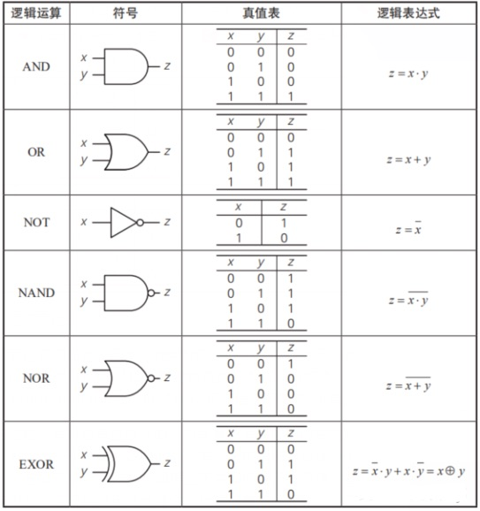

构成门电路的主要部件包括与门、或门、非门和与非门等。而与非门被称为“通用门”，因为通过组合与非门可以用来构建所有其他门，所以只需要与非门，就可以表达所有的计算过程。

bitvm的思路，就是将一个计算过程表示为门电路提交到链上，在链上用比特币脚本实现与非门，并通过一种挑战机制来验证门电路执行的正确性。

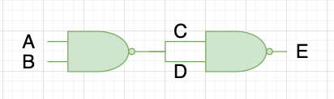

比如上面这个简单的逻辑门，用2个与非门来实现了一个与门，它有两个输入A,B，一个输出E，电路的逻辑是E=A*B，假如我现在要在链上证明我成功计算了1=1*1，可以通过首先承诺输入输出A=1 B=1 E=1和两个nand门，然后利用比特币脚本实现的nand逻辑，在链上执行nand计算，验证我提供的输入输出是否符合门电路。理论上，通过nand门我们可以表示任何逻辑，甚至zk-snark验证程序。那么如何用比特币脚本来表示门电路呢？

## lamport 签名

在讲承诺之前，我们先介绍lamport 签名，能够帮助我们理解bitvm中用到的承诺思路。

1979 年，一位名叫 Leslie Lamport 的数学家发明了世界上第一个基于哈希函数的签名。Lamport 发现只要使用简单的哈希函数，或是单向函数，就可以构建出非常强大的数字签名方法。

假设Alice想创建并使用一个Lamport密钥对，即一个私钥和一个相应的公钥。

为了创建私钥，Alice生成256对随机数（总共2 × 256个数字），每个数字的大小为256位，即总共2 × 256 × 256位。这是她的私钥，她会把它保存在一个安全的地方以备后用。

为了创建公钥，她对私钥中的512个随机数中的每一个进行hash，从而创建512个hash值，每个hash值的大小为256位。这512个哈希值构成了她的公钥，她会公布出去。

Alice想签名一个消息，首先她将消息hash为256位的值。然后，对于hash值中的每个位，基于该位的值，她从私钥的相应数字对中挑选一个数字（如果位是0，则选择每对第一个数字，如果位是1，则选择第二个数字）。这产生了一个256个数字的序列。由于每个数字本身是256位长，总大小将是256×256位= 65536位，从私钥中选出来的数字就是她的签名。

然后Bob想要验证Alice对消息的签名。他对消息进行hash获得256位的hash值。然后，他根据hash值中的位在Alice的公钥中挑选出256个hash值，他选择hash值的方式与Alice选择的方式相同，如果消息hash值的第一位是0，则他选择公钥第一对中的第一个hash值，依此类推。

然后Bob对Alice签名中的256个随机数进行hash，得到256个hash值，如果这256个hash值与他刚刚从Alice的公钥中选取的256个hash值完全匹配，那么就验证成功。

在Alice发布消息签名之前，没有其他人知道私钥中的2 × 256个随机数。因此，没有其他人可以为签名创建正确的256个随机数列表，在Alice发布签名后，其他人仍然不知道其他256个随机数，因此无法创建其他消息的签名。

我们体会一下这个签名思路，首先提前发布一些hash值，然后通过选择揭示不同hash值的原像(即被hash的值)，来向对方传递信息，利用hash函数的单向性，保证签名的安全。我们一定要理解这种通过揭示不同的hash值来承诺信息的方式。

## Bit Value Commitment

回到上面的例子，如何用一种方法在链上提交A=1 B=1 E=1呢？bitvm实现了一种承诺方式，允许证明者将nand门的输入或输出设置为“0”或“1”。首先，我们承诺两个哈希值，hash 0和hash 1，分别对应承诺0或1，这两个哈希值还分别对应着两个原像preimage(hash(preimage0)=hash0，hash(preimage1)=hash1)，在承诺提交后，通过揭示preimage0（hash0的原像）将值设置为“0”，或者揭示preimage1（hash 1的原像）将值设置为“1”。对应的脚本实现如下：

```rust
OP_IF
	OP_HASH160
	<hash1>
	OP_EQUALVERIFY
	<1>
OP_ELSE
	OP_HASH160
	<hash0>
	OP_EQUALVERIFY
	<0>
OP_ENDIF
```

这个脚本根据提供的原像，如果和hash1匹配则返回1，和hash0匹配则返回0，我们举个例子解释一下：

还是举上面与门的例子，假设我们现在要承诺第一个nand的输入A为1，我们可以这样实现(简易画图仅供参考，实际实现为taproot脚本)：

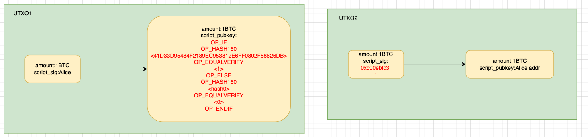

在UTXO1中，我们承诺了一个哈希值0x41D33D95484F2189EC953812E6FF0802F88626DB，在UTXO2中，我们揭示了它的原像0xc00ebfc3，(hash(0xc00ebfc3)=0x41D33D95484F2189EC953812E6FF0802F88626DB)，并附加1，表示我们希望执行OP_IF分支，原像判断成功后，向栈中推入1。最终的执行结果如下，栈上会留下1这个值，实现了我们最开始的需求，将值设为了1。

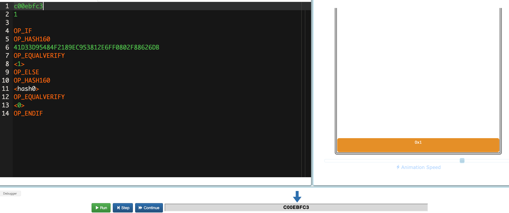

为什么需要这种承诺呢？因为我们已经将计算表示为了门电路，在电路固定后，证明方如果想要操纵计算过程，就是改变门的输入输出，这就会造成在相连的两个门对应的值不一致，在挑战过程中验证者会强制证明者揭示值的原像，证明者如果想操纵，他必然会通过揭示两个不同的原像来将两个门对应的值设置为不一致，而我们还有一种机制，只要你同时揭示了一个值的两个原像，就可以发起slash，因此验证者就可以拿到这两个不同的原像去slash资产。

## Logic Gate Commitment

我们已经解决了提交输入输出的问题，那么如何承诺单个nand门呢，其实很简单，承诺nand门其实就是承诺nand门的输入输出+实现nand运算，用比特币脚本实现nand运算非常简单，只需要OP BOOLAND和OP NOT：

```rust
witness:
1,1

script:
OP_BOOLAND  // 1 AND 1 = 1       
OP_NOT   // NOT 1 = 0

out：
0
```

使用 **`OP_BOOLAND`** 对栈上的两个布尔值执行 AND 操作，再用 **`OP_NOT`** 对 AND 操作的结果取反，就达到了nand门的功能。

用OP_NAND指代上面的脚本实现，用OP_BITCOMMITMENT指代我们上一节讲的承诺的脚本实现来，我们可以组合成最终的Logic Gate Commitment，其实现如下：

```rust
// 揭示hashE preimage
<hashE preimage/1>
OP_BITCOMMITMENT
OP_TOALTSTACK
// E的值在栈顶，放到另一个栈上

// 揭示hashD preimage
<hashD preimage/1>
OP_BITCOMMITMENT
OP_TOALTSTACK
// D的值在栈顶，放到另一个栈上

// 揭示hashC preimage
<hashC preimage/1>
OP_BITCOMMITMENT
// C的值在栈顶

// 从另一个栈读取D
OP_FROMALTSTACK
// 计算C NAND D 
OP_NAND
// 从另一个栈读取E
OP_FROMALTSTACK
// 检查C NAND D == E
OP_EQUALVERIFY
```

通过分别揭示输出，输入的3个值，然后用上面实现的OP_NAND脚本，就可以实现在链上验证C NAND D == E计算的正确性。

## Binary Circuit Commitment

我们已经实现了nand门承诺，通过组合nand门，可以实现任何电路的表示，代表任意计算过程。每一个nand门代表了一步执行过程，每一步都被提交到Tapleaf中，它们被合并到一个Taproot地址中，我们可以对某个门的执行正确性发起挑战，这需要prover打开相应的门承诺，揭示对应的输入和输出设置的值，如果prover同时揭示了一个值不同的原像，比如nand1的输出E和nand4的输入E一个揭示为1，一个揭示为0，这代表他作恶操纵了计算过程，验证者可以将其用作欺诈证据，将承诺与时间锁相结合，还能够实现强制prover在一段时间内必须揭示对应的值。

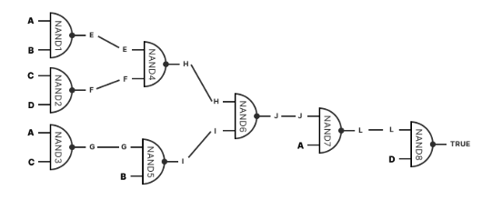

实际应用中，nand门Taptree会非常巨大，可能有10亿个Tapleaf节点，但它在链上占用的空间很小，因为整个承诺被提交到一个taproot地址中，同时，在挑战过程中应用二分法，能极大地减少交互次数。

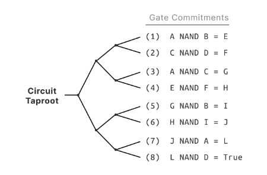

## Challenges and Responses

我们用一个具体的例子分析一下挑战的过程：


还是以这个最简单的与门为例，上面的电路表示的计算为A*B=E，注意这里的运算都是位运算，假设现在证明者要证明他正确计算了1*1 = 1，构建完上述电路后，我们还需要构建3个taptree。

第一个是challenge taptree，用来让verifier花费脚本发起挑战，它包含了两种脚本，nand hashlock script和prover timelock script，nand1 hashlock script类似于我们上面讲的Bit Value Commitment，可以理解为它承诺了nand门的编号，verifier和prover协商好每个nand门的编号承诺，prover生成对应的nand hashlock script，verifier花费这个script，揭示nand门编号的hash原像，表达自己想要挑战的是哪个nand门。

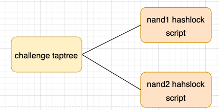

第二个是response taptree，verifier通过花费challenge taptree的某个tapleaf揭示nand门编号的原像，对某个门发起挑战后，prover需要回应挑战，因此该交易的输出需要为response taptree，用来后续给prover花费来回应挑战。这里的hashlock脚本就是前面的nand hashlock script，因为在前面verifier揭示了原像选出了他要挑战的nand门，在这里要保证prover回应对应的nand门，也就是要强制prover解锁正确的tapleaf，就需要用verifier之前揭示的原像解锁对应hashlock脚本。

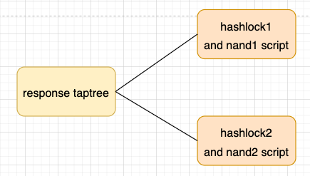

然后nand script就是我们上面讲的Logic Gate Commitment，nand门的承诺，保证prover必须揭示nand门的输入输出。

第三个是equivocation taptree，如果prover同时揭示了一个值不同的原像，这代表他作恶操纵了计算过程，这时我们利用equivocation taptree，可以slash prover的资金。

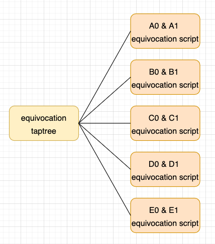

slash script实现如下：

```rust
OP_HASH160 <hash0>
OP_EQUALVERIFY //验证hash0原像匹配
OP_HASH160 <hash1>
OP_EQUALVERIFY //验证hash1原像匹配
OP_1
```

如果prover同时揭示了hash0和hash1的原像，那么verifier就可以用这两个原像去执行上述脚本，花费equivocation taptree对应的tapleaf，slash资产。

下面讲一下详细流程:

1. prover和verifier双方共同fund一笔资金，构造challenge taproot和equivocation taproot，供verifier发起挑战。

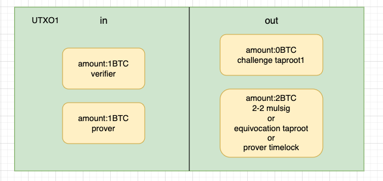

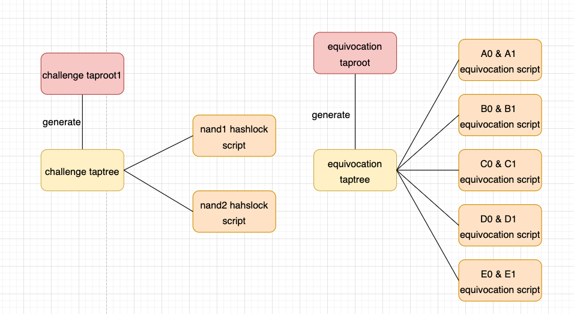

1. verifier对nand1发起挑战，花费nand1 hashlock script，揭示nand1的原像。

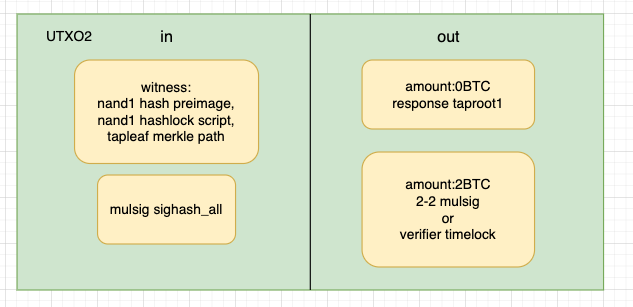

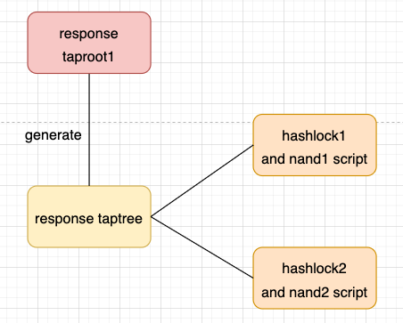

1. prover回应挑战，用2中verifier揭示的nand1的原像，消费nand1script，揭示nand1的输入输出A=1 B=1 C=1并在链上执行nand1门，然后生成challenge taproot2。

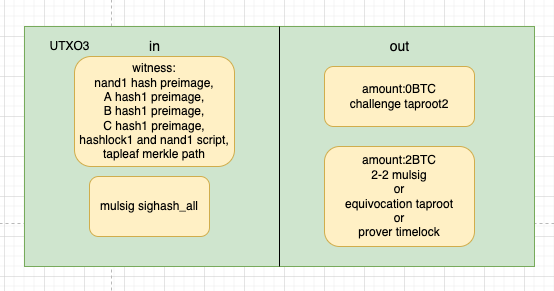

注意之后的challenge和response taproot生成时需要剔除已经挑战过的tapleaf，防止prover还去花费旧的tapleaf，保证prover响应新的挑战。

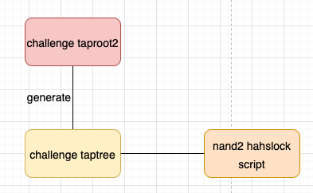

1. verifier对nand2发起挑战，揭示nand2的原像，过程同2。
2. prover回应挑战，揭示nand2的输入输出，假设这次揭示的C=0 D=1 E=1，过程同3。
3. verifier发现prover同时揭示了C的两个原像C=0 C=1，这时他可以通过花费equivocation script，发起slash。

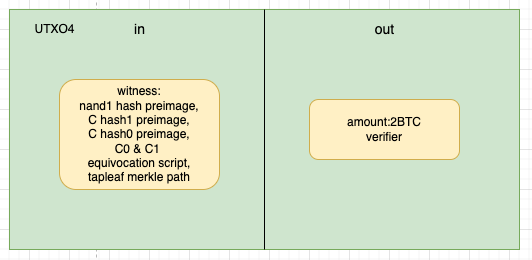

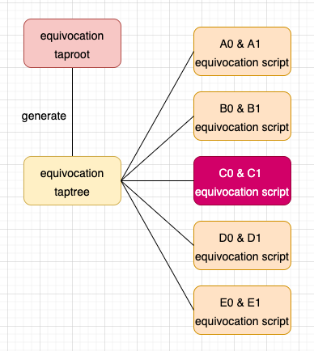

上述流程中的每笔交易都有一个Timelock脚本，用于防止prover或verifier不响应对方。整个过程中的所有交易，除了涉及时间锁和equivocation的交易，都需要prover和verifier的多重签名。之所以需要prover和verifier的多重签名，因为我们需要确保从challenge taproot address解锁的UTXO会被发送到response taproot address，而从response taproot address解锁的UTXO会被发送到challenge taproot address。

## BitVM的缺陷

目前的方案仅用于理论上论证，真正落地bitvm还有很大的挑战，首先把计算编译成Binary Circuit后可能会有非常多的门电路，即使用二分的方式，也要进行非常多轮交互，还有一个很大的缺陷就是这是一个两方挑战协议，相当于是一个需要2-2多签来实现的计算，只有证明者和单个验证者能够参与，而且每次都需要双方共同的签名，这降低了其安全性。

## BitVM1

BitVM1相对于原始BitVM提案又两个改动：

1. 它实现了一个通用CPU来计算，其验证的粒度变为了CPU指令，而不是门电路，这样大大减少了挑战的次数，因为同一个程序，指令要比门电路少的多。
2. 由于其通用CPU的能力，它可以验证任意程序的执行，不需要为每个程序开发单独的电路。

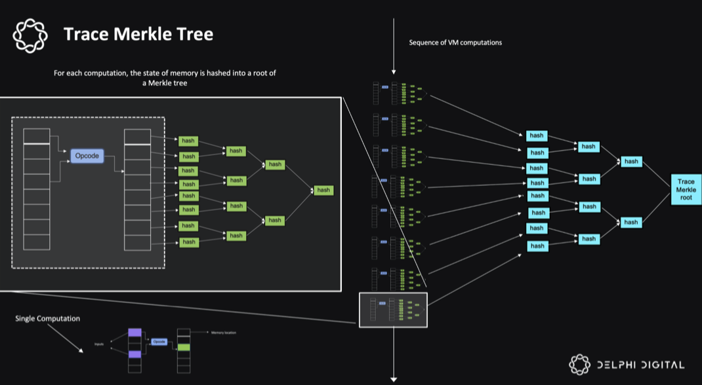

其实现思路与op的cannon非常像，BitVM1验证每条CPU指令的计算，而CPU指令计算的正确性，可以通过内存的状态来表示，每条指令执行后，都可以将内存状态快照并生成一个merkle tree，此时merkle root就代表了这条指令执行后的状态，随着每条指令的执行，每次执行后的内存状态可以表示为一系列的merkle tree，这一系列的merkle tree，就形成了指令执行的trace。

prover和verifier在链下分别运行程序，并构建出merkle tree，prover在链上提交merkle root，随后verifier执行一系列的搜索来检测冲突：

1. verifier通过二分的方法，找到与自己不同的merkle root，不断比较来缩小冲突范围。
2. 重复步骤2，直到精确到某一条cpu指令，在链上执行该指令来判断。

每次查询和检查都需要一笔 BTC 交易，最终在链上执行某条指令，还是需要bitvm0中的门电路方式，BitVM1实际上是在BitVM0基础上又封装了一层，其抽象层次从门电路提升到了CPU指令。

## BitVM2

在之前的版本的BitVM中有一些局限性，只有prover和单个verifier能够进行交互式挑战-响应。BitVM2是一个新的变体，任何人都可以充当verifier，此外，它将交互式挑战的过程缩短到两轮。

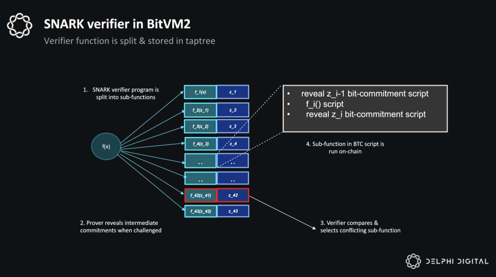

BitVM2的思路是实现一个SNARK 验证器，同时将一个大的计算 f(x)=y 被分解为 f_i(x_i-1)=z_i，每一个sub-function的输出作为下一个的输入，这些sub-function用比特币脚本编写，与之前的nand门相比，实现这些sub-function需要的脚本会更复杂。prover生成taptree来承诺每个 f_i 和 z_i，其中的每个tapleaf 包含sub-function的承诺，verifier可以花费任何一个sub-function的tapleaf f_i(z_i-1)=z_i实现在链上计算脚本。

与BitVM0相比，从验证NAND门执行变为了验证SNARK sub-function的执行，这增加了每个tapleaf的验证成本和大小，但减少了所需交易数量。由于sub-function的数量较少，可以在单个步骤中揭示所有的承诺，因此也不再需要进行二分搜索。

## 无许可验证

Ark的Burak基于BitVM2提出了一种使用connector输出实现的无许可验证方式，使用connector输出，任何人都可以充当验证者，极大地增强了安全性，这种方式创造了一种交易输出之间的依赖性，使得一个输出只能与另一个一起花费。

如下图所示，最左边是一笔fund交易，所有verifier和prover预签名另一个交易，允许prover花费fund资金，这个交易的输入条件是同时花费connector A和B，同时利用时间锁，保证prover可以在特定时间后花费。

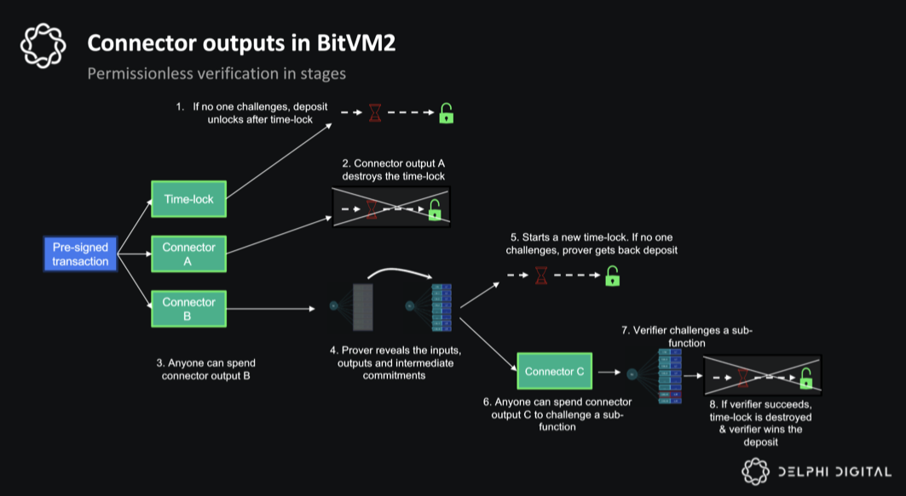

如果prover有作恶行为，欺诈证明机制允许任何verifier在时间锁之前花费connector A，这将导致prover无法直接花费fund交易，他必须去花费connector B来揭示所有中间状态承诺，

花费connector B会创建两个输出，一个新的时间锁和connector C，如果一段时间没人挑战，prover可以提取资产，通过connector C，verifier可以链下运行每个sub-function并找到哪个不正确，一旦找到，就可以通过提供有效证明来花费connector C，使prover无法提取资金。整个过程实现了无许可验证，允许任何人挑战，并且最多只有 2 笔交易，降低了交易成本和时间。

利用connector输出这种机制，可以在比特币上实现无许可的跨链桥，这种实现方式由多个operator和委员会组成，operator负责响应用户的跨链请求，委员会负责对资金池进行管理，operator操作资金池需要委员会进行多签，但委员会无法私自挪用用户的存款，因为用户在向指定地址打款前，会要求委员会先进行预签名，确保这些存款只能被operator合法申领**。**他的无许可体现在如果operator作恶，任何人可以发起挑战进行惩罚，这种方式将信任模型降到了1/n：


上图描述了这样一个场景，Bob从其他链往比特币跨99个btc，有一个operator在bitcoin支付给Bob金额后，需要从资金池赎回相同的金额。通过在这里引入一个挑战机制，operator想要赎回金额需要成功通过挑战，而这个挑战可以由任何人发起。

operator通过构造take1 take2两笔交易从资金池里赎回资金，通过改变take交易里input的来源，实现了任何人可以发起挑战，并且强制operator去应对挑战，否则他无法赎回资产。其中take1是未被挑战的情况，take2是被挑战的情况。

1.为了构造take1交易，operator首先构造kickoff交易，对应本节最开始的图中描述的步骤3，该交易包含一个承诺y，表示他在L1上给用户支付了跨链交易的证明。


operator质押2btc，并提交提款状态承诺y，output1实现了时间锁，output2即connectorA作为一个空输出，同时预签一笔SIGHASH_SINGLE | SIGHASH_ANYONECANPAY的challenge交易。

SIGHASH_SINGLE | SIGHASH_ANYONECANPAY是比特币的交易参数，意味着其他人拿到交易，可以对所有输出进行更改，但不能对与当前输入匹配索引的输出进行更改，所有其他输入都可以修改、添加和/或删除。由于这个交易固定了1个btc的输出，因此想要发起挑战必须增加1个btc的输入，这提供了一个任何人都可以发起这个挑战的机制，挑战者支付1个btc的输入作为挑战费用，花费掉这个output，使得后续的take1交易无法花费(因为take1以这个output作为输入)

output3金额为质押金额，用来让operator来响应挑战。

2.根据kickoff交易构造take1交易


有了kickoff交易，operator可以构造出take1交易，此时take1能否花费由kickoff交易中的时间锁和connector A决定，如果有人挑战，导致connector A无法花费，take1交易失效，如果无人挑战，则时间锁到期后即可花费，完成赎回。

3.根据kickoff交易构造take2交易


为了应对挑战，operator需要再构造assert交易，提交提款过程所有的中间状态的证明，对应本节最开始的图中描述的步骤4，output1是时间锁，output2是揭示的一系列中间状态脚本，然后operator可以构造take2，此时take2能否花费由时间锁和connectorC决定，如果有人发起Disprove交易花费connectorC挑战成功，导致operator无法花费connectorC，则take2交易失效，如果无人能挑战成功，则时间锁到期后即可花费take2。

kickoff，assert，take1，take2四笔交易都在链下构造，并让委员会进行预签名，

4.operator将kickoff交易上链，如果没有人发起challege交易，2周后，它可以将take1交易上链，完成赎回，如果有人发起challege交易，connectorA失效，他无法提交take1交易。

5.如果有人发起challege交易，operator可以将Assert交易上链，如果没有人反驳，2周后，它可以将take2交易上链，赎回资产，如果有人提交disaprove反驳交易，则connectorC失效，operator无法赎回资产，并且失去质押的2btc。

## bitlayer方案

bitlayer基于BITVM2的思路实现，不同的是它使用的证明系统是STARK，其整体架构如下：

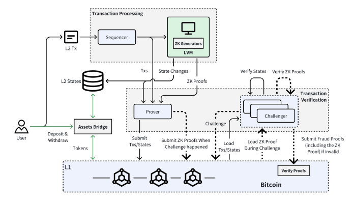

其实现类似于现在的以太坊zklayer2，prover生成证明并将证明提交到链上，但不同的是，证明并不是立即在bitcoin链上被验证，而是需要挑战者在链下对证明的正确性做出判断，如果发现作恶行为，挑战者通过bitvm的交互式欺诈证明机制对作恶进行惩罚。

证明生成部分使用了组件化的方式，通过对不同证明逻辑进行拆分，能增加证明生成的效率，降低复杂度，其中包括了L2区块状态转换的证明，L1区块派生证明，L1区块确定性证明，最终将证明汇总，确保整个 Rollup 执行的有效性。

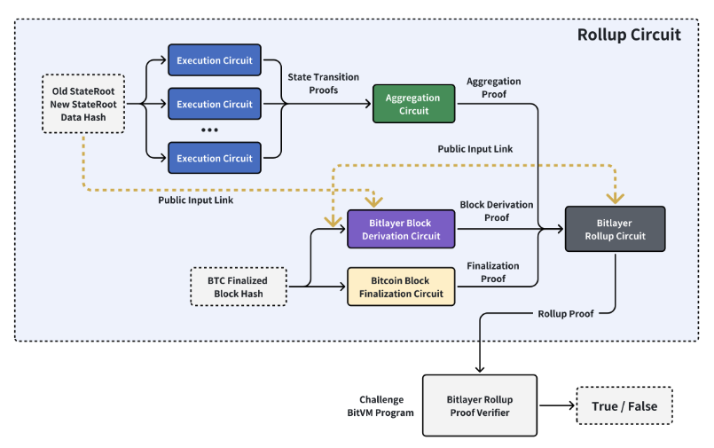

bitlayer使用的证明系统选择了STARK而不是SNARK， 是由于比特币不支持OP_MUL操作码，难以实现SNARK所需要的椭圆曲线上较大的域运算，而STARK主要基于哈希函数，并且STARK还有另一个显著优势，抗量子安全性，因此STARK更适合在bitcoin上验证，即使如此，用比特币脚本实现哈希函数仍然具有很大挑战，上个月，多个项目方包括bitlayer还在twitter上对实现SHA256脚本发布悬赏。

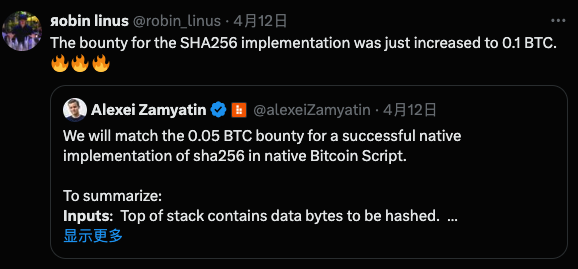

脚本随后被人实现：


STARK证明中用到的哈希函数为FRI，其在STARK中的功能类似于SNARK中的KZG承诺，用比特币脚本实现FRI非常困难，bitlayer针对FRI进行了创新，使得其可以在比特币上以非常低的成本进行验证。


Bitlayer使用Taptree来取代FRI中使用的传统Merkle树，实现了一种比特币友好的FRI，证明者不再使用Merkle Tree提交中间状态，而是在Taptree中实现脚本来提交，这减少了需要提交的状态个数，并且避免了使用比特币脚本模拟merkle path的验证过程，最终将FRI的验证成本减少了2/3。

## 多证明系统

在以太坊客户端生态中，一直推崇客户端多样性，客户端多样性是指用不同编程语言或更改实现方式来实现相同的客户端逻辑，比较出名的客户端有Geth，Besu等，多样的客户端能够最大程度降低出现bug的几率，而用比特币脚本实现zkproof验证器的难度更上一层楼，实现无bug几乎是不可能的，更需要通过这种方式来降低单一系统产生的漏洞风险，Bitlayer计划实现多种zkproof验证挑战系统，包括ZK-SNARKs（如Groth 16）和比特币友好的ZKSTARKs。

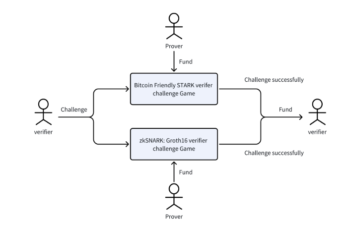

通过将多个证明系统融入挑战机制，实现不同类型的ZK Proof验证器的挑战逻辑，只要任意一个被挑战成功，验证者都将获得奖励。这有效地降低了单一证明产生的漏洞风险，提高了Bitlayer的安全性。

为了实现多证明系统，bitlayer实现了一种分层虚拟机（LVM）机制，其分为前端合约层，能够支持各种智能合约类型，如EVM/CairoVM，以及后端zk generator，包括ZK-STARKs和ZK-SNARKs（Groth 16，PLONK等），这种方式最大化了兼容性和合约开发效率，可帮助其他生态系统的开发者快速进入bitlayer开发生态。

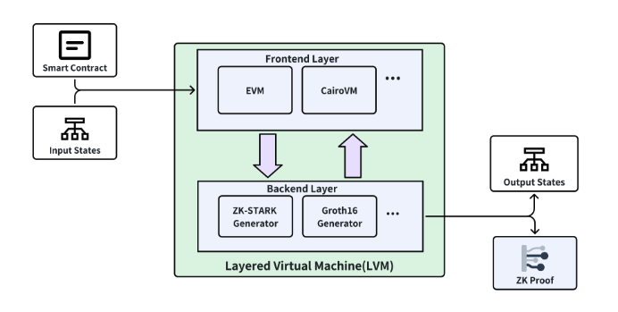

比如以太坊生态的开发人员可以轻松得迁移已有的基于EVM的智能合约到bitlayer，无需关心其底层zk机制。在后端方面，不需要修改智能合约就可以支持不同种类的证明系统，同时可以根据需求灵活选择，并且随着zk技术的快速发展，这种分层的方式也可以快速适配新的证明系统，这带来了极大的灵活性。

## 挑战过程

尽管使用了zk，但优化后的STARK Verifier的中间状态数量仍然相对较大，所以bitlayer采用了乐观挑战的机制，证明者链上承诺状态，验证者对正确性进行挑战，整个过程使用了bitvm2中的无需可验证思路，类似无许可跨链桥的实现，使用connector output的方式，让任何人可以发起挑战。

1. Bet Phase

首先证明者构建TX1向一个taproot地址质押3BTC，此taprood地址包含对程序状态的声明。

1. Claim State Phase

证明者花费TX1中的taproot地址构建TX2，通过位承诺的方式来揭示程序的开始和结束状态，TX2会产生3个输出，第一个输出是时间锁，第二个输出是一个bitvm2中的connector output，用来让任何人都可以花费，第三个输出同样是一个connector output，用来让证明者响应挑战，同时所有的output都附加了多签条件，需要bitlayer的委员会进行签名，确保证明者诚实地构建Taptree并接受挑战。证明者在构建好TX2之后并不直接上链，而是发给委员会，拿到委员会对TX3的签名，TX3能够让证明者在一段时间没有人挑战之后拿回质押的资产，在确保自己能够通过TX3拿回资产后，才将TX2上链。

1. Awaiting Finalization Phase

在此阶段，证明者等待时间锁到期，如果没有人花费TX2的output2，那么它可以将TX3上链，拿回自己的资产。

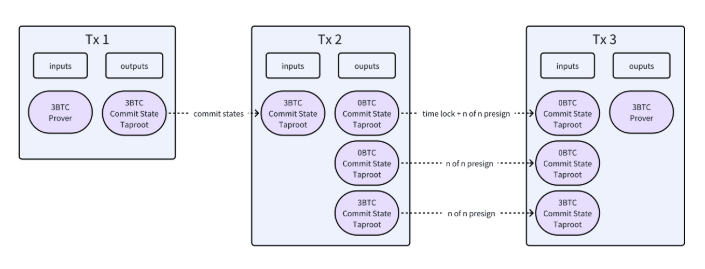

1. Verifier Bet Phase

如果任何人对证明者声称的状态有异议，他们可以使用TX4发起挑战，花费TX2的output2，质押2BTC，阻止证明者去花费TX3，TX4是由委员会提前设置SIGNHASH=SINGLE| ANYONECANPAY参数并且签名后公布，可以允许任何人发起这一挑战，与上面跨链桥中讲的方式相同。

1. Prover Reveals Intermediate States

TX2的output2一旦被花费，证明者就无法花费TX3取回自己的资产，因此他必须去花费TX2中的output3，通过构建TX5，证明者揭示程序的中间状态来响应挑战，TX5的output中包含时间锁，如果验证者找不出错误，证明者可以花费并取回资产。

1. Prover Wins the Challenge Phase

如果证明者提供的所有状态都是正确的，验证者无法找到错误的门，证明者可以在时间锁到期后构建TX6，取回自己的资产，并且证明者获得了TX4中验证者质押的资产。

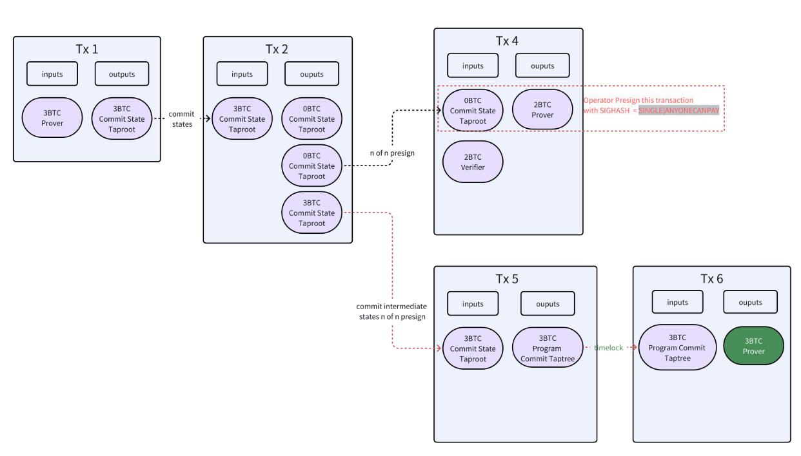

1. Verifier Wins the Challenge Phase

如果验证者在TX5中检测到证明者揭示的中间状态有错误，可以在TX5的Taptree中找到相应的equivocation解锁脚本，花费脚本构建TX7，赢得挑战并获得1BTC奖励（减去发起挑战质押的2BTC）。

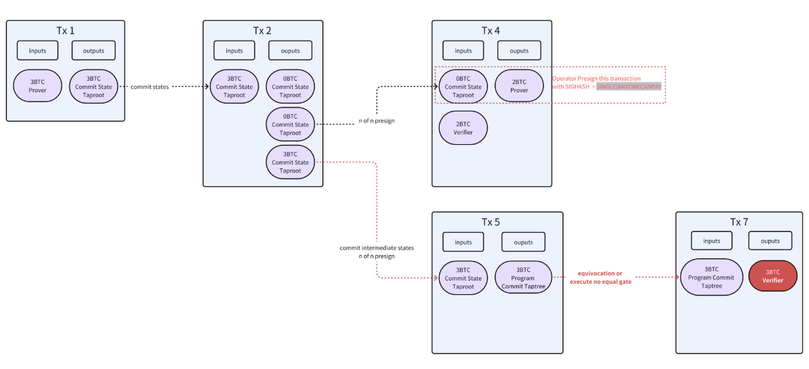

## BitVMX

BitVMX与bitvm1类似，其目的同样是在bitcoin上实现通用计算cpu。与BItVM1对每一个指令后的内存状态生成merkle tree不同，BitVMX为每个指令产生的内存状态变化生成一种自定义的trace来表示，每个trace经过哈希得到哈希值，就像BitVM1中的merkle root，这一系列的哈希值就代表了指令执行后的状态变化。

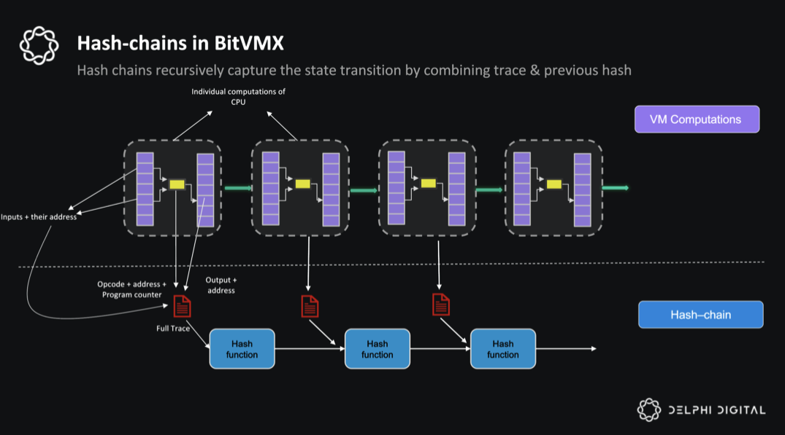

BitVMX实现了一种消息链接机制(**Message linking scheme**)，可以简单理解为这是一种通过预签名，在多个交易之间建立关系的方式，这里的关系指的是在不同的交易之间能够共享某些状态，同时能够保证prover和verifier能够按协商好的方式作出回应，符合预先协商的格式。

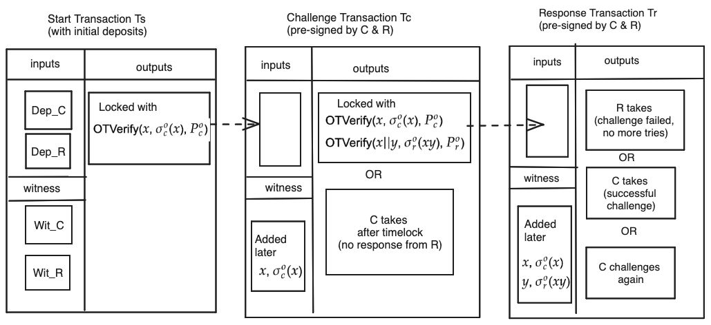

双方通过预签署一系列不完整的“交易模板”，保证挑战-响应交互按照预定义流程进行，同时通过强制在witness中携带中间数据，在不同交易之间传递信息。

BitVMX实现了从8位到32位RISC-V的通用架构，无需为BitVMX构建特定的编译器，其验证的粒度同BitVM1一样，都是单个的CPU指令。

其挑战过程与BitVM1类似，通过二分法，在一系列trace root中找到冲突的root，但它的挑战是针对指令状态的某一部分进行挑战，比如针对指令码，来检查CPU指令本身是否正确，针对指令操作数，来检查CPU指令操作的内容是否正确，针对PC程序计数器，来检查CPU指令的地址是否正确等等。