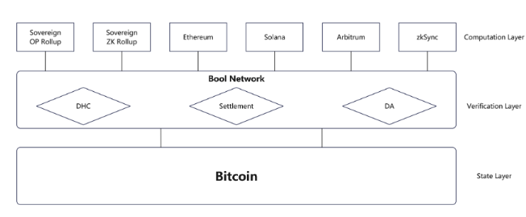
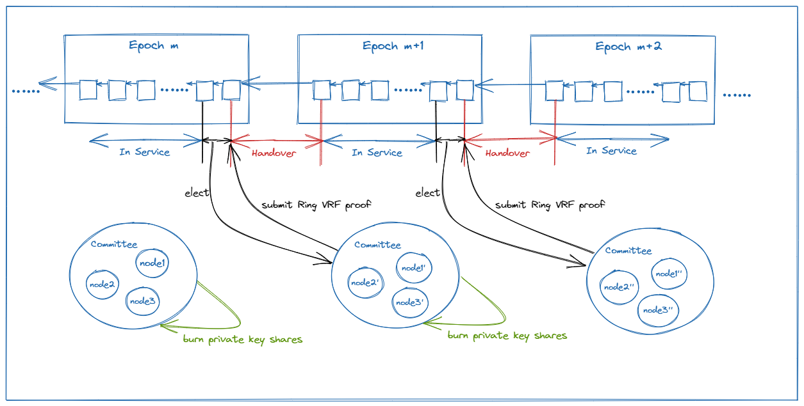
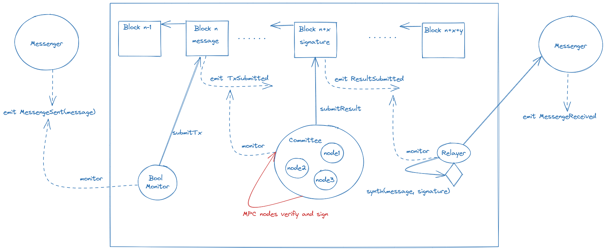

## bool network

区别于一般的btc Layer2，bool network另辟蹊径，通过实现一个无许可的，去中心化的验证层，在验证层集成DA，智能合约，DHC共识等能力，将btc与其他生态链接起来。利用bool作为验证层，可以轻松在Btc基础上构建跨链桥，rollup等一系列应用。



## 组件

## **Bool Chain**

是一条去中心化公链，目前用于支持和记录网络中DHC的生命周期和行为，还是一个 EVM 兼容链，可以在 Bool Chain 之上构建应用程序，同时可提供DA的能力，基于 Polkdot Substrate 框架开发，并使用提名权益证明 (NPoS) 共识算法，任何人可以通过质押的方式运行节点参与验证出块。

## **Dynamic Hidden Committees (DHC)**



DHC名为动态隐藏委员会，独立于bool chain节点。DHC是bool network最重要的机制，DHC节点通过运行不同链的轻节点，验证确保提交到boolchain的跨链消息的安全性。与普通固定的MPC多签委员会不同，DHC节点是完全无许可的，只要有TEE硬件就可以运行，因此，可以有非常多的DHC节点加入进来，实现非常强的去中心化。

每个应用都会对应一个委员会，DHC有两大特点，首先是实现了隐藏，所有DHC节点都可以参与委员会的选举，通过基于 ZKP 和 VRF 构建的ring VRF 算法选举委员会成员，每个委员会使用多方计算 (MPC) 生成私钥和委员会的帐户地址。简单说一下Ring VRF协议，传统的vrf协议一般用来实现抽签选举，但选举过程会暴露自己的公钥，使得外界可以得知谁获得了选举，bool network实现的Ring VRF协议，不会暴露自己的公钥，也就无法获得选举信息，根本就不知道谁当选了。同时，由于在 TEE 节点中运行，在选举结束后，委员会成员无法知道彼此的身份，也无法知道自己的身份。

然后实现了动态，bool network即使节点都正常运行，每隔一段时间，就通过Ring VRF协议，选举出来与上次不同的新的委员会，实现了委员会成员的不断变更，同时，委员会交接过程中共享密钥从上个纪元的委员会传递到新委员会，保持公钥不变，旧委员会抹去密钥。

通过DHC机制，使得选举过程基本处于一个黑盒状态，外界无法感知每个节点的状态，实现了极强的安全性，隐私性与随机性。正在运行的TEE 节点，任何实体（包括节点自己、其他节点或外部攻击者）都无法获取其运行状态，包括所属DHC、同一 DHC 内的其他节点、共识通信或签名消息等等信息。在这种情况下，只要 Bool Network 能够正常的进行网络通信，每个DHC成员都是安全的。要实现攻击，攻击者必须控制 Bool Network 中的大多数节点，由于节点完全无需可运行，控制大多数节点几乎不可能实现，而且由于在 TEE 内运行的程序是不可变的，即使控制了节点，攻击者只能导致网络停机，而无法获取网络中的资产。

## **External Relayers**

realyer节点监听第三方链和bool chain，并提交跨链消息到boolchain或者目标链，relayer可以从他们提交到每笔交易中获利，但不保证跨链消息的安全性。relayer是开放无需可的。

## 智能合约

每个区块链上都部署了几个合约，以帮助开发者在 Bool Network 上构建全链应用程序，

Anchor 合约，开发者自定义，与开发者的合约交互，将开发者合约的自定义跨链消息转发给messenger，或将messager传递过来的源链消息，转发给开发者的合约。

Messenger ，接受anchor合约的转发消息，接受relayer提交的转发消息。作为发送方，它能将源链消息生成事件，relayer监听后传输到 Bool chain，作为接收方，他能接受relayer提交的消息，并将消息转发到目标链上的anchor合约。

## DA

bool chain作为一条公链，可以实现DA层的能力，不同于很多中心化的DAC，由于bool chain本身去中心化，任何人都可以通过质押的方式运行节点，因此bool chain作为DA层，实际上成为了一个任何人都可加入的去中心化DAC，避免了数据扣留的问题。

## 强制提款与逃生舱

### 强制提款

如果基于bool network构建的rollup其Sequencer发动审查攻击，故意拒绝用户的交易或者提款请求，或者直接跑路，用户如何提取资产？这个问题其实在以太坊Layer2中就有解决答案，由于bool chainevm兼容，可以实现智能合约，以太坊Layer2的解决方案在boolnetwork同样可以实现。

如以太坊Layer2中的Loopring，用户直接在 Layer1 上通过合约中的 forcedWithdraw 函数发起强制提款，Sequencer 在一定时间内需要响应强制提款请求，如果 Sequencer 在 15 天内没有响应用户的强制提款请求，用户可以调用合约开启破产清算模式，停止接收 Sequencer 提交的新 L2 区块，用户此时可以通过L2 merkle proof 证明自己的资产状况，在 Layer1 上把自己的资产提走，在bool network中，由于rollup的合约部署在bool chain上，可以完全实现相同的强制提款功能，同时，bool chain作为去中心化的DAC，可以提供用户证明自己的资产状况DA数据，避免数据扣留问题。一旦用户的merkle proof通过验证，DHC便可以发起btc上的提款交易，为用户提款。

### 逃生舱

当bool验证网络中的所有节点都无法运行时，此时整个bool nerwork瘫痪，如何将资产取回用户的比特币账户？用户进行跨链时，可以转入一个taproot地址，我们知道taproot有两个花费路径，一个是普通公钥，一个是taproot脚本，那就可以构造一个taproot地址，其内部公钥是DHC公钥，这样使得DHC可以操作跨链的资产。

同时构造一个基于时间锁的taproot脚本，其实现如下：

```rust
OP_PUSHBYTES_2 
<expire time  large than 500000000 is timestamp>
OP_CLTV 
OP_DROP 
OP_PUSHBYTES_32 
<internal key of the beneficiary> 
OP_CHECKSIG
```

该脚本的功能是时间锁+用户签名验证，可以实现为1年后，只要用户签名，就可以转移该taproot地址的资产，用这种方式，即使在bool nerwork瘫痪的极端情况下，用户在一定时间过后也能最终提取在btc上的资产，提供了一种逃生舱的机制。

## 跨链消息的生命周期

利用bool network开发一个从btc到eth的跨链桥:

1. 用户在比特币上向跨链桥地址提交转账。
2. relayer监听到交易，将交易信息提交到bool chain，触发交易提交事件。
3. DHC监听到bool chain的交易提交事件，根据自身运行的btc轻节点验证交易正确性，并对交易签名后提交到bool chain，触发交易验证完成事件。
4. relayer监听到交易验证完成事件，向ETH的messager合约提交交易及DHC签名。
5. messager合约将交易转发至跨链桥的anchor合约。
6. anchor合约验证DHC签名，并将交易转发至跨链桥应用合约。
7. 跨链桥应用合约在ETH给用户铸造代币。

整个流程的安全性由DHC保障。



## bool stack

bool network的所有组件，包括bool chain， DHC， realyer， 链上的anchor和messager合约消息机制，可以成为构建BTCL2 区块链生态系统的通用开发堆栈，你可以把bool network当做一个安全的BTC智能合约层，此时，ETH生态上的所有项目可以完全迁移过来，把boolchain当做以太坊链，在ETH上建立的各种rollup可以平滑迁移到bool network，成为一条BTC layer2，极大降低在BTC上建立L2的成本。