## Cellula

在过去的几年中，以太坊生态系统迅速发展，成为了Defi和资产发行的核心平台。借助智能合约的力量，项目方能够以无许可的方式快速发行代币、NFT和其他数字资产。然而，这些资产发行方式也暴露出了诸多问题，例如代币分配不均、流动性管理困难，以及受到大资金持有者（“鲸鱼”）操控的风险。传统的发行模式，如首次代币发行（ICO）和流动性挖矿，虽然推动了市场的发展，但在公平性、透明度和参与门槛方面都有明显的不足。

Cellula 为解决这些问题提供了全新的视角，实现了一个可编程激励层，Cellula 利用虚拟工作量证明（vPoW）机制，将资产发行过程游戏化，旨在实现更公平的代币分配和更智能的流动性管理。

## 以太坊上的pow

pow是公认的最去中心化的共识方式，能否在以太坊上以pow的方式实现资产分配呢？照搬比特币的sha256计算模型显然不可能，Cellula 的解决方法是找到 “proof of work”中的一种新的“work”，引入了康威生命游戏规则，赋予每个链上数字实体（称为“BitLife”）独特的算力，将细胞的存活数量视为虚拟算力，存活数量越多算力越高，参与者之间的竞争变为了如何获得存活细胞数更多的BitLife，而在不同区块高度下计算 BitLife 的算力变化需要大量的计算资源，就像 BTC 矿工使用算力计算哈希一样，这套机制被称为vPoW。

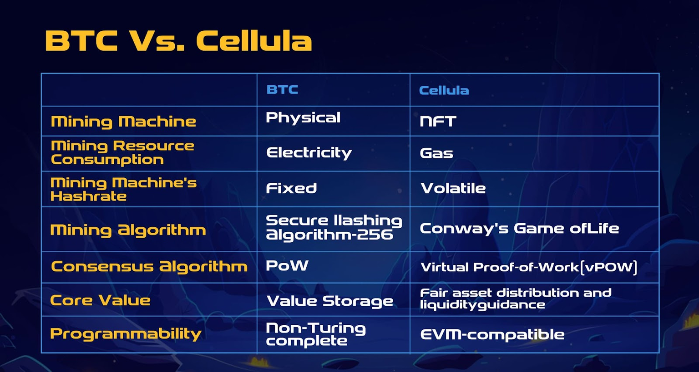

vPoW 机制不是简单的SHA-256哈希计算，而是基于游戏规则的计算模型，不同的参与者可以通过优化策略来竞争，通过游戏化的方式，进行资产的发行与分配。其独特的链下计算，链上进化的模式，算力会因挖矿周期的不同而变化，因此任何BitLife都不存在全局最优，今天算力最强的BitLife，随着不断进化明天就可能被超越，其简单规则会导致复杂的涌现现象和动态的玩家间策略。

## 康威生命游戏与BitCell,BitLife

vpow的核心机制是康威生命游戏，其是一个二维的格子游戏，其游戏规则非常简单：

- 每个细胞有两种状态 - 存活或死亡，每个细胞与以自身为中心的周围八格细胞产生互动（如图，黑色为存活，白色为死亡）
- 当前细胞为存活状态时，当周围的存活细胞低于2个时（不包含2个），该细胞变成死亡状态。（模拟生命数量稀少）
- 当前细胞为存活状态时，当周围有2个或3个存活细胞时，该细胞保持原样。
- 当前细胞为存活状态时，当周围有超过3个存活细胞时，该细胞变成死亡状态。（模拟生命数量过多）
- 当前细胞为死亡状态时，当周围有3个存活细胞时，该细胞变成存活状态。（模拟繁殖)

给定一个细胞的初始布局，按照这些规则细胞就会不断地进化，产生千变万化的结果，比如下面这种可持续繁殖模式：上方两个不断碰撞的部分能够一直繁殖出下方的的细胞，你甚至能用这些细胞构建出一个图灵机。

在Cellula中，参与者需要做的就是对细胞进行布局，创造链上数字生命BitLife，BitLife在链上以NFT的方式表示，每个 BitLife 由 2-9 个 BitCell 组合而成，每个BitCell都是一个3x3的方格，每种组合都作为 BitLife 的基因，多达$2^{81}$的 BitCell 组合方式创造了无尽的可能性，BitLife中活跃细胞数量被视为算力大小，因此BitLife成为了一种虚拟矿机。为了找到算力更高的BitLife，参与者需要在链下进行大量的计算，利用BitLife不断链上进化的特性来动态调整挖矿策略。

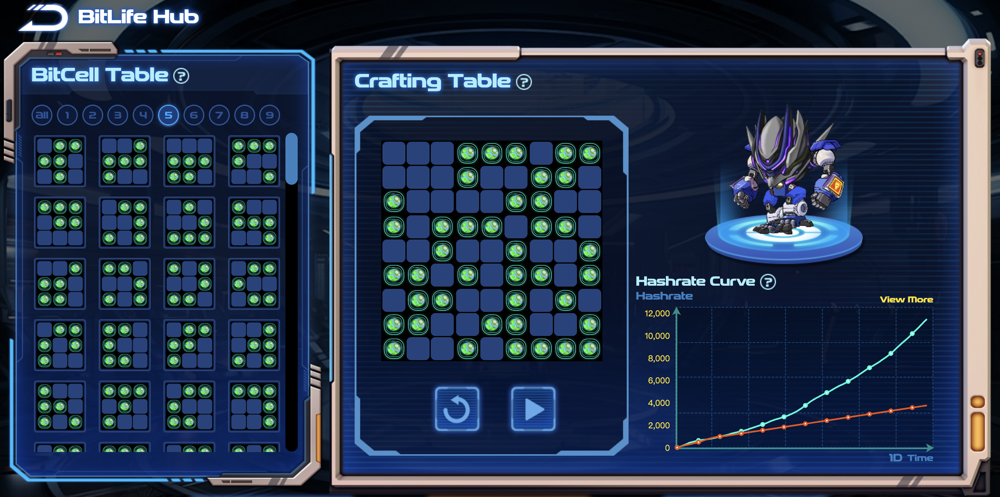

BitLife会随着区块高度的增加在链上不断进化，如图所示，其活跃细胞数量不断增多，其虚拟算力也会越来越高，如果BitCell组合不合理，造成活跃细胞越来越少，其算力也会越来越低。

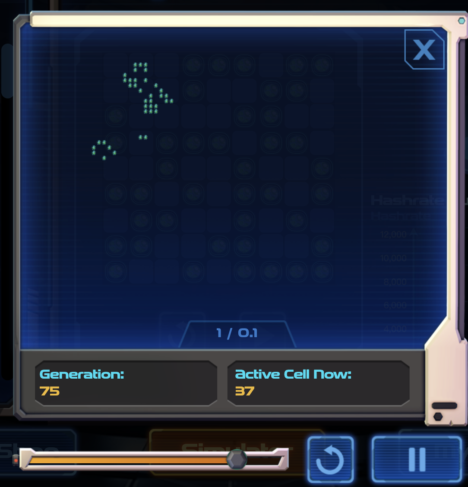

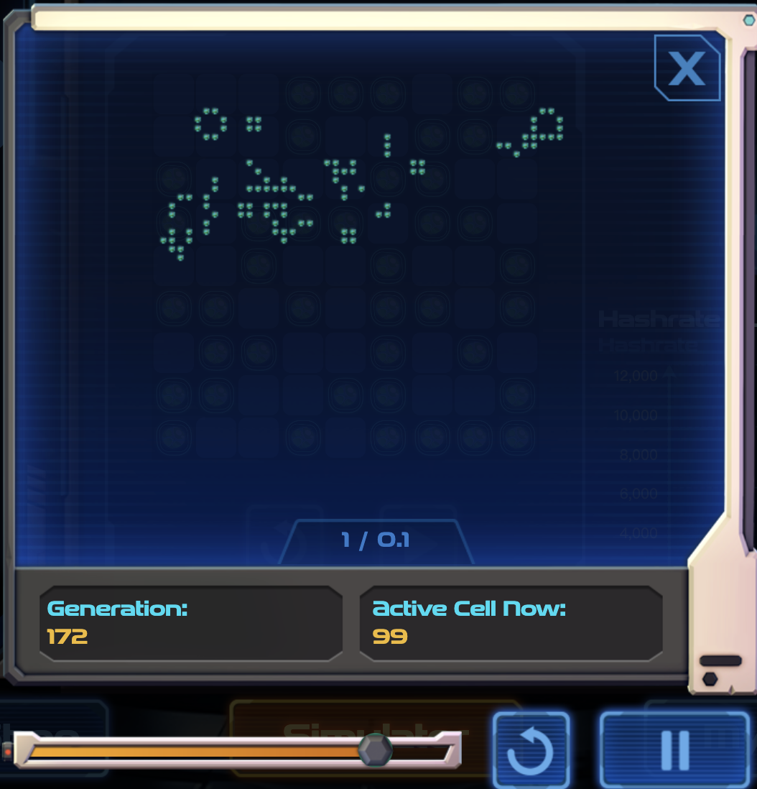

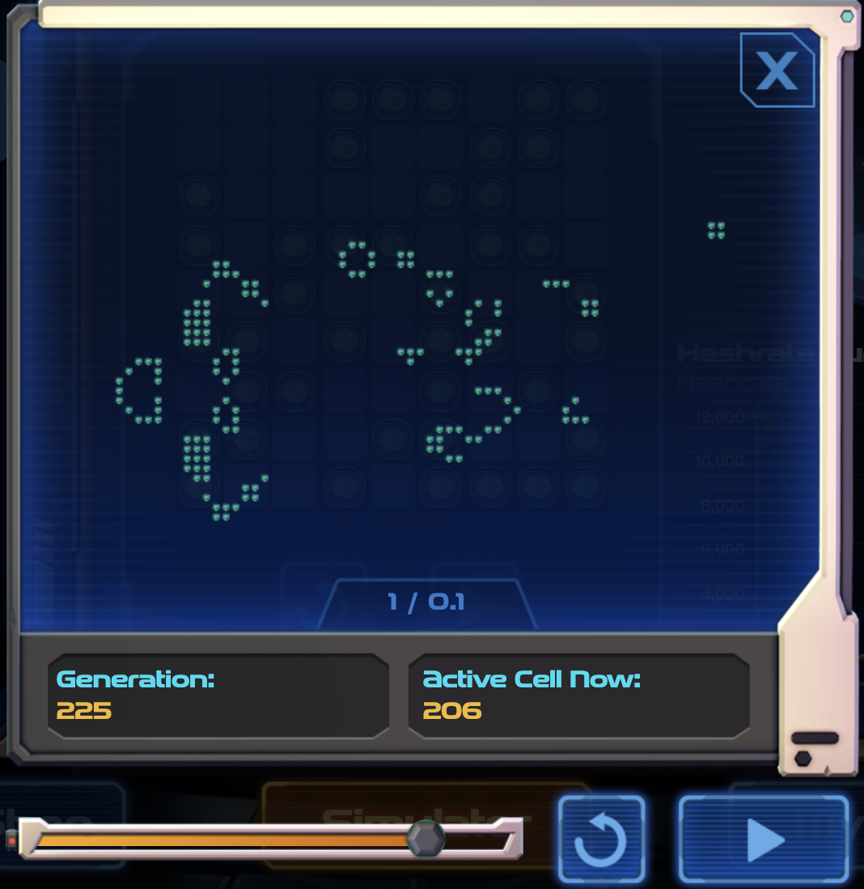

BitCell合成BitLife的过程，就是一个发明新矿机的过程，BitLife被mint后，需要进行“充电”来启动挖矿，时间分为1天，3天和7天，需要支付一笔小额的充电费用来启动BitLife，到期后需要重新发起充电继续挖矿。系统会每 5 分钟生成一定数量的能量点，并根据 BitLife 在总网络算力中的当前份额分配给每个用户，随着 BitLife 的算力随着区块高度动态变化，挖矿奖励也不断变化。

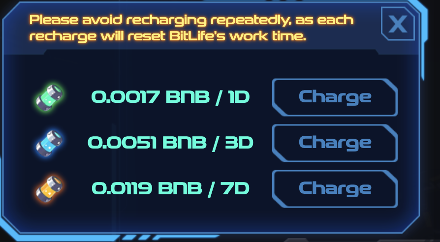

对 BitLife 发起充电交易的过程也是参与新资产发行的公平启动方式，充电交易可以被视为购买新资产公平启动的“区块彩票”，在链上根据Analysoor算法算法规则选出中奖交易，获得新发行的资产，即使拥有大量资产也无法拥有优势，参与者不需要担心巨鲸会影响分配结果的公平性。

## Analysoor算法-公平资产发行

Analysoor算法是一个公平启动协议，它通过使用区块哈希作为随机数生成器来选择每个区块中的赢家，实现了一种公平发行资产的机制。

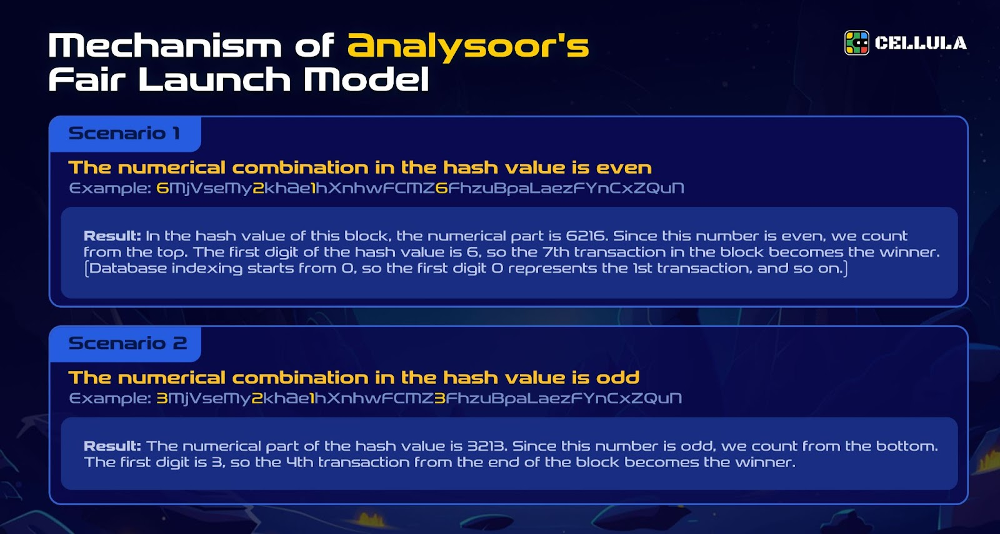

在 Analysoor 中，用户将不再需要通过提高 GAS 费进行疯狂竞标，每个用户参与mint的成本是固定的，每次参与都可以视为购买一张“区块彩票”。区块哈希值的第一个数字作为彩票号码，而哈希值中数字的奇偶性决定计算顺序，号码对应顺序的交易即为获胜者。

这种不可预测的随机方式，保证了其公平性，有效地过滤掉了机器人和“科学家”，同时充电交易的费用都被用于为新发行资产注入初始流动性，形成了一种良性的生态循环。

## Variable Rate GDAs算法-快速定价BitLife

新的BitLife一旦被mint，其组合的BitCell即公开，其他人也可以按照相同的组合方案进行mint，如果该BitLife的活跃细胞数量大幅超过其他BitLife，其算力也就越高，此时相当于一种效率更高的矿机被研发出来，其他参与者会大量mint该BitLife，引起fomo，Cellula引入了可变速率渐进荷兰拍卖（VRGDA），这是由 Paradigm 开发的机制，它会动态调整价格——当销量超过预期时提高价格，而当销量滞后时降低价格。

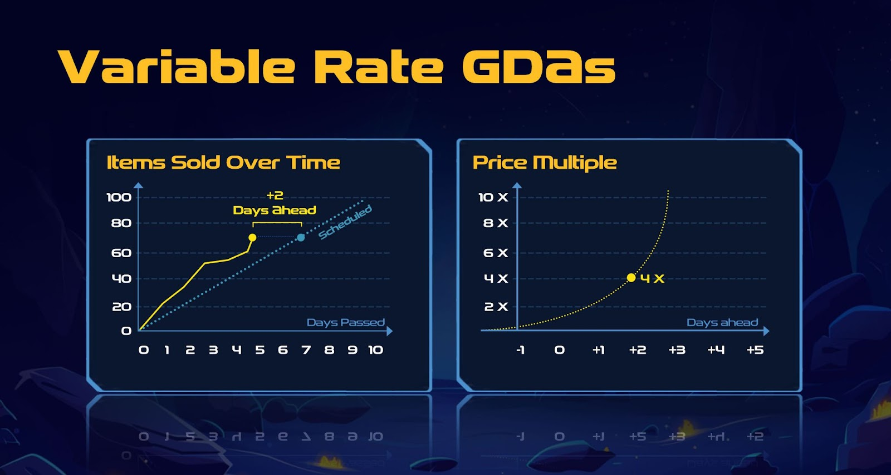

在上述场景中，当某个 BitLife 在短时间内被频繁铸造时，价格会指数增长，而当购买力不足时，价格则会指数下降，fomo会将mint BitLife的价格大幅抬高，考虑挖矿收益后价格最终会趋于平稳，快速完成对新产生BitLife的定价。

## vpow参与方视角博弈

在vpow机制中有很多的参与方，每个参与方的策略都不同，以一级发行市场为例，一个”科学家“，可以编写代码，通过组合不同的BitCell去找到算力更高的BitLife，以地板价去铸造，获取更高的挖矿收益，同时会存在一些MEV bot的角色，他们监听链上的铸造事件，当发现算力较高的BitLife时，会进行大量铸造，由于VRGDA定价算法的存在，铸造价格会指数增长，考虑到挖矿收益的ROI后他们便会停止铸造，此时就完成了新产生BitLife的定价，而散户这时也可以以一个较为公允的价格进行铸造，后续也可以通过挖矿获得一定收益。在矿机铸造环节以及发行环节，就产生了这三方的博弈，没有一方能够完全垄断市场，形成一种动态的平衡。

类比比特币矿机的发行过程，科学家发现BitLife就好像矿机公司研发出新的矿机，MEV Bot定价就好像矿机一级经销商完成矿机的定价，散户进行铸造就好像矿机推向市场，在二级市场中对高效率矿机产生需求。不同的是相比现实世界的矿机研发，科学家发现新的BitLife的速度会快上很多，矿机的进化迭代速度和市场的博弈相比现实世界是指数级的加速。

## 代币获取及经济模型

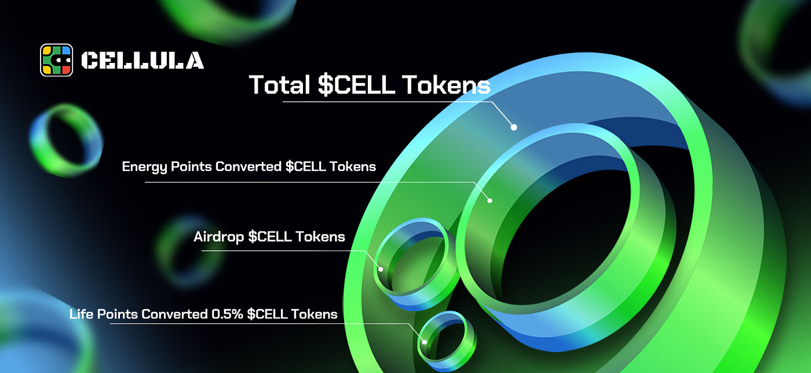

CELL 代币是 Cellula 生态系统的核心资产，在代币生产之前，有一下三种方式可以获得CELL代币。

1. 通过为 BitLife 充电获得能量点，后续兑换CELL代币，每5分钟会产生 101962.08 能量点，按 BitLife 持有者的当前算力份额分配给每个用户。
2. 可以通过完成任务和邀请好友获得Life积分，后续可以分享 0.5% 的 CELL 代币。

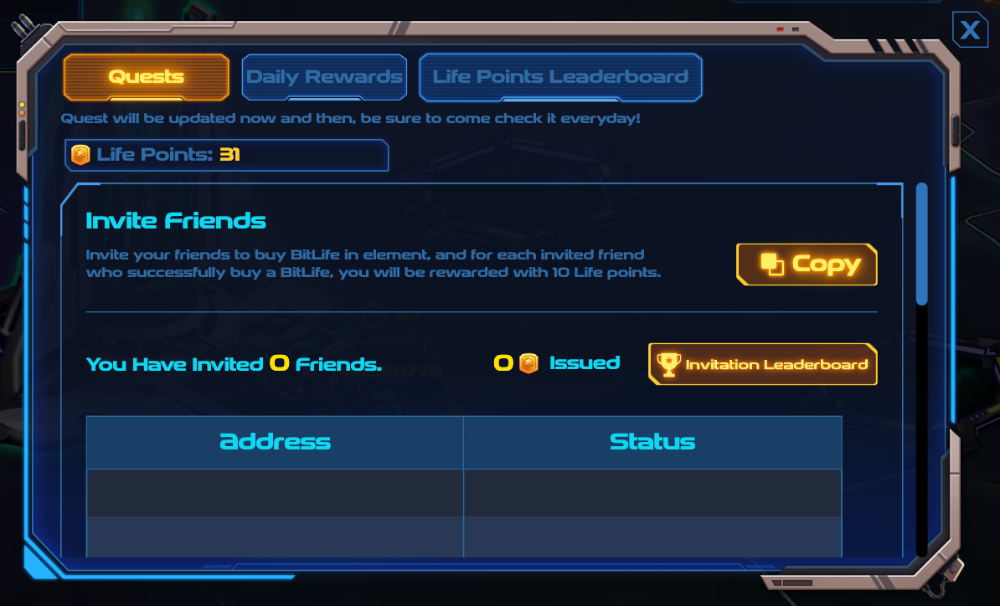

1. 参与Cellula与不同合作伙伴发起的进行空投活动，活动列表如下：

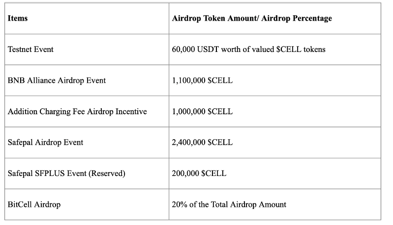

在代币生成后，除了可以对BitLife充电进行挖矿获取CELL代币之外，还可以将CELL代币存入质押池中，获取质押奖励。质押池只有BitCell NFT的持有者才有资格创建，池中质押的CELL代币越多，获得的质押奖励比例则越高，最终奖励的CELL代币将由质押池创建者按照一定规则在池创建者，BitCell NFT 质押者和 CELL 代币质押者之间进行分配。

CELL代币也会被用作支付协议中的费用，比如mint BitLife和为BitLife充电，这样会产生对CELL代币巨大的消费需求，同时代币持有者可以投票决定治理事项，新资产的发行也需要cell代币参与Fair Launch。

站在项目方的角度，mint BitLife的铸造费用会作为项目方收入，覆盖团队的日常运营费用，使团队能够维护项目正常运营。而充电的费用则作为国库收入，这部分资金将用在扩展生态系统，注入流动性，激励计划等，再投资于项目当中，形成一个正向的生态循环。

## 参与方式

目前，3x3 BitLife的铸造已经停止，一共完成铸造了150w+BitLife，新用户可以在 NFT 市场中进行 BitLife 的二级交易，购买BitLife并进行充电挖矿。

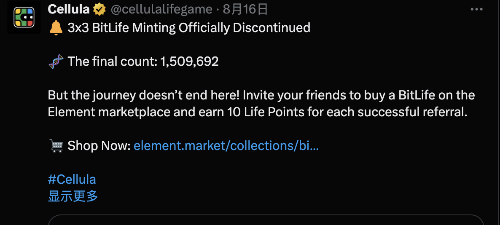

在后面的RoadMap中，Cellula将引入矿机制造商的角色，这些制造商将通过基于代币质押量、销售渠道、社区规模和影响力等标准建立一个准入机制来选出。这些制造商将负责铸造和销售 4x4的BitLife，并且铸数量将受到其质押代币数量的限制。

停止 3x3 BitLife 的铸造以及引入矿机制造商角色将限制网络总算力的无序增长，为 BitLife 的逐步更新和迭代提供更稳定的预期，新角色的引入也将带来新的博弈，更好地模拟现实世界的比特币生态系统。