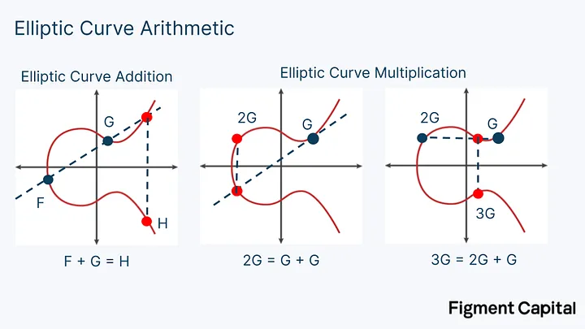

## cysic

上个月，Vitalik Buterin造访香港区块链大会，发布了《Reaching the Limits of Protocol Design》的主题演讲，在这次演讲中，Vitalik再次提到了ZK-SNARKs，它展望了ASIC芯片应用在zk加速的场景，借助ASIC芯片对ZK计算进行硬件加速，能够将以太坊区块的zk证明时间再降低一个数量级。Vitalik之前也曾在多个公开场合强调过ZK技术的重要性，并表示看好ZK硬件加速的前景。

zk硬件加速的讨论在2022年开始兴起，伴随着一众zkrollup的产生，彼时，验证一个以太坊区块的时间需要数小时，成为大规模应用zk的最大障碍，急需通过优化技术手段解决这个问题，硬件加速方案油然而生。

硬件加速项目方和zk项目方构建了一个硬件加速市场，zk项目方通过计算外包的方式，将证明生成的任务外包给硬件加速项目方，硬件加速企业通过在软件层面优化zk算法，并且研发效率更高的专用硬件，最大化并行处理能力，为zk项目方提供saas证明生成服务，或者通过销售硬件来提供加速服务，目前来看，这还是一个纯粹面向项目方的B端市场。

Cysic是ZK硬件加速赛道的领先项目之一，致力于实现实时zk证明生成，Cysic团队认为zk是区块链行业实现终极扩展的最佳解决方案，而实现这一目标的关键在于硬件加速技术。通过引入硬件加速，不仅可以达成Vitalik设想的ZK实时验证，还能显著提升以太坊主网的整体性能。其自研的 FPGA去年获得知名硬件加速 ZKP 技术竞赛平台ZPrize的Beat the Best(FPGA/GPU)奖项。 同时，Cysic通过自研算法和自有的大规模GPU算力，提供强大的zkp生成saas服务。未来，cysic将向c端用户推出自研硬件，打造depin算力网络，进一步释放ZKP 硬件加速市场的想象空间。

想要理解zk硬件加速，我们首先要搞清楚什么是零知识证明？为什么需要加速？

## **零知识证明简介**

ZKP 允许一方（称为证明者）向另一方（称为验证者）证明他们正确地执行了计算，而无需透露除了证明之外的任何其他信息(零知识)。

以上图为例，用一个简单的方法描述就是，现在证明方和验证方都知道一个$F(x)$函数，还知道一个函数值 $y$，然后证明方要给验证方证明一个东西就是我知道一个$w$满足$F(w)=y$，但是我又不能告诉你这个$w$是多少，转而给你一个证明proof，你去通过$F(x)$对应的验证程序验证这个证明，如果验证成功了就表示证明方知道$w$，否则他给不出来这个能验证通过的证明。

在区块链中使用的ZKP主要是 zk-SNARK（“零知识简洁非交互式知识论证”）。他附加了两个属性：简洁性和非交互性。简洁性意味着证明大小很小，通常只有几百个字节，并且可以由验证者快速验证。非交互性意味着证明者和验证者不需要交互，有证明本身就足够了。

目前我们用ZK指代了一切的ZK相关的技术。但是在例如zk-Rollup等应用中，我们更多的是使用了计算可验证性的特征，并不关心其中的零知识特征。

在证明系统的实现中，核心是将程序转换为多项式约束，然后证明并验证多项式约束的成立。如同LLVM编译器一样，这个过程分为前端和后端，前端就是将普通程序转换为多项式约束的过程，程序越复杂，多项式的次数就越高。后端则是证明多项式约束成立的过程，这个过程通常可以描述为 PIOP（多项式交互式预言机证明）+ PCS（多项式承诺方案）。前者可以看作是证明者说服验证者的商定程序，而后者在数学上确保该程序不会被破坏。类比地说，PCS 是枪，PIOP 是子弹。项目可以修改 PIOP 以满足自己的需求，并从不同的 PCS 中进行选择，比如scroll使用的PIOP是Plonk，PCS是KZG，zcash使用的PIOP是Plonk，PCS是IPA。

以plonk算法为例，简单解释其工作原理(为了讲解最基本原理，省去了原始算法中的很多步骤，例如零知识，拷贝约束等)。

## Plonk算法

假设现在证明方和验证方都知道下面这个式子，现在证明方要向验证方证明：我知道一组满足以下式子的取值$(x1,x2,x3,x4,out)$，但不透露具体的值。我们来看如何用plonk算法实现：

$$
(x_1+x_2)⋅(x_3⋅x_4)=out
$$

首先，这个计算可以表达为下面这个门电路：

这个门电路涉及到三个约束：

$$
x6⋅x5=out \\ x3⋅x4=x5 \\ x1+x2=x6 
$$

还记得我们上面提到的，证明系统的第一步，是将程序转换为多项式约束。在plonk算法中，每个门需要表示为Plonkish算术门，就是下面这个多项式约束形式：

$$
q_L \cdot w_a + q_R \cdot w_b + q_M \cdot (w_a \cdot w_b)  - q_O \cdot w_c + q_C = 0

$$

这个式子里的q，就是电路的描述，w就是输入，所有的约束都要统一转化为上面这个表达式，以$x1+x2=x6$为例，可以看到它只有加法，且没有常数项，所以我们不用关心$q_M \cdot (w_a \cdot w_b)$和$q_C$这两部分，可以很容易得出$q_L=1,q_R=1,q_O=1$，因为这个式子可以写成$1 \cdot x1 + 1 \cdot x2 - 1 \cdot x6 = 0$。

同理我们看$x3⋅x4=x5$ ，它只有乘法，所以我们不用关心$q_L \cdot w_a + q_R \cdot w_b$和$q_C$这两部分，可以得出$q_M =1,q_O=1$，因为这个式子可以写成$1 \cdot (x1 \cdot x2) - 1 \cdot x5 = 0$。

我们将所有q和w的取值填到一个表格里：

| $q_L$ | $q_R$ | $q_M$ | $q_C$ | $q_O$ | $w_a$ | $w_b$ | $w_c$ |
| --- | --- | --- | --- | --- | --- | --- | --- |
| 0 | 0 | 1 | 0 | 1 | x6 | x5 | out |
| 1 | 1 | 0 | 0 | 1 | x1 | x2 | x6 |
| 0 | 0 | 1 | 0 | 1 | x3 | x4 | x5 |

此时，红色部分组成的矩阵就描述了电路状态，绿色部分则是所有的输入赋值。对于 Prover 和 Verifier ， 绿色部分就是witness，也就是输入，对 Verifier 保密， 红色部分代表了一个实现双方约定共识的电路描述，表示双方都知道的上面那个式子。

这个表格可以写成以下矩阵相乘的形式，和我们多项式约束的表示方式是一致的：

$$
\begin{bmatrix}
0 \\
1 \\
0
\end{bmatrix}
\cdot
\begin{bmatrix}
x_6 \\
x_1 \\
x_5
\end{bmatrix}
+
\begin{bmatrix}
0 \\
1 \\
0
\end{bmatrix}
\cdot
\begin{bmatrix}
x_5 \\
x_2 \\
x_4
\end{bmatrix}
+
\begin{bmatrix}
1 \\
0 \\
1
\end{bmatrix}
\cdot
\begin{bmatrix}
x_6 \cdot x_5 \\
x_1 \cdot x_2 \\
x_3 \cdot x_4
\end{bmatrix}
=
\begin{bmatrix}
1 \\
1 \\
1
\end{bmatrix}
\cdot
\begin{bmatrix}
out \\
x_6 \\
x_5
\end{bmatrix}
$$

到此，我们已经完成了第一步，将程序转换为多项式约束。

现在证明方需要证明的问题转化成了：我知道一组合理的w赋值，满足以上多项式约束。

实现思路大致如下：

Prover 如实填写表中的w部分，然后把w的每一列转化为多项式，并进行多项式承诺，将结果发送给 Verifier。

> 简单讲一下多项式承诺，假如我现在有一个多项式，我给你一个多项式的承诺c，但是不告诉你多项式具体是什么，只告诉你这个多项式在a处的值是y，再给你一个证明π，现在跟你说，这个值是用刚才的多项式计算的，你是不知道这个多项式的，怎么验证呢？
> 

> 通过最开始给的承诺，可以将承诺c，证明π，a，函数值y代入椭圆曲线的双线性映射公式验证，如果成立，就说明我给你的这个函数值确实是刚才承诺对应的多项式。简单来说就是先给你一个承诺，然后给你一个证明和函数值，在你不知道具体多项式的情况下，验证函数值是不是承诺对应的多项式计算得到的。其过程分为commitment承诺计算和evaluation proof证明计算，前者需要大量的NTT计算，后者需要大量的MSM计算。
> 

Verifier 与 Prover 通过进一步的交互，验证下面的等式是否成立：

$$
q_L(X) \cdot w_a(X) + q_R(X) \cdot w_b(X) + q_M(X) \cdot \left( w_a(X) \cdot w_b(X) \right)  - q_O(X) \cdot w_c(X) + q_C(X)\stackrel{?}{=} 0

$$

注意这个式子的变化，现在式子里所有的项都变成了多项式，比如$w_a$，我们之前只有几个离散的取值，如何把他们转换成多项式呢？

假设$w_a$的取值现在是(3,1,2)，现在要把这三个数转换成一个多项式，我们可以取定义域(1,2,3)，让这个多项式过(1,3)(2,1)(3,2)这3个点，利用拉式插值法或者iFFT，就可以得到一个过这3个点的多项式。anyway，我们只要知道有办法把值转换为多项式就好了，这个转换操作需要大量的NTT计算。

还有一个问题，上面的等式不容易直接证明，我们需要继续将其进行转换，我们知道一个多项式都可以写成其根式表达式，比如$P(x)=x^2−5x+6$ 可以写成$P(x)=(x−2)(x−3)$

同理，上述式子可以写成：

$$
q_L(X) \cdot w_a(X) + q_R(X) \cdot w_b(X) + q_M(X) \cdot \left( w_a(X) \cdot w_b(X) \right)  - q_O(X) \cdot w_c(X) + q_C(X) = Z(x) H(x)

$$

其中根式$Z(x) = (x - 1)(x - \omega) \cdots (x - \omega^{n-1})$
，此时，$H(x)$被称为商多项式。现在的定义域是1，$w$，，，$w^{n-1}$，你不用去明白它，它就像我们上面举的例子中的定义域(1,2,3)，现在的问题最终转化为：存在商多项式$H(x)$满足上述等式，或者说原多项式能被$Z(x)$整除。

这一步的转换可能让人有点挠头，我们再举个具体的例子：

比如上面的例子中我们转换多项式的时候定义域选择的是1,2,3，也就是说这个大的多项式在1,2,3处的值是0，这就是我们需要证明的东西：多项式在1,2,3处的值为0，那么我们定义$Z(x)=(x-1)(x-2)(x-3)$，如果能被$Z(x)$整除，那就说明多项式在1,2,3处的值为0。

下一步，计算商多项式$H(x)$，就是把$Z(x)$挪到左边，此过程需要大量的NTT运算。

最后，计算所有w列和商多项式H(x)的commitment给到验证方，然后验证方随机选一个点$\alpha$，证明方计算所有w列和商多项式H(x)在点$\alpha$处的evaluation proof，这两部分组成完整的证明。

验证方验证的过程如下：验证每个evaluation proof是否和commitment匹配，验证商多项式公式在评估点$\alpha$处是否成立。如果成立那么（几乎肯定地）它在任何地方都成立，因为*α*是随机选择的。

我们再回顾一下整个问题转换的过程：

验证输入输出满足程序→程序转换为多项式→验证输入输出满足多项式约束→验证在定义域上约束多项式是否为0→验证多项式能否被$Z(x)$整除→随机选一个点，证明方提供$w(x)$值，和商多项式的值，验证方验证等式是否成立。根据[Schwartz-Zippel](https://en.wikipedia.org/wiki/Schwartz%E2%80%93Zippel_lemma?ref=research.metastate.dev)引理，随机选一点两个多项式值相同，几乎可以认为两个多项式相等→原多项式能被$Z(x)$整除→原多项式在定义域上为0→输入输出满足程序

这就是plonk算法的基本原理，其主要的计算过程就是MSM和NTT，其复杂度与约束的个数相关，我们这个例子只有3个门电路约束，当我们把这个简单的函数逻辑，变成复杂的zkevm逻辑时，其约束可达百万级别，需要巨大的算力。

## 为什么需要优化

ZKP 的大部分计算开销都来自于本地计算，而且 SNARK 的简洁性通常要求验证时间较短，这意味着 Prover 在生成证明过程中的时间开销非常的大，所以 zk­SNARK 协议中经常会出现这样一种情况：Ver­i­fier 只需要一秒就可以验证证明，但是证明生成时间可能需要花费 Prover 半天甚至一天的时间。

为了使用 ZKP 证明计算，首先要将计算从经典程序转换为 ZK 友好的格式。有两种方法可以做到这一点：要么使用一些证明系统框架编写电路，如Halo2，要么使用领域特定语言 (DSL)，如 Cairo 或 Circom，dsl能够将其转换为中间表达，以便后续提交给证明系统。程序操作越复杂，生成证明所需的时间就越长。

另外，某些操作本质上对 ZK 不友好，需要额外的工作才能实现。例如，SHA 或 Keccak 哈希函数是zkp不友好的，使用这些函数将导致证明生成时间延长。即使对于在经典计算机上执行成本很低的操作，也可能是zkp不友好的。随后证明系统根据编写的电路或者dsl编译的中间表达生成证明，证明生成过程可能因证明系统而异，但瓶颈是相似的。

ZKP 生成中有两个主要的瓶颈：MSM 和NTT。仅这些操作就可以占到证明生成时间的 80-95%，具体取决于 ZKP 的承诺方案和具体实现，

其中，MSM是可预测的内存访问，可以大量并行化，但其需要大量的内存资源。MSM还存在可扩展性挑战，即使在已经并行化的情况下，也可能仍然很慢，因此，虽然 MSM 有可能在硬件上加速，但它们需要巨大的内存和并行计算资源。

NTT是随机内存访问，这使得它们对硬件不友好，而且在分布式基础设施上难以运行，因为其随机访问的特点，如果在分布式环境下运行，其总要访问其他节点的数据，一旦经过网络交互，性能就大大下降。因此，存储数据的访问和数据移动成为一个主要的瓶颈，并限制了 NTT 并行化的能力，加速 NTT 的大部分工作都集中在管理计算如何与存储器交互上。

解决 MSM 和 NTT 瓶颈的最简单方法是彻底消除这些操作。一些新提出的算法，比如 Hyperplonk，对 Plonk 进行了修改，消除了NTT操作。这使得 Hyperplonk 更易于加速，但引入了新的瓶颈，比如计算成本较高的sumcheck协议。还有STARK算法， 它不需要 MSM，但其fri协议引入了大量哈希计算。

Cysic通过自研 FPGA方案，实现了全球最快的MSM，NTT，Poseidon Merkle tree等模块的实现，覆盖了zk计算中最主要的部分，这一套 FPGA方案已经经过了多个顶级ZK项目的原型验证。其自研的SolarMSM 可以在 0.195 秒内完成$2^{30}$规模的 MSM 计算，SolarNTT 则可以在 0.218 秒内完成$2^{30}$规模的 NTT 计算。

那么MSM和NTT具体是什么？

## **MSM 和 NTT**

用于证明生成的时间主要由两种计算任务主导：MSM（Multi-Scalar Multiplication）和 NTT（Number Theoretic Transform）。MSM 主要处理与椭圆曲线上的多标量乘法，NTT 是在有限域上的 FFT（快速傅立叶变换），用于加速处理多项式乘法。同时，使用不同的 PIOP 和PCS 的组合将带来不同的 FFT/MSM 负载比例。以 Stark 为示例，其PCS 使用的 FRI，一种基于哈希的承诺，而不是 KZG 或 IPA 使用的椭圆曲线，因此完全没有 MSM 。表中越靠上意味着需要越多的 FFT 运算，越靠下则需要越多的 MSM 运算。

### MSM

MSM 主要处理与椭圆曲线上的多标量乘法。

将椭圆曲线上的一个点乘以一个标量称为点乘法。将两个点相加称为点加法。点乘法和点加法都会输出椭圆曲线上的一个新点。

椭圆曲线加法可以这样实现：给定任意两个点，我们将他们相连，并找到连线与椭圆曲线的交点，然后找到这个点关于x轴的对称点，这个对称点就是这两个点的和。

要将一个点 G 加到它自身(乘法)，需要在这个点作椭圆曲线的切线，找到切线与椭圆曲线相交的点，然后画一条与x轴垂直的线，这条线与椭圆曲线的另一个交点就是 2G。如图所示，点乘法就是将一个点加到它自身。

这种取多个椭圆曲线点、将它们乘以标量（点乘法）并对它们求和（点加法）以获得椭圆曲线上的新点的操作称为多标量乘法 (MSM)，“桶方法”(Bucket Method)是一种用于加速 MSM 计算的巧妙技巧。点加法计算在计算上开销很小。MSM 的性能问题在于点乘法。在实际的 ZK 证明中，乘以椭圆曲线点的标量非常大。对于每个点乘法，计算将需要数百万次求和，通过Bucket Method，可以并行计算所有的点乘法。

### NTT

NTT 是在有限域上的 FFT（快速傅立叶变换），用于加速处理多项式乘法。

$$
A(x) = a_0 + a_1 x^1 + a_2 x^2 + \cdots + a_{n-1} x^{n-1}

$$

$$
B(x) = b_0 + b_1 x^1 + b_2 x^2 + \cdots + b_{n-1} x^{n-1}

$$

比如上述两个多项式相乘，会得到一个最高2n-1次多项式，如果直接遍历某一项计算，其时间复杂度为$O(n^2)$
，如果两个多项式次数很高，那么计算会非常慢。使用FFT，能够将时间复杂度降低到$O(nlogn)$。如果我们计算一个次数为 100 万的多项式（这意味着多项式中的最高指数为 100 万），则直接计算需要 1 万亿次运算。使用 NTT 计算相同的多项式只需要 2000 万次运算——速度提高了 50,000 倍。然而，即使使用此技术，大型 NTT 的处理时间仍然是 ZKP 生成的主要瓶颈。

## 如何优化

尽管软件优化非常重要且有价值，但它们有局限性，要充分优化 ZKP 性能，必须使用硬件加速。就像ASIC矿机称霸btc挖矿市场，GPU称霸当时的pow以太坊。那么问题是：使用高度优化的 MSM 和 NTT 算法加速 ZKP 生成的最佳硬件是什么？

上述加速技术可以在多种硬件技术上实现：GPU、FPGA 或 ASIC。cysic在这几个技术方向上均进行了布局，并且达到了领先地位。

我们首先对比一下这几种硬件：

首先举个简单的例子来说明他们之间开发上的区别，比如现在要实现一个简单的并行乘法，在GPU上，利用CUDA SDK提供的api，可以像写原生代码一样开发，就可以获得并行的能力，在FPGA上，需要重新学习硬件描述语言，用这种语言来控制硬件级别的连接，实现并行算法，在ASIC，在芯片设计阶段，硬件层面直接固定好晶体管的连接排布，之后无法再修改。

|  | GPU | FPGA | ASIC |
| --- | --- | --- | --- |
| 架构 | 并行处理核心 | 可编程逻辑单元 | 定制硬件逻辑 |
| 灵活性 | 高 | 中 | 低 |
| 性能 | 高（并行任务） | 高 | 极高（特定任务） |
| 功耗 | 高 | 中 | 低 |
| 开发成本 | 低 | 中 | 高 |
| 应用场景 | 图形渲染、机器学习、科学计算 | 通信设备、工业控制、原型设计 | 比特币挖矿、消费电子、专用设备 |

CPU为了实现最大的灵活和通用，芯片中的很大一部分芯片面积用来提供控制功能和各级缓存，导致其并行计算能力较弱。

在GPU当中，用作运算的芯片面积比例大大提高，能够支持大规模的并行处理，GPU已经非常普及，例如nivida cuda sdk等库可帮助开发人员利用 GPU 的并行性，而无需了解底层硬件，降低开发成本，通过CUDA SDK可以封装CUDA ZK库，加速常见 ZK 操作（如 MSM 和 NTT）。

在GPU方面，cysic通过整合社区GPU资源，快速构建了基于GPU的高效ZK算力解决方案。随着各种新型ZK Proof System不断诞生，Cysic基于自研 CUDA加速SDK对其进行了适配，配合强大的GPU算力，为ZK项目提供全网最强大，效率最高，使用最方便的ZK硬件加速服务。目前，Cysic GPU算力网络已经链接了数十万张顶级算力显卡，同时Cysic CUDA SDK比最新的开源框架提速了50%-80%以上。

而到了FPGA，它是由大量小型处理单元组成的阵列，对FPGA进行编程要使用硬件描述语言对硬件进行编程，硬件描述语言描述的逻辑可以直接被编译为晶体管电路的组合。所以FPGA实际上直接用晶体管电路实现用户的算法，没有通过指令系统的翻译。FPGA价格大约是GPU的三分之一，同时能效可以比GPU高出十倍以上。这种显著的能效优势部分原因在于GPU需要连接到主机设备，而主机设备通常消耗大量电力，但是FPGA最大的问题是很少有开发人员有编程经验，对于 ZK，组织一个既拥有密码学专业知识又拥有 FPGA 工程专业知识的团队极其困难。

Cysic的自研FPGA方案，实现了ZK硬件加速的原型验证，证明了Cysic团队强大的供应链管理能力，ZK密码学算法和硬件结合的实现能力，并且用实测数据证实了硬件加速是迈向ZK实时证明的最可行的技术方案。

而ASIC则相当于完全用硬件来实现某个程序，一旦设计完毕，硬件无法更改，ASIC能够执行的程序自然也无法更改，只能用作特定任务。对于一个固定的程序，用ASIC实现一定是最强大、最节能的。但ZK 正在快速发展，而 ASIC 需要 1-2 年和 1000-2000 万美元才能生产，因此必须等到 ZK技术足够稳定才能够投入，以至于生产的芯片不会很快过时。

在完成了FPGA层面的验证之后，Cysic进入了自研**zk DePIN芯片/设备**阶段。通过自研芯片，构建极致高效的ZK-DePin硬件算力解决方案**。**比特币以太坊网络的成功告诉我们，一个稳健的网络离不开大量社区节点的支持。一个稳健的算力网络同样也是如此。为了引入更多的社区用户可以为ZK项目们提供硬件算力的支持，同时考虑到不同ZK应用场景所需要的不同的算力需求。Cysic最近设计和即将发布两款ZK硬件产品，ZK Air和ZK Pro，

ZK Air的大小和充电宝/笔记本电脑电源接近。作为轻量级便携式**zk DePin**设备，用户可以通过Type-C接口，将ZK Air连接到笔记本电脑，iPad，甚至手机上，为ZK Proof提供加速服务。ZK Air的算力能力大于顶级消费级显卡所提供的算力，可以帮助加速小规模的ZK证明生成任务。同时也可以辅助ZK项目开发人员进行本地及时的生成证明，帮助开发及时发现问题和进行系统调优。通过ZK Air，普通用户也可以为某些ZK项目提供算力支持，获得系统算力奖励。

ZK Pro 的设计和传统的矿机类似，旨在最大程度的加速ZK证明生产，为用户实时计算ZK证明。ZK Pro的单台算力可以达到一台连接了数块最高级别的消费级显卡的GPU服务器的加速水平。ZK Pro适用于大型ZK项目，例如zkRollup，zkML等场景。

通过自研的 ZK Air和 ZK Pro，在社区的支持下最终组建可靠稳健的**ZK-DePIN网络**。目前 ZK Air和 ZK Pro的研发工作正在加速进行中。按照现阶段的产品规划和设计方案，该产品预计2025年开发发售。

## 终极目标Cysic Network

除了自有算力之外，Cysic也在积极的拥抱社区的力量。通过构建 Cysic Network，充分的整合和调度社区资源。Cysic Network是链接ZK项目方，算力提供商，社区验证者的桥梁。基于芯片算力+社区GPU算力，整合社区海量验证节点，最终构建Cysic Network为全行业提供可信的一体化算力+验证网络。

从算力需求方看，ZK项目方通过接入Cysic Network，可以及时地获得最可靠稳健的算力。从算力提供端看，Cysic Network整合 Cysic自有GPU，Cysic zk DePIN设备算力和第三方算力(第三方GPU/社区购买的Cysic zk DePIN设备等)，构建完备可靠稳定的算力网络。作为算力提供商，接入Cysic Network，可以获得最高的算力收益分成。

除此之外，作为普通用户，除了可以购买zk Air/Pro为Cysic Network提供算力支持外，也可以使用自己的电脑/手机，作为社区验证者来验证ZK Proof生成的正确性(正如我们在第一部分提到的Verifier只需要很小的算力就可以验证Proof的正确性)，为社区添砖加瓦，并获得验证者奖励。

作为行业领先的 ZK硬件加速方案提供商，Cysic同时积极参与ZK技术生态建设。基于多年的积累和强大的密码学/硬件团队，Cysic从去年开始加入了ZPrize平台，是目前的设计者以及裁判之一。ZPrize是目前技术社区中质量最高，技术最为深厚的硬件加速ZKP比赛技术竞赛平台，奖金一度高达数十万美金。

## reference

[https://medium.com/amber-group/need-for-speed-zero-knowledge-1e29d4a82fcd](https://medium.com/amber-group/need-for-speed-zero-knowledge-1e29d4a82fcd)

[https://figmentcapital.medium.com/accelerating-zero-knowledge-proofs-cfc806de611b](https://figmentcapital.medium.com/accelerating-zero-knowledge-proofs-cfc806de611b)