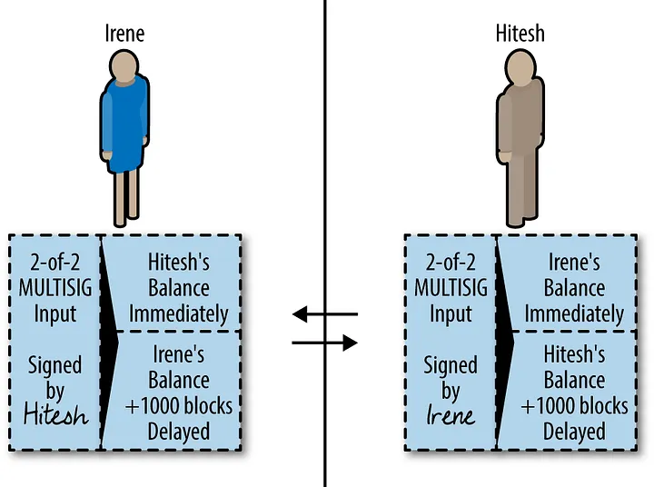
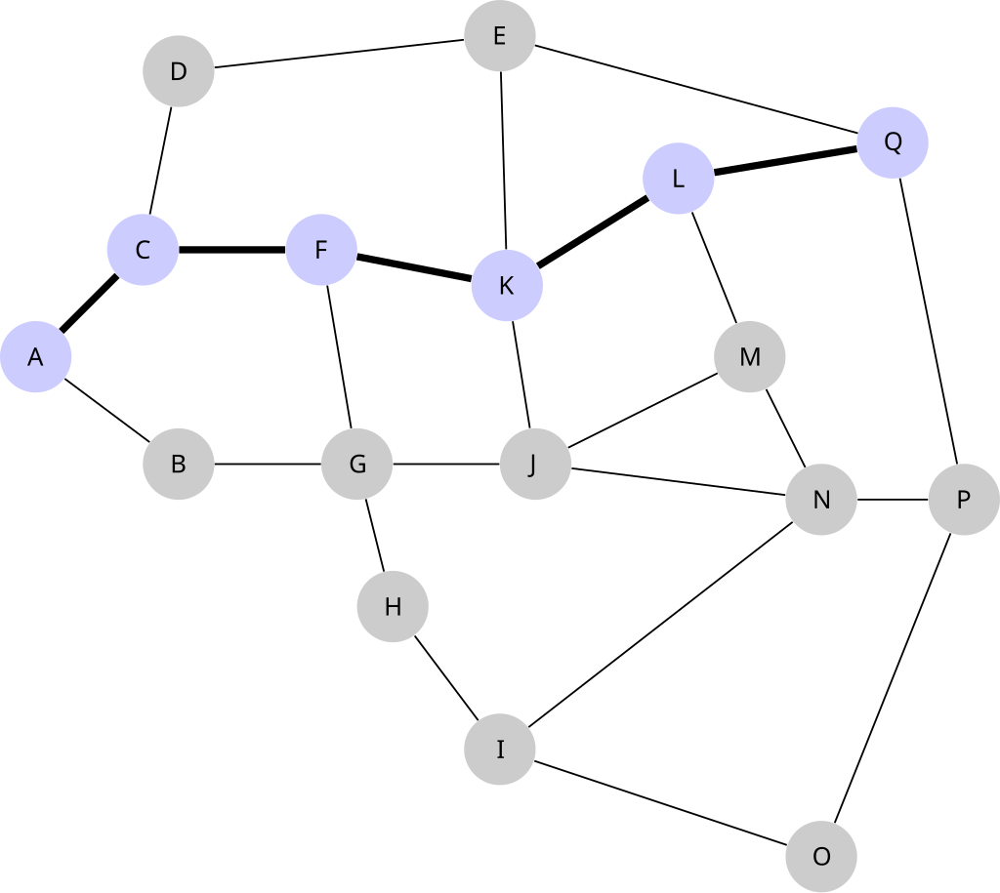

## 闪电网络的前世今生-为什么ckb需要闪电网络

闪电网络（Lightning Network）作为比特币的扩容层，旨在解决比特币区块链因扩展性限制而面临的挑战。比特币网络虽然确保了其安全性和去中心化，但有限的TPS导致了网络拥堵和高昂的交易费用，同时交易需要等待多个区块确认，这一过程可能耗时数十分钟之久。为了应对这一问题，闪电网络通过创建双向支付通道，将交易从链上转移到链下进行结算，从而显著提升交易速度和降低成本。闪电网络的核心目标是实现快速且廉价的小额支付，尤其是满足即时支付的需求。

闪电网络技术的发展十分曲折，其技术基础是支付通道，这一概念早在比特币诞生时就已提出，并在此后的发展中逐步改进，双向支付通道和支付网络构想的提出，最终促成了闪电网络的诞生。在2015年，随着比特币扩容讨论的深入和技术上的不断突破，基于HTLC（哈希时间锁）的完整技术方案被提出，并有项目方实现了这一技术方案。2016年，多个实现项目方达成了一个叫做“BOLT”的闪电网络协议规范（Basis of Lightning Technology），成为了今天闪电网络实际上的标准。针对BOLT标准，有几个著名的实现，比如lightning labs的LND，blockstream的c-lighting等。

CKB作为一条POW公链，虽然在性能和确认时间方面相比BTC已有所改进，但面对小额和即时支付的需求时，仍需进一步提高交易速度并降低成本。因此，闪电网络对CKB而言仍是重要补充。它能增强CKB在小额支付场景中的竞争力，在保持去中心化和安全性的同时，更好地满足用户的支付需求。由此，Fiber诞生了，Fiber是一个基于CKB之上的闪电网络实现，Fiber之于CKB，就像LND之于bitcoin，借助Fiber，CKB上的原生代币和任何RGB++资产，都可以利用闪电网络的机制，在Fiber上实现快速、低成本和去中⼼化的⽀付和点对点交易。

通过利用 CKB 的强大智能合约模型，Fiber可以实现多资产支付和网络互操作的功能。CKB 独有的 Cell 模型和 RISC-V 指令集虚拟机，赋予了 UTXO 模型更强的能力。不仅允许开发者轻松实现多资产支持，还能够利用抽象账户和 covenant 等特性，为用户提供多样化的支付选择，在Fiber中用户可以使用CKB或者任何RGB++资产进行支付。此外，CKB 的合约模型能够与比特币闪电网络无缝互操作，支持CKB和RGB++资产的跨链支付和资产转移。通过这些创新特性，CKB 为去中心化应用提供了更广泛的应用场景和扩展可能性，进一步推动了区块链生态的互联互通。

[](https://sxan03wvtz.feishu.cn/space/api/box/stream/download/asynccode/?code=NzIzNDdkM2RiM2RhY2Y2OTI5ZTYwODE1MTI3YmQ4NmFfUG9PbXhzYkU0T1V6MXl0SXhDVlo4TERldjk0WldGazZfVG9rZW46UUQ1WmJyTEptb2pkVmt4RUNuN2NIUm11blJmXzE3MjQ5MDMzNDA6MTcyNDkwNjk0MF9WNA)

根据mempool当前的闪电网络数据，通道容量已达到约 5100BTC，折合 3.03 亿美元，闪电网络的节点数量约为 12790 个，维护着 48665 条支付通道，这些通道支持了闪电网络的全球小额支付需求，虽然通道的数量在下降，但网络的容量基本维持不变，使得通道的平均容量不断增长，支付能力越来越强。在spendmybtc.com上，可以看到使用闪电网络能够购买衣服，礼品卡等一系列商品，随着闪电网络继续扩展，其作为小额支付解决方案的重要性变得愈加明显。

要理解Fiber闪电网络的运作，首先需要理解支付通道的机制，以及构成支付通道基础的 HTLC。

## fiber四大机制-支付通道，HTLC，路由，watchtower

fiber作为ckb上的闪电网络实现，其技术原理与比特币闪电网络基本一致，其总体架构包括以下四个核心模块：

## 支付通道

支付通道的本质是将链上的多笔交易转到链下进行，无需等待区块链确认，并在交易完成后将最终的状态提交到链上，链下的交易都是即时完成的，且无需支付高昂的链上交易费。 

当开启通道时，参与方共同构建一个多签地址，双方各存入一笔资金，存入的资金就是通道中双方各自的余额。接下来，双方进行多笔转账交易，比如Alice和Bob一开始各存入1btc，alice要向bob转账0.5btc，那么双方就共同构造一笔”承诺交易”，花费多签地址并生成两个输出：给Alice0.5btc，Bob1.5btc，这笔交易并不需要上链。

接下来Alice还要给Bob转0.1btc，那么双方再构造一笔”承诺交易”，花费多签地址并生成两个输出：给Alice0.4btc，Bob1.6btc，此时转账结束，双方可以沟通关闭通道，将刚才的最后一笔交易上链完成结算。

当通道中的两方希望更新通道的状态时，他们会各自创建一笔新的承诺交易。这笔承诺交易代表了当前通道的资金状态，即每一方在通道中的余额。这笔交易会包含两个输出，一个是给自己的资金，另一个是给对方的资金。关键在于，双方生成的承诺交易在结构上是不同的，且每一方都会构造对自己最有利的交易版本并签名后交给对方。

一旦某一方试图提交旧的承诺交易，另一方就可以利用手中的撤销密钥将全部资金转移到自己控制的地址，甚至使得作弊方损失通道中的所有资金。

通过这个过程可以发现，通道主要的成本就是开启和关闭通道，中间的交易都不需要上链，双方的交易越频繁，这种交易方式的优势就越大，在实际应用中，通道可以一直保持打开的状态，

上述流程存在几个明显问题。首先，如何确保旧的承诺交易不被提交？例如，Alice在第二笔交易后可能直接将第一笔交易上链，导致Bob少收0.1btc。其次，由于双方各持有一笔相同的承诺交易，当一笔交易上链时，其他人无法分辨究竟是谁发出的。因此，我们需要一种机制来作废旧的承诺交易，并能够区分交易发起方。

解决方案是让双方生成不对称的承诺交易，如下图所示：

假设Hitesh和Irene已建立一个通道，准备开始发送承诺交易进行转账。此时，双方不再共同构造一笔承诺交易，而是各自创建一笔不同的承诺交易。



Hitesh 收到由 Irene 签名的交易有两个输出：一个是给 Irene 的即时转账，另一个是给自己的转账，但附加了 1000 个区块的时间锁。

Irene 同样收到由 Hitesh 签名的承诺交易，输出相反：一个是给 Hitesh 的即时转账，另一个是给自己的带时间锁的转账。

双方各自持有对方签名的承诺交易。任何一方都可以随时签名并广播自己持有的交易。这样做会导致对方立即获得资金，而自己需等待 1000 个区块后才能使用资金。这种机制实现了交易发起者的区分，我们仍需在生成新的承诺交易时废除旧的交易。

通过给予各方一个 “撤销密钥（revocation key）” ，可以让试图发送较早的承诺交易进行欺诈的一方收到惩罚，达到废除旧交易的目的。

具体的实现机制是在上述的时间锁条件中增加一个条件，使其可以被通道的另一方使用，如果通道的另一方持有撤销密钥，那么就可以将两个输出都花费掉，欺诈的一方将血本无归。

[](https://sxan03wvtz.feishu.cn/space/api/box/stream/download/asynccode/?code=ZDc5N2I5ZTBiZjkxYTcwMjYwN2U3OTBmMTE1ZjU5MWJfcTFwUllUZ1ljOVZzZTJuZThtSVp1MFVjY1RQd1B4RlJfVG9rZW46Wkk2WWJWMzlwb2M3YmZ4UXZyUmNVd216bjlkXzE3MjQ5MDMzNTY6MTcyNDkwNjk1Nl9WNA)

假设 Irene 向Hitesh发起两笔转账的承诺交易，第一笔转0.5btc，第二笔转0.1btc，注意上图中第一笔交易的时间锁中增加了revocation key1作为花费条件，在进行第二笔转账前，双方互相交换撤销密钥，随后进行第二笔转账。如果 Hitesh 希望以通道最后的余额来结算，而 Irene 想作恶，不转第二笔的0.1btc，他把自己第一笔承诺交易签名后广播到网络中，尝试在1000个区块后取走0.5btc，但这笔承诺事务的撤销密钥revocation key1已经给了 Hitesh，如果Hitesh发现这笔承诺事务上链了，他可以在 1000 个区块的时间把通道内的所有钱都拿走，Irene将损失他的全部资产，达到了惩罚的目的。

假设 Irene 和Hitesh 要更新通道的状态，创建一笔新的承诺事务，此时先把上一笔承诺事务的撤销密钥交给对方，如果 Hitesh 希望以通道最后的余额来结算，而 Irene 看着觉得更旧的状态对自己更有利，她可以尝试把自己手中的上一笔承诺事务签名后广播到网络中，但这笔承诺事务的撤销密钥已经暴露给了 Hitesh，如果Hitesh发现这笔承诺事务上链了，他可以在 1000 个区块的时间把通道内的所有钱都拿走，Irene将损失他的全部资产，达到了惩罚的目的。

## HTLC

上面讲的支付通道机制仅适用于两方之间的交易。然而，闪电网络支持多跳支付，即通过中转节点实现没有直接建立通道的两方之间的转账。这种多方交易需要使用哈希时间锁定合约（HTLC）。

HTLC 是一种具有两个支出分支的锁定脚本，可以实现一方向另一方购买一个秘密值。举例来说，如果 Bob 想从 Alice 那里购买一个秘密值，Alice 会提供该秘密值的哈希值 H。Bob 可以向 Alice 提供如下 HTLC：

```
Alice 可通过揭晓 H 的原像以及自己的签名花费这笔资金
24 小时后，Bob 可独自取回资金
```

当Alice花费第一个分支时，Bob就获知了H的原像（秘密值）。如果Alice不愿揭晓H的原像，24小时后Bob可自行取回资金。

```
Alice -- HTLC --> Bob -- HTLC --> Carol -- HTLC --> Daniel
```

假设Alice要向Daniel付款1个btc，但是他们并无直接的通道相连，Alice通过网络拓扑发现它可以通过与他建立通道的Bob和Carol向Daniel付款，Alice首先向Daniel请求一个哈希值，Daniel用秘密值R生成一个哈希值交给Alice，然后在每条通道上创建一个使用相同哈希值的HTLC：

Alice给Bob的HTLC如下：Alice 会给 Bob 支付 1.002 btc，只要他能在 10 个区块内交出秘密值 R，否则这些钱会返回给 Alice。

Bob收到后，在自己跟 Carol 的通道中创建了一个同样的 HTLC：Bob 会给 Carol 支付 1.001 btc，只要他能在 9个区块内交出秘密值 R，否则这些钱会返回给 Bob。

如果Carol 想获得这笔钱，就就需要秘密值 R 来解锁这个 HTLC，一旦她这么做Bob就会知道这个 R，因此也能解锁 Alice 的 HTLC，拿到 1.002 btc。如果 Carol 没法找到这个秘密值 R，Bob 和 Alice 都能在时间锁解锁后拿回自己的钱。

Carol如法炮制，在Daniel的通道中创建了一个HTLC：给 Carol 支付 1btc，只要他能在 8个区块内交出秘密值 R，否则这些钱会返回给 Carol

当 Daniel 收到 Carol 提供的 HTLC 后，为了领取 HTLC 资金，他会揭示对应的秘密值R。这一过程在每条通道中重复，每一个中转节点都揭示秘密值，领取HTLC中的资金，这样便实现了多跳交易。

每个中间节点（Bob、Carol）在一条通道中接收 HTLC，并在另一条通道中提供 HTLC。两个 HTLC 面额的差值即为该节点在支付成功时获得的转发费收入。

整个流程实现了 Alice 向 Daniel 支付 1 BTC，而无需在两者之间开设一个直接相连的通道。在整个支付链条中，每个参与者都无需信任其他人，同时他们还通过提供中介服务赚取了 0.001 BTC 的费用。即使支付在某个环节出现了问题，也不会有人遭受损失，因为资金仍然被锁定在那里，一旦超过设定的时间就可以取回。

未来Fiber将借助 PTLC（Point Time-Locked Contracts）技术，增强交易的隐私性和安全性，

HTLC 的一个主要问题是整条支付路径使用同一个原像。由于收款方会随机生成原像，不同的交易使用相同原像的可能性极低。如果某个实体控制了支付路径上的多个节点，它可以通过比较这些节点的输入和输出来获取一些的交易信息，推测出付款方和收款方的身份，这样会导致类似洋葱路由这种为保护隐私的机制失效。

我们以一个更长的路径为例：

```
Alice --> Bob --> Carol --> Daniel --> Eve
```

假设 Alice 想向 Eve 发送一笔付款，但她们之间没有直接通道。Alice 在网络中寻找一条路径，最终选择了经过 Bob、Carol 和 Daniel 的路径。但是Alice 并不知道 Bob 和 Daniel 的节点实际上属于同一个实体。

由于所有 HTLC 都使用相同的原像，Bob 和 Daniel 的控制者可以判断出这些交易源自同一笔支付。他能确定 Carol 只是一个中间节点，但无法确定 Alice 就是付款方或 Eve 是收款方。这是因为 Alice 之前可能还有其他节点，而 Eve 之后也可能有更多节点。

然而，路由路径的延长会降低付款的可靠性：节点可能离线，通道内地流动性可能不够，每增加一个中间节点都会显著提高出错的可能性。可能认为一条路径上不太可能存在超过3个中间节点，控制者也可能识别出Alice和Eve是移动节点（因其频繁离线且IP地址经常变化）。这类节点通常仅作为收付款方，不负责路由付款。基于这些判断，可以推断出Alice很可能是付款方，而Eve是收款方。

PTLC 基于椭圆曲线密码学来实现支付路径上的隐私，它要求每条通道中的支付都使用不同的私钥，使这些支付完全无法关联，从而避免支付路径上的中间节点窃取或追踪支付路径的信息。相比于传统的 HTLC 机制，PTLC 提供了更高的隐私性和安全性，结合洋葱路由，PTLC能够进一步增强隐私支付的能力，在洋葱路由中，每一跳的路由信息都被加密，只有到达该节点时才能解密，这意味着中间节点只能看到上一跳和下一跳的路由信息，而无法得知整个支付路径。通过将 PTLC 与洋葱路由相结合使得 Fiber 成为满足隐私支付需求的理想选择，在隐私支付领域有强大的潜力。

## 路由



在交易双方没有直接建立通道的情况下，需要中转节点进行转账，这种多跳路由机制增强了网络的灵活性和覆盖范围，发送方需要了解所有的公共节点和通道的状态，而所有公开的通道即网络的拓扑图是完全公开的，任何一个节点都可以从其它节点处获得该节点所掌握的拓扑信息。

整个网络的状态是不断变化的，fiber会使用 Dijkstra 最短路径算法需找一条最优路径，随后在路径上的每个节点都创建相应的 HTLC 合约，将资金依次转移到路径上的各个节点，完成最终交易。

## watchtower

我们在支付通道中提到，当一方提交旧的承诺交易时，另一方可以使用撤销密钥去惩罚作恶方，但这是一种被动的机制，需要去实时监控对方的交易，如果我们的节点长时间离线，可能无法发现对方的作恶行为。这就是 watchtower 的作用——它是网络中的监控者。Watchtower 负责监控链下支付通道的状态，检测通道中的异常活动。一旦发现异常，它会立即向区块链网络广播最新的通道状态，从而确保通道和资金的安全。

对于一笔旧的承诺交易，用户可以提前用撤销密钥创建惩罚交易并签名发送给watchtower，让其帮助自己监控链上交易，一旦发现旧的承诺交易在链上发布，让watchtower替代他去发送惩罚交易惩罚作恶方，这笔惩罚交易可以用对应承诺交易的id进行加密，这样只有承诺交易上链发布可以获取交易id后，watchtower才能够根据交易的id进行解密，然后将惩罚交易广播到区块链网络上。同时用户还要向watchtower发送这笔承诺交易的前半部分交易 ID，告诉watchtower需要监控哪笔交易，其会监控区块和内存池，寻找任何交易 ID 的前半部分与用户提供的ID相匹配的交易，一旦发现他就可以拿到完整的交易ID，可以对惩罚交易进行解密然后发送了。

## 跨链原子支付实现

利用HTLC的能力，还可以实现跨链支付，HTLC能够实现原子交换来确保交易要么全部执行，要么完全不执行，不会出现部分转账的情况。这种方式能够将fiber与比特币闪电网络连接起来，我们可以直接在fiber中支付ckb及rgb++资产，在btc闪电网络上接收比特币。

这种方式不需要信任第三方即可在不同区块链网络间实现交易，HTLC同样可以与现有的比特币支付通道网络直接无缝集成，不需要任何修改。

假设Alice在ckb上运行fiber节点，Bob在btc上运行闪电网络节点，Alice想用ckb向bob支付btc，

Alice可以通过跨链中转服务商Ingrid实现这笔交易，Ingrid会分别在CKB和Bitcoin上运行一个fiber和一个btc闪电网络节点。

如果Bob 想在Bitcoin上接收X个BTC，Alice会与Ingrid协商兑换比率，Alice在CKB中向Ingrid发送Y+F个CKB，由Ingrid将在Bitcoin上向Bob发送X个BTC，Ingrid会保留F个CKB作为费用。

借助HTLC，Bob为了在比特币上获取资金，必须向Ingrid揭示原像。一旦Ingrid获取原像，他就可以使用它来解锁CLB上Alice的资金。两笔交易是原子性的，意味着要么两笔都完成，要么都不完成，相比其他跨链的方式，这种方式提供了极强的安全性。

## 比特币闪电网络对比

我们在通道中提到惩罚机制被称为 “LN-Penalty”，它也有一个明显的缺点：为了保证惩罚能力，节点必须保存过去每一次更新通道的状态：承诺交易的id和对应的撤销密钥，这会造成非常大的存储陈本。

早在 2018 年，比特币闪电网络就提出了一种叫做 “eltoo” 的方案，但其需要比特币进行协议升级，支持SIGHASH_ANYPREVOUT才能实现。其基本思路是让新的承诺交易总能花费较旧的承诺交易，   用户只需保存最新一笔承诺交易及即可，即使对方尝试欺诈，也只需发布最新一笔承诺交易，便可使用最新状态来结算通道。但是SIGHASH_ANYPREVOUT 还未激活，导致这个方案迟迟不能落地。

而fiber实现了Daric协议， 与eltoo类似，Daric 修改了撤销密钥的设计，允许同一个撤销密钥适用于多个通道状态。通过使用类似于 SIGHASH_ANYPREVOUT 的签名类型，撤销密钥不再绑定于特定的一笔承诺交易，可以匹配任何满足条件的历史状态，这样使得通道各方只需要存储最新的撤销密钥，从而大幅减少了存储需求。

在网络安全性方面，去年10月份，比特币安全研究员 Antoine Riard 通过一封邮件深入探讨了闪电网络通道所面临的资金丢失风险，他指出闪电网络的通道可能会受到一种替代循环攻击（Replace-by-Fee Cycle Attack）的威胁，他本人甚至宣布他将从即日起停止参与闪电网络的开发工作，而到目前为止比特币闪电网络尚未有根本的机制解决这个问题，安全性已经成为了一个巨大的风险点。

替代循环攻击是一种利用比特币交易池中的交易替换规则来进行攻击的手段，未确认的比特币交易能够通过支付更高的费用来替换，在某些场景下会产生安全问题，而CKB针对交易替换的安全问题对交易池进行了改进，被替换的交易会被保存下来，持续地再次尝试放入交易池。因此，CKB之上构建的Fiber并没有这种安全风险。

相较于比特币闪电网络，fiber除了能够实现多资产跨链支付这一强大功能外，最重要的一点就是其通道内支持转移ckb和任何RGB++资产，闪电网络用比特币作为支付手段，而比特币作为一种价值存储，其实并不适合用作支付，而在Fiber上利用RGB++发行的稳定币资产，非常适合闪电网络小额支付的场景。

## 更多应用场景

Fiber实现的ckb和RGB++的多资产功能使得它在链下即时支付场景中展现出极大的潜力，利用 RGB++发行的稳定币，Fiber 可以大幅降低支付的波动性风险，从而更适合日常小额支付需求。对于用户来说，在 Fiber 网络中使用稳定币进行链下支付，不仅可以享受闪电网络带来的快速与低成本的优势，还可以避免传统加密货币价格波动带来的不确定性。

未来Fiber还计划借助 PTLC（Point Time-Locked Contracts）技术，增强交易的隐私性和安全性，HTLC 的一个主要问题是整条支付路径使用同一个原像。由于收款方随机生成原像，不同的交易使用相同原像的可能性极低。如果某个实体控制了支付路径上的多个节点，它可以通过比较这些节点的输入和输出来获取一些的交易信息，推测出付款方和收款方的身份，这样会导致了类似洋葱路由这种为保护隐私的机制失效。

PTLC 基于椭圆曲线密码学来实现支付路径上的隐私，让每一条通道中的支付都需要揭晓不同的私钥，从而让这些支付完全无法关联起来，从而避免支付路径上的中间节点窃取或追踪支付路径的信息。相比于传统的 HTLC 机制，PTLC 提供了更高的隐私性和安全性，使得 Fiber 成为满足隐私支付需求的理想选择，在隐私支付领域有强大的潜力。

闪电网络还有一个主要痛点就是是流动性管理问题，每个支付通道的容量是有限的，这意味着当一方的额度耗尽时，无法再进行支付，除非重新注入资金或打开新的通道。特别是在网络中的复杂支付路径中，如果中间节点的流动性不足，支付可能会失败。其实流动性分为两个方面，入账流动性和出账流动性**，**

入账流动性是指一个节点在闪电网络中能够接收资金的能力。换句话说，它代表了其他节点可以向该节点支付的金额。这种流动性与通道的另一方持有的资金量直接相关。

出账流动性是指一个节点可以向其他节点支付的能力。它代表了你在支付通道中可以发送的金额，与通道中你所持有的资金量直接相关。

假设你在闪电网络上开通了一个支付通道，双方各将 1 BTC 存入该通道，如果想向对方支付2BTC，然而自己的额度只有1BTC，无法支付，这就是出账流动性不足；如果第三方想经过这个通道转2BTC过来，由于这个通道对方的额度也只有1BTC，也无法收款，这就是入账流动性不足。即时收款也会对通道流动性有一定要求，这可能是闪电网络体验最不好的一点。

为了应对流动性问题，Fiber 计划与 Mercury layer 合作，提出一种创新的解决方案。Mercury layer 是一个非托管的链下 UTXO 转移方案，它通过实现状态链（Statechain）机制，使 UTXO 能在链下安全转移。这一机制让用户无需依赖中心化第三方，就能安全地将 UTXO 转移给其他用户，而且不需要在 BTC 链上直接交易。

当用户的支付通道内额度耗尽时，传统方法需要用户重新为通道注资或关闭旧通道并开启新通道。注资可通过"潜水艇互换"等机制实现：当出账流动性不足时，用户在BTC链上向互换服务中介方转账，中介方随后通过闪电网络通道向用户的支付通道注入等值流动性。然而，这种方式最大的缺点是需要在BTC链上进行交易，不仅需要支付高昂费用，还需要忍受较长的链上等待时间。

而通过 Mercury layer，可以实现类似潜水艇互换的机制。不同之处在于，交易不在 BTC 链上发生，而是用 Mercury layer 实现链下安全转移 UTXO，再通过闪电网络为通道注入等值流动性，与 BTC 链上互换相比，使用 Mercury layer 支付能够在保证安全性的前提下提高效率并降低成本。