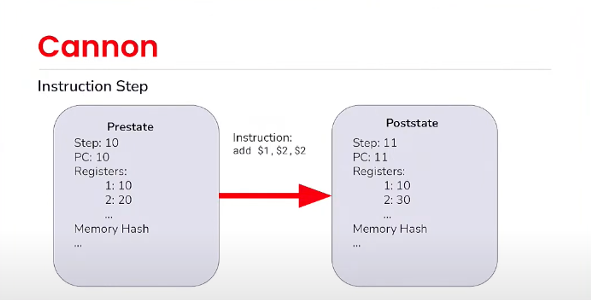

欺诈证明（Fraud Proof）是op rollup中一个非常重要的概念，其思想非常简单，相比zk rollup更容易实现，如今在比特币Layer2中大火的bitvm技术，其底层应用的其实也是欺诈证明的思路。我们以Optimism为例，详细分析其欺诈证明的实现原理。

## The Optimistic Rollup

之所以被称为乐观rollup，是因为其核心思想就是，预先假设所有的交易都是有效的，这样交易就能够被快速确认并接受，但是另外有一套兜底的验证系统，如果你认为某个交易无效，那么你可以提交一个证据来证明你的主张，这个证据就是所谓的欺诈证明。乐观的思想在计算机领域非常常见，比如数据库中的乐观锁和悲观锁，都使用了这种先执行-后检验-发现冲突后回滚的思路。有了证据以后，一个关键的问题就是谁来验证证据？由于排序器是中心化的，我们需要一种去中心化的机制来验证，L1上的智能合约是最适合的方式。了解了其大概思路，我们抛出这两个问题：

1. 如何保证在非法交易出现时，每个人都能够成功生成证据？
2. 如何用智能合约验证证据的有效性？

弄明白这两个问题，就理解了欺诈证明的底层原理，在探究这两个问题之前，我们先简单讲解Optimistic Rollup中的一些基本组件和他们的作用，便于我们理解整个系统的运行流程。

## Architecture

我们从Optimism一笔交易的生命周期来看其整个架构，整个系统由RollupNode，execution engine，batch submitter，output submitter再加上L1上的智能合约组成。用户首先通过向L1合约提交Deposit交易完成跨链，比如跨eth过去，然后L2rollup节点会监听L1的deposit事件在L2上执行交易完成eth的跨入。有了ETH我们就可以直接向L2提交交易，交易是直接提交到L2的执行层的。BatchSubmitter会定期拉取最新的L2区块，将那些直接提交到L2的交易发送至L1上的batchinbox地址，这一部分就是完成DA提交的过程，还有一个OutputSubmitter也会定期拉取区块，向L1的OutputOracle提交L2状态，供提款时进行验证。然后就是Fraud Proof机制，·根据BatchInbox加上L1区块，可以自己重放得到L2状态，如果遇output oracle不一致，可以发起链上挑战，通过链上的FaultProofVM执行验证程序，判断output Oracle状态的正确性。


## **Software Reuse**

以太坊围绕其开发者生态系统建立了一条护城河，包括solidity等智能合约编程语言以及围绕它们构建的大型工具链（例如 Ethers、Hardhat、dapp、slither），还有EVM，其内部结构比任何其他区块链虚拟机都更容易理解，还有Geth，最流行的执行层实现，经过了广泛的测试和模糊测试被证明其强大的可靠性。由于 Optimism 将以太坊作为L1，因此可以重用所有现有的工具，只需要进行很少的修改，这将改善开发人员的体验，因为开发人员不需要学习新技术栈，同时复用这些软件也使得整个系统的安全性得到保证。OP对Geth做了极少的修改作为其执行层op-geth，大大降低了开发rollup的工作量。

## **Block Derivation**

理解区块派生对于理解rollup的工作原理非常重要，rollup之所以安全就是因为他的数据和状态都被提交到L1，每个人都可以运行一个L2节点，通过读取L1上的数据还原出所有L2区块，这一过程就被称为区块派生。

我们可以把整个L2看成这么一个函数derive_rollup_chain，输入l1_blockchain也就是l1的区块数据，就可以得到rollup_blockchain，也就是L2的所有区块。

```json
derive_rollup_chain(l1_blockchain) -> rollup_blockchain
```

因为构成L2区块的所有交易只有两个来源，一是L1上发起的跨链交易也就是deposit交易，二是直接提交给L2节点的普通交易，而这些直接提交到L2的交易，又会通过batch submitter提交到L1上，所以当我们自己运行L2节点时，他会执行区块派生逻辑，遍历L1的所有区块，读取deposit合约的deposit交易，以及batchinbox的所有L2普通交易，还原出L2的所有区块。

## Data Availability Batches

直接发送给L2节点的普通交易，会通过batch submitter提交到L1，这一过程被称为DA，DA是实现区块派生的关键，没有这些数据，我们无法从L1还原得到L2的所有区块。submitter会不断轮询最新的L2区块交易，然后把他们编码后通过calldata的方式提交到L1的batchinbox地址，被一起提交的还包含一些其他数据，比如L2交易对应的L1区块。

这里就会有几个问题：

1. submitter何时提交这些交易？
2. 如果漏提交交易怎么办？
3. 如果submitter根本不向L1提交交易呢？

先看第一个问题，submitter何时提交这些交易？从区块派生的过程来看，只有获得了L1上batchinbox的交易，才能去派生L2区块，这就要求submitter必须在一定时间内向L1提交交易，这个时间称为sequencing window size(sws)，sws越长，则允许submitter可以晚一些提交，如下图所示，每个L1区块对应1个Epoch，在对Epoch1对应的L1区块进行派生时，假设sws为2，那么派生时会获取epoch2和epoch3区块对应的batchinbox数据，并筛选出属于epoch1的交易，完成对epoch1L1区块的派生。


第二个问题，如果submitter故意漏提交了交易，这本质是一种审查，此时可以通过L1上的deposit交易来绕过排序器让交易强制执行，deposit交易能完成的不仅是单纯的跨链，其本质是一种L1到L2的消息传递，通过deposit交易可以构造任何L2的交易使其在L2上执行。

第三个问题，如果submitter根本不提交任何交易，发起数据扣留，此时，所有未被提交到L1的L2交易都被认为是不安全的，比如你开发一个交易所充币程序，必须等到L2充币交易被submitter提交后，才能算充币完成，因为只要交易被提交到L1，我们就可以通过区块派生还原出L2。如果submitter继续长时间不提交交易，我们可以认为排序器已经不可信任，没有人会继续使用它，用户会发起提款交易，提取自己的资产。

## State Commitments

在以太坊中，每笔交易都会导致账户状态和全局状态根的修改。证明一个账户在某个区块拥有一些 ETH 是通过提供该区块的状态根以及证明该账户的状态与所声明的值相匹配的 Merkle 证明来完成的。output submitter会不断的提交L2区块的状态，供L1上执行提款交易时验证。它提交的是output_root，其中包括state_root，也就是L2区块的mpt的状态，还有withdrawal_storage_root，是L2上提款合约的存储状态，这个两个合在一起能够证明L2上有某个提款。

```json
output_root = keccak256(version_byte || payload)
payload = state_root || withdrawal_storage_root || latest_block_hash
```

用户发起的提款，其本质是在L2上发起一个交易，在L1上执行。当执行时第一要确定L2上发起的交易是什么，第二要确定用户确实在L2上发起了这个交易。


整个提款流程需要发起3个交易，第一个是initiating触发L2上的提款合约，记录发起提款的状态，然后等待发起提款的区块的output_root提交后，调用L1上的提款合约提交提款的具体信息，此时L1上的提款合约会根据outputroot中的状态根，验证这个提款交易确实在L2提交了，最后等到欺诈证明的挑战期过后再次调用提款合约来真正执行提款交易。

其中的第一步其实就是把交易哈希存入L2的提款合约，第二步把原始交易内容和merkleproof提交到L1提款合约，合约根据output_root的withdrawal_storage_root就能够验证这笔交易存在于withdrawal_storage，并且得到了具体的交易内容。

这里同样会有问题:

1. 如果submitter提交错误的output_root怎么办？
2. 如果submitter根本就不提交呢？

第一个问题就是我们下面讨论的欺诈证明要解决的，如果提交了错误的output_root，任何人可以利用DA数据重放得到正确的output_root，在链上提交证据发起挑战。第二个问题如果submitter一直不提交状态，那么上一次提交状态之后的所有区块中的提款交易都不能被确认，因为在L1上的提款合约拿不到output_root，这本质和问题1一样，可以认为在L1上提交了空状态，同样可以用欺诈证明解决。

## Fraud Proofs

### **Fault Proof Program**

了解了以上的基本知识，我们来看最重要的FraudProof是如何实现的。FraudProof的整体思路如下：假设我现在认为某个交易完成后op提交的output_root不对，那我就可以发起一个挑战，通过获取L1上的DA数据，自行执行区块派生逻辑，得到正确的output_root和证据，在链上进行挑战交互完成证据的验证。这就好比两个人现在有同样的输入，然后执行一个程序，但是结果不一样，现在需要一种方法来验证谁是正确的，那就必须用去中心化的方式进行链上验证，就需要在链上实现一个虚拟机来执行这个程序，提供需要的数据和执行指令，在链上的虚拟机执行这个程序，得到正确的结果。

这个在链上执行的验证程序应该具备以下功能，输入L1的DA数据和发生争议的outputroot，执行区块派生逻辑，根据DA数据派生得到L2区块，并计算出output_root，判断哪个outputroot是正确的。这个程序被称为Fault Proof Program，其在链下很容易实现，但想要在链上运行十分困难。

第一个问题是链下的程序通过RPC获取DA数据，这种方式是没办法在链上运行的，第二个问题是EVM只能执行opcode，无法执行golang，rust等编程语言编写的程序，第三个问题是链上运行程序受到gas上限的约束，无法完整的运行。

解决第一个问题的办法是在程序与外界的交互之间封装一层通信协议，在op中被称作Pre-image Oracle，程序通过读写指定的文件描述符与Pre-image Oracle交互获取DA数据，Pre-image Oracle在链下实现为通过RPC获取数据，在链上则通过Pre-image Oracle合约读取数据，供链上虚拟机使用，这里又会有一个问题，如何保证链上的Pre-image Oracle合约存储的数据是正确的？这个我们后面再解释。

解决第二个问题就是实现一个链上的虚拟机，为了方便实现，op选取了MIPS指令，go，rust等语言都支持编译到MIPS指令，但用solidity在链上实现MIPS虚拟机仍不是一件容易的事情，op找了世界顶级黑客geohot帮他们实现，他用不到400行solidity代码实现了一个MIPS虚拟机。

解决第三个问题就是进行简化，只在链上运行一条MIPS指令，所以刚才提到的链上MIPS虚拟机其实是一个单步的虚拟机，一次只运行一条指令。

解决这些问题后，我们现在有了可以在链上运行的，根据DA数据执行区块派生并验证正确outputroot的程序和链上的单步MIPS虚拟机，由于验证程序的指令会有千万甚至上亿条，不可能每条都放到链上去运行，我们需要一种方法找到真正需要放到链上运行的指令，前面我们提到，既然双方最终得到的output_root不同，那么一定能找到这么一条指令，这条指令执行后，双方得到的状态不一致，我们要做的就是找到这一条指令，把这条指令放到链上运行，得到正确的状态。这里又有两个问题，如何找到这个指令？指令在链上运行需要提供哪些数据？

### **Fault Proof Virtual Machine**



因为虚拟机可以认为是一个状态转换函数，提供一个执行前的状态，要执行的指令，他可以产出一个执行后的状态，其中的prestate和poststate是vm执行前后的状态，包括寄存器，当前指令地址，内存状态的merkle root等等，统称为packedstate。

```json
// @param _stateData The encoded state witness data.
// @param _proof The encoded proof data for leaves within the MIPS VM's memory.
// @param _localContext The local key context for the preimage oracle. Optional, can be set as a constant if the caller only requires one set of local keys.
function step(bytes calldata _stateData, bytes calldata _proof, bytes32 _localContext) public returns (bytes32)
//The proof of a single execution-trace step:MerkleProof of state.PC and read/write memory addr
```

我们首先看指令在链上运行需要提供哪些数据，这是在链上单步执行MIPS指令的函数，第一个参数是statedata，其实就是上面的packedstate，也就是prestate，是运行这条指令的初始状态，第二个参数是proof，这个是某个内存地址的merkle证明，因为packedstate中仅有整个内存空间的merkleroot，当指令访问了某个内存地址时，需要提供内存地址的数据。


整个内存地址空间是32位，用一个固定27层的二叉树来表示，所有数据存放在叶子节点，每个叶节点存放4字节的数据，那从根节点到叶节点分支上的值就够表示27位的二进制数据，也就是任意的内存地址。现在已知merkleroot和要读取的内存地址，通过提供叶节点的merkle证明，就能保证对应内存地址数据的正确性，单一的merkle证明只能说明这个数据在这个merkletree里，通过分支来表示地址的方式，就能够进一步确定这个数据确实在指定的叶节点即指定的内存地址。

解决了内存数据的问题，回到我们最开始的另一个问题，链上DA数据是从Pre-image Oracle合约获得的，这些数据包括比如某个区块的header，某个区块的transcations，MIPSVM通过调用Pre-image Oracle合约读取这些数据，需要保证存入的数据是正确的。

MIPSVM和Pre-image Oracle合约的交互过程可以认为Pre-image Oracle是一个key-value存储，MIPSVM想获得某个区块的transcations时，提供transcations的哈希，Pre-image Oracle返回哈希对应的transcations。Pre-image Oracle上传数据的方式就是直接提交value，合约会计算value的哈希作为key存储起来。

数据可以根据大小分为两种，比如header比较小，可以直接上传，但是transcations可能很大，超过calldata的上限了，没办法一次上传，需要支持分批上传，这里同样有一个挑战机制，保证上传数据的正确性，为什么小的数据不需要挑战？前面提到PreimageOracle本身就是一个key-value存储，小的数据上传的时候是直接提交value，在链上keccak哈希得到key然后存起来，value传递的不对链上算出来的key就不对，那MIPSVM就访问不到，所以这种上传方式不需要挑战。


```go
func (d *StateMatrix) StateCommitment() common.Hash {
	buf := d.PackState()
	return crypto.Keccak256Hash(buf)
}

func (d *StateMatrix) PackState() []byte {
	buf := make([]byte, 0, len(d.s.a)*uint256Size)
	for _, v := range d.s.a {
		buf = append(buf, math.U256Bytes(new(big.Int).SetUint64(v))...)
	}
	return buf
}
```

那如果分批上传，怎么用挑战机制保证正确性呢？这里涉及到了keccak哈希的实现，其本身可以实现为一个流式的哈希，把一段数据分批上传，其可以每次只对这一段数据哈希，并维护一个中间状态，最后得到的哈希结果和直接对这段完整数据哈希是一样的，这个中间状态就是代码中的packstate，StateCommitment是packstate的哈希。

因此整个过程可以分批上传原始数据和对应的StateCommitment，上传完毕后等待挑战，挑战时间过后完成最终提交。这里的验证过程也是通过merkle化实现，每一个节点包括input和StateCommitment，通过这种方式可以去检验每次上传的StateCommitment是不是对应其input，如果不是可以提出挑战，指定某个叶节点和他的merkle证明，可以在链上执行计算stateCommitment的过程，如果执行结果和提交的不一致，那就标记为被挑战的状态不能使用了。

### **Fault Dispute Game**

最后我们看如何找到产生分歧的指令，op设计了一个链上的挑战游戏，叫做Fault Dispute Game(FDG)，这是一个二分游戏，如果对submitter提交的outputroot有异议，可以在链上创建一个FDG，对这个outputroot发起挑战，其他人可以参与这个游戏，共同构建一个二叉树，这个二叉树的每一个节点都是程序执行的一个中间状态即packedstate，同时有一个max depth最大深度，游戏的两个参与者分为Challengers和Defenders，具体分为两个动作attack和defend，对某个节点，如果同意声明，那就做defend操作，如果不同意，就做attack操作，提交自己的状态，直到走到maxdepth，也就是叶节点，说明此时已经二分到某个具体的指令了，在链上用MIPSVM执行这个指令，就可以判断出谁提交的状态是对的。


我们用一个具体的例子来演示一下：字母游戏，假设现在有个程序按顺序吐出26个英文字母，我们取前8个字母，比如执行完第一条指令，他吐出A，现在的poststate就是A，继续执行，prestate是A，poststate是AB，以此类推，假设现在submitter他创建了一个fdg，提交的outputroot是ABCDEXYZ，然后发现不对，应该是ABCDEFGH，那第一步就是attack，我们先来看一下这个树，他的每个叶节点都代表一条指令，或者说执行完这条指令后的状态，每个非叶节点都对应一个叶节点，对应的就是一直向右遍历的叶节点，比如根节点，对应的就是最后一个叶节点，因为他代表执行完最后一条指令后的状态，对跟节点attack，就是向左走，因为这是一个二分的过程，state8二分就是state4ABCD，所以向左走提交这个节点状态，然后submitter发现他也是ABCD没错，所以执行defend，在state4到state8继续二分，就是state6，需要先回到父节点，然后向右走，再向左走，提交这个节点状态state6，然后challenger发现state6不一致，继续attack，向左走，提交state5，然后submitter发现跟他一致，而且这个时候已经到叶节点了，我们通过二分已经能确定是state6的这条指令造成的双方不一致，那就在链上执行state6的这条指令，就可以判断谁对谁错了。

总结一下，回顾我们开篇的两个问题：

1. 如何保证在非法交易出现时，每个人都能够成功生成证据？
2. 如何用智能合约验证证据的有效性？

batch submitter向L1提交L2交易的DA机制，保证了每个人都能从L1获得L2的数据，还原出L2区块，用这些数据，可以在链上发起FDG，通过一系列链上的二分游戏交互，找到发生争议的指令，最终利用链上MIPSVM这个审判官来判定最终状态。

## BitVM

BitVM的实现中，也用了欺诈证明的思想，以BitVM2的实现为例，它一个SNARK 验证器划分为多个sub-function，将一个大的计算 f(x)=y 被分解为 f_i(x_i-1)=z_i，每一个sub-function的输出作为下一个的输入，这些sub-function用比特币脚本编写，证明者提交输出状态y，如果不正确，任何人都可以发起挑战，prover需要提交所有的中间状态z_i，verifier可以花费任何一个sub-function f_i(z_i-1)=z_i实现在链上运行脚本，对输出状态进行反驳。


类比op的实现，bitvm中的这些sub-function其实就是Fault Proof Program，由于是用比特币脚本编写的，并不需要其他虚拟机，prover和verifier之间的交互是一种轮数更少的Fault Dispute Game，最终同样是通过在链上执行Fault Proof Program，来得到正确的最终状态。