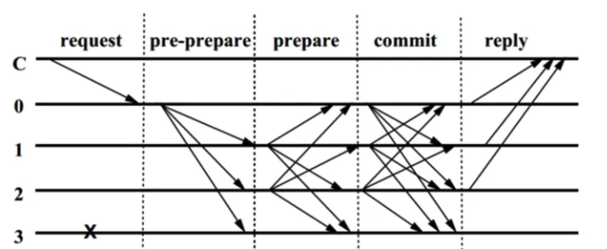
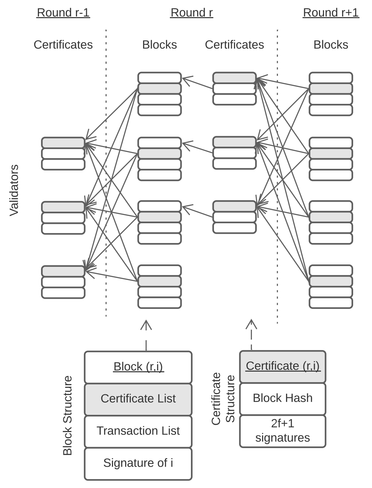
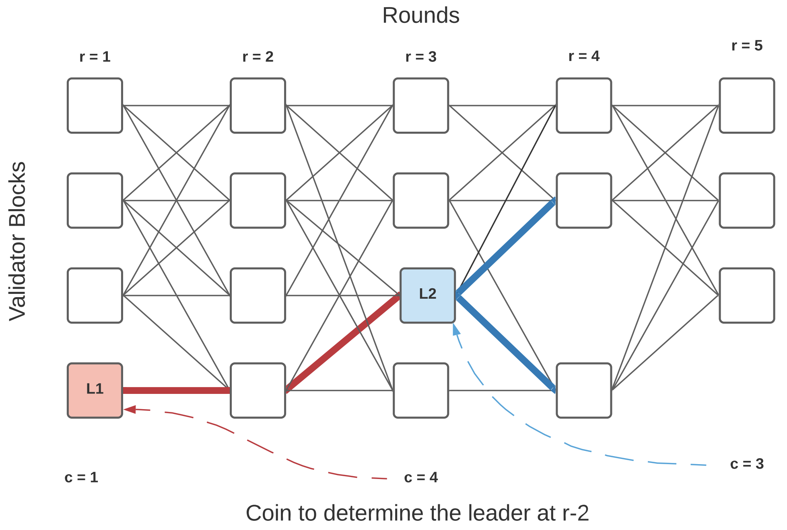
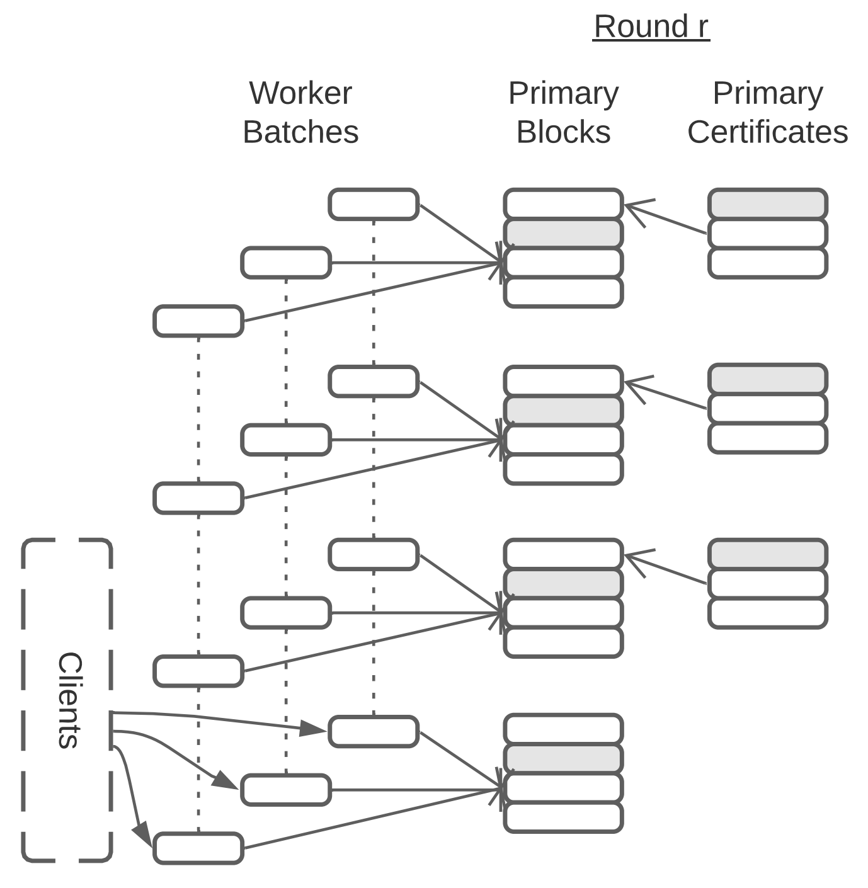
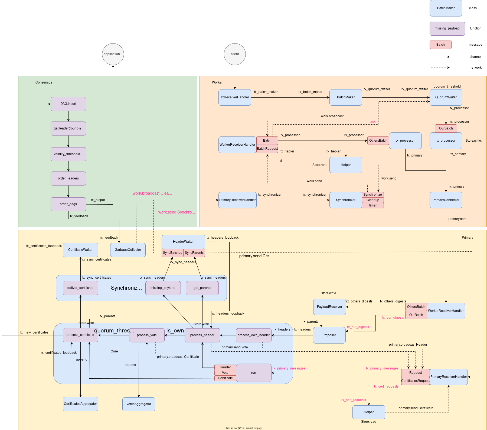
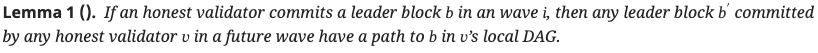

## Next Generation Consensus Algorithm - BFT on DAG

1. [Narwhal & Tusk](https://arxiv.org/abs/2105.11827) 

**Narwhal and Tusk: A DAG-based Mempool and Efficient BFT Consensus**

2. [Bullshark](https://arxiv.org/abs/2201.05677) 

**Bullshark: DAG BFT Protocols Made Practical**

3.[Mysticeti](https://arxiv.org/abs/2310.14821)

**Mysticeti: Low-Latency DAG Consensus with Fast Commit Path**

## PBFT



## Overview

We assume a known Δ and say that an execution of a protocol is eventually synchronous if there is a global stabilization time (GST) after which all messages sent among honest parties are delivered within Δ time. An execution is synchronous if GST occurs at time 0, and asynchronous if GST never occurs.



## **Consensus**



## Worker



## **Life of a Transaction**



## Header

```rust
pub struct Header {
    pub author: PublicKey,
    pub round: Round,
    pub payload: BTreeMap<Digest, WorkerId>,
    pub parents: BTreeSet<Digest>,
    pub id: Digest,
    pub signature: Signature,
}
```

## Certificate

```rust
pub struct Certificate {
    pub header: Header,
    pub votes: Vec<(PublicKey, Signature)>,
}
```

## DAG

```rust
type Dag = HashMap<Round, HashMap<PublicKey, (Digest, Certificate)>>;
struct State {
    /// The last committed round.
    last_committed_round: Round,
    // Keeps the last committed round for each authority. This map is used to clean up the dag and
    // ensure we don't commit twice the same certificate.
    last_committed: HashMap<PublicKey, Round>,
    /// Keeps the latest committed certificate (and its parents) for every authority. Anything older
    /// must be regularly cleaned up through the function `update`.
    dag: Dag,
}
```


```rust
for leader in self.order_leaders(leader, &state).iter().rev() {
    // Starting from the oldest leader, flatten the sub-dag referenced by the leader.
    for x in self.order_dag(leader, &state) {
        // Update and clean up internal state.
        state.update(&x, self.gc_depth);

        // Add the certificate to the sequence.
				sequence.push(x);
    }
}
/// Order the past leaders that we didn't already commit.
fn order_leaders(&self, leader: &Certificate, state: &State) -> Vec<Certificate> {
		let mut to_commit = vec![leader.clone()];
		let mut leader = leader;
		for r in (state.last_committed_round + 2..leader.round())
				.rev()
				.step_by(2)
					{
            // Get the certificate proposed by the previous leader.
            let (_, prev_leader) = match self.leader(r, &state.dag) {
                Some(x) => x,
                None => continue,
            };

            // Check whether there is a path between the last two leaders.
            if self.linked(leader, prev_leader, &state.dag) {
                to_commit.push(prev_leader.clone());
                leader = prev_leader;
            }
    }
    to_commit
}

/// Checks if there is a path between two leaders.
fn linked(&self, leader: &Certificate, prev_leader: &Certificate, dag: &Dag) -> bool {
		let mut parents = vec![leader];
		for r in (prev_leader.round()..leader.round()).rev() {
				parents = dag
                .get(&(r))
                .expect("We should have the whole history by now")
                .values()
                .filter(|(digest, _)| parents.iter().any(|x| x.header.parents.contains(digest)))
                .map(|(_, certificate)| certificate)
                .collect();
		}
    parents.contains(&prev_leader)
}

/// Flatten the dag referenced by the input certificate. This is a classic depth-first search (pre-order):
/// https://en.wikipedia.org/wiki/Tree_traversal#Pre-order
fn order_dag(&self, leader: &Certificate, state: &State) -> Vec<Certificate> {
        debug!("Processing sub-dag of {:?}", leader);
        let mut ordered = Vec::new();
        let mut already_ordered = HashSet::new();

        let mut buffer = vec![leader];
        while let Some(x) = buffer.pop() {
            debug!("Sequencing {:?}", x);
            ordered.push(x.clone());
            for parent in &x.header.parents {
                let (digest, certificate) = match state
                    .dag
                    .get(&(x.round() - 1))
                    .map(|x| x.values().find(|(x, _)| x == parent))
                    .flatten()
                {
                    Some(x) => x,
                    None => continue, // We already ordered or GC up to here.
                };

                // We skip the certificate if we (1) already processed it or (2) we reached a round that we already
                // committed for this authority.
                let mut skip = already_ordered.contains(&digest);
                skip |= state
                    .last_committed
                    .get(&certificate.origin())
                    .map_or_else(|| false, |r| r == &certificate.round());
                if !skip {
                    buffer.push(certificate);
                    already_ordered.insert(digest);
                }
            }
        }

        // Ensure we do not commit garbage collected certificates.
        ordered.retain(|x| x.round() + self.gc_depth >= state.last_committed_round);

        // Ordering the output by round is not really necessary but it makes the commit sequence prettier.
        ordered.sort_by_key(|x| x.round());
        ordered
    }
}
```



