## Overview

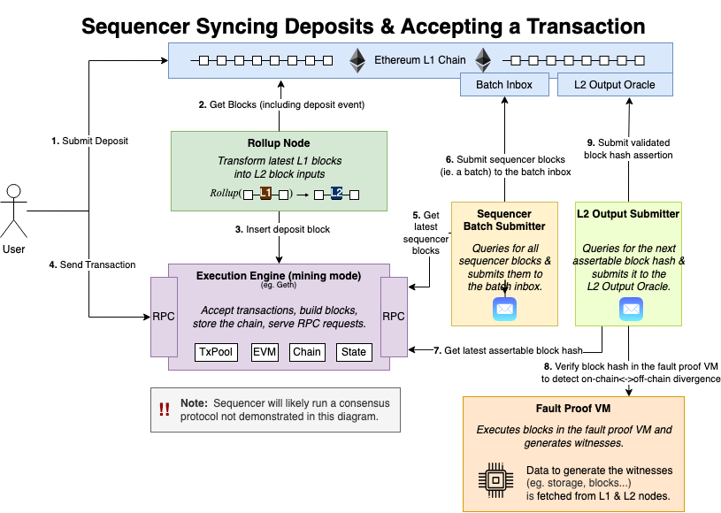

## **Components**

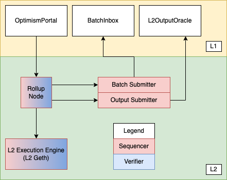

### L1 Components

- **OptimismPortal**: A feed of L2 transactions which originated as smart contract calls in the L1 state.
    - The `OptimismPortal` contract emits `TransactionDeposited` events, which the rollup driver reads in order to process deposits.
    - Deposits are guaranteed to be reflected in the L2 state within the *sequencing window*.
    - Beware that *transactions* are deposited, not tokens. However deposited transactions are a key part of implementing token deposits (tokens are locked on L1, then minted on L2 via a deposited transaction).
- **BatchInbox**: An L1 address to which the Batch Submitter submits transaction batches.
    - Transaction batches include L2 transaction calldata, timestamps, and ordering information.
    - The BatchInbox is a regular EOA address. This lets us pass on gas cost savings by not executing any EVM code.
- **L2OutputOracle**: A smart contract that stores [L2 output roots](https://github.com/ethereum-optimism/specs/blob/main/specs/glossary.md#l2-output) for use with withdrawals and fault proofs.

### L2 Components

- **Rollup Node**:
    - A standalone, stateless binary.
    - Syncs and verifies rollup data on L1.
    - Applies rollup-specific block production rules to synthesize blocks from L1.
    - Appends blocks to the L2 chain using the Engine API.
    - Handles L1 reorgs.
    - Distributes unsubmitted blocks to other rollup nodes.
- **Execution Engine (EE)**:
    - A vanilla Geth node with minor modifications to support Optimism.
    - Maintains L2 state.
    - Sync state to other L2 nodes for fast onboarding.
    - Serves the Engine API to the rollup node.
- **Batch Submitter**
    - A background process that submits [transaction batches](https://github.com/ethereum-optimism/specs/blob/main/specs/glossary.md#sequencer-batch) to the `BatchInbox` address.
- **Output Submitter**
    - A background process that submits L2 output commitments to the `L2OutputOracle`.

## **Transaction/Block Propagation**

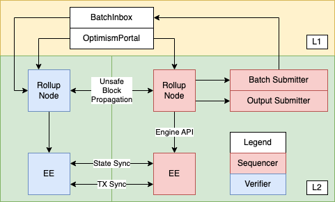

## **Block Derivation**

The rollup chain can be deterministically derived given an L1 Ethereum chain. The fact that the entire rollup chain can be derived based on L1 blocks is *what makes Optimism a rollup*. This process can be represented as:

```
derive_rollup_chain(l1_blockchain) -> rollup_blockchain
```

- **unsafe** transactions are already processed, but not written to L1 yet. A batcher fault might cause these transactions to be dropped.
- **safe** transactions are already processed and written to L1. However, they might be dropped due to a reorganization at the L1 level.
- **finalized** transactions are written to L1 in an L1 block that is old enough to be extremely unlikely to be re-organized.

For L1 block number `n`, there is a corresponding rollup epoch `n` which can only be derived after a *sequencing window* worth of blocks has passed, i.e. after L1 block number `n + SEQUENCING_WINDOW_SIZE` is added to the L1 chain.

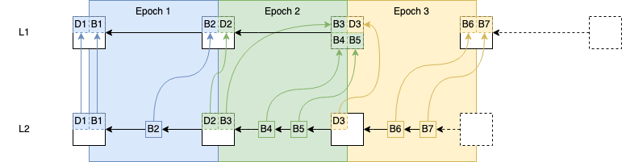

## Block Derivation Loop

A sub-component of the rollup node called the *rollup driver* is actually responsible for performing block derivation. The rollup driver is essentially an infinite loop that runs the block derivation function. For each epoch, the block derivation function performs the following steps:

1. Downloads deposit and transaction batch data for each block in the sequencing window.
2. Converts the deposit and transaction batch data into payload attributes for the Engine API.
3. Submits the payload attributes to the Engine API, where they are converted into blocks and added to the canonical chain.

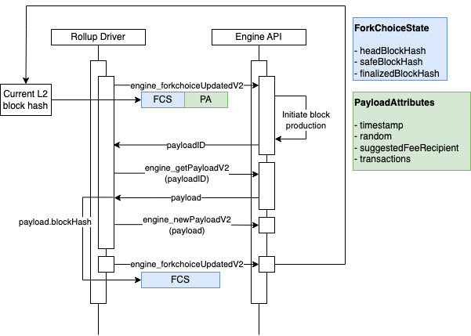

## **Bridges**

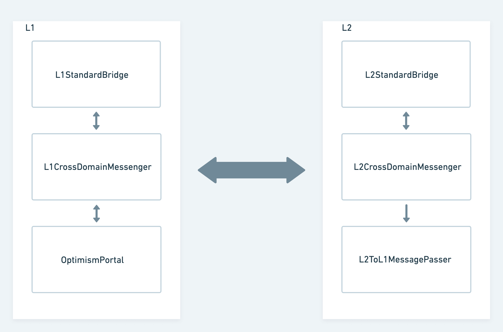

### L1→L2

onL1

```solidity
//L1StandardBridge.sol
messenger.sendMessage{ value: _amount }({
        _target: address(otherBridge),
        _message: abi.encodeWithSelector(this.finalizeBridgeETH.selector, _from, _to, _amount, _extraData),
        _minGasLimit: _minGasLimit
    });
//L1CrossDomainMessenger.sol
_sendMessage({
        _to: address(otherMessenger),
        _gasLimit: baseGas(_message, _minGasLimit),
        _value: msg.value,
        _data: abi.encodeWithSelector(
            this.relayMessage.selector, messageNonce(), msg.sender, _target, msg.value, _minGasLimit, _message
            )
    });
function _sendMessage(address _to, uint64 _gasLimit, uint256 _value, bytes memory _data) internal override {
    portal.depositTransaction{ value: _value }({
        _to: _to,
        _value: _value,
        _gasLimit: _gasLimit,
        _isCreation: false,
        _data: _data
    });
}
```

onL2

```solidity
//L2CrossDomainMessenger.sol
function relayMessage(
        uint256 _nonce,
        address _sender,
        address _target,
        uint256 _value,
        uint256 _minGasLimit,
        bytes calldata _message
    ){
     if (_isOtherMessenger()) {
        assert(msg.value == _value);
        assert(!failedMessages[versionedHash]);
    } else {
        require(msg.value == 0, "CrossDomainMessenger: value must be zero unless message is from a system address");
        require(failedMessages[versionedHash], "CrossDomainMessenger: message cannot be replayed");
        }
	  xDomainMsgSender = _sender;
	  bool success = SafeCall.call(_target, gasleft() - RELAY_RESERVED_GAS, _value, _message);
	  xDomainMsgSender = Constants.DEFAULT_L2_SENDER;
}
//L2StandardBridge.sol
modifier onlyOtherBridge() {
    require(
        msg.sender == address(messenger) && messenger.xDomainMessageSender() == address(otherBridge),
        "StandardBridge: function can only be called from the other bridge"
    );
    _;
}
function finalizeBridgeETH(
        address _from,
        address _to,
        uint256 _amount,
        bytes calldata _extraData
)
    public
    payable
    onlyOtherBridge
{
     _emitETHBridgeFinalized(_from, _to, _amount, _extraData);

    bool success = SafeCall.call(_to, gasleft(), _amount, hex"");
    require(success, "StandardBridge: ETH transfer failed");
}
```

### L2→L1

```solidity
//L2CrossDomainMessenger.sol
function _sendMessage(address _to, uint64 _gasLimit, uint256 _value, bytes memory _data) internal override {
    L2ToL1MessagePasser(payable(Predeploys.L2_TO_L1_MESSAGE_PASSER)).initiateWithdrawal{ value: _value }(
        _to, _gasLimit, _data
    );
}
```

## Deposit

### The Deposited Transaction Type

[Deposited transactions](https://github.com/ethereum-optimism/specs/blob/main/specs/glossary.md#deposited) have the following notable distinctions from existing transaction types:

1. They are derived from Layer 1 blocks, and must be included as part of the protocol.
2. They do not include signature validation (see [User-Deposited Transactions](https://github.com/ethereum-optimism/specs/blob/main/specs/deposits.md#user-deposited-transactions) for the rationale).
3. They buy their L2 gas on L1 and, as such, the L2 gas is not refundable.

### Kinds of Deposited Transactions

1. The first transaction MUST be a [L1 attributes deposited transaction](https://github.com/ethereum-optimism/specs/blob/main/specs/deposits.md#l1-attributes-deposited-transaction), followed by
2. an array of zero-or-more [user-deposited transactions](https://github.com/ethereum-optimism/specs/blob/main/specs/deposits.md#user-deposited-transactions) submitted to the deposit feed contract on L1 (called `OptimismPortal`). User-deposited transactions are only present in the first block of a L2 epoch.

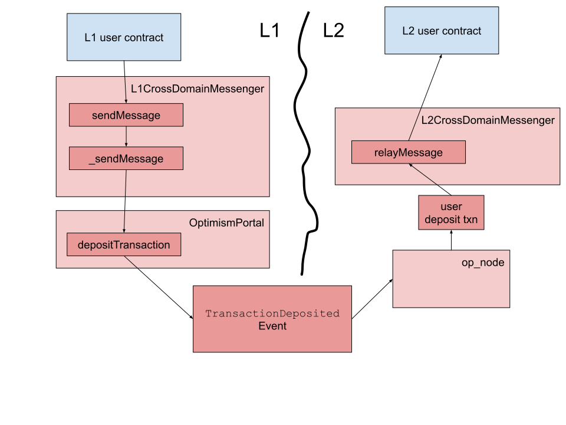

An [L1 attributes deposited transaction](https://github.com/ethereum-optimism/specs/blob/main/specs/glossary.md#l1-attributes-deposited-transaction) is a deposit transaction sent to the [L1 attributes predeployed contract](https://github.com/ethereum-optimism/specs/blob/main/specs/deposits.md#l1-attributes-predeployed-contract).

## Withdraw

Withdrawals require the user to submit three transactions:

1. **Withdrawal initiating transaction**, which the user submits on L2.
2. **Withdrawal proving transaction**, which the user submits on L1 to prove that the withdrawal is legitimate (based on a merkle patricia trie root that commits to the state of the `L2ToL1MessagePasser`'s storage on L2)
3. **Withdrawal finalizing transaction**, which the user submits on L1 after the fault challenge period has passed, to actually run the transaction on L1.
    
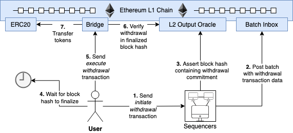
    

### **Withdrawal initiating transaction**

calls [`initiateWithdrawal`](https://github.com/ethereum-optimism/optimism/blob/62c7f3b05a70027b30054d4c8974f44000606fb7/packages/contracts-bedrock/contracts/L2/L2ToL1MessagePasser.sol#L91-L129) on [`L2ToL1MessagePasser`](https://github.com/ethereum-optimism/optimism/blob/62c7f3b05a70027b30054d4c8974f44000606fb7/packages/contracts-bedrock/contracts/L2/L2ToL1MessagePasser.sol). This function calculates the hash of the raw withdrawal fields. Mark sentMessages[withdrawalHash] = true

### **Withdrawal proving transaction**

Once an output root that includes the `MessagePassed` event is published to L1, calls [`OptimismPortal.proveWithdrawalTransaction()`](https://github.com/ethereum-optimism/optimism/blob/62c7f3b05a70027b30054d4c8974f44000606fb7/packages/contracts-bedrock/contracts/L1/OptimismPortal.sol#L234-L318) on L1. To prove  the given withdrawal in the L2ToL1MessagePasser contract.

```solidity
function proveWithdrawalTransaction(
    Types.WithdrawalTransaction memory _tx,
    uint256 _l2OutputIndex,
    Types.OutputRootProof calldata _outputRootProof,
    bytes[] calldata _withdrawalProof
) external;

function finalizeWithdrawalTransaction(
   Types.WithdrawalTransaction memory _tx
) external;
```

### **Withdrawal finalizing transaction**

Once the fault challenge period passes, calls [`OptimismPortal.finalizeWithdrawalTransaction()`](https://github.com/ethereum-optimism/optimism/blob/62c7f3b05a70027b30054d4c8974f44000606fb7/packages/contracts-bedrock/contracts/L1/OptimismPortal.sol#L320-L420)on L1.Mark the withdrawal as finalized in `finalizedWithdrawals`.Run the actual withdrawal transaction.

## OptimismPortal can send arbitrary messages on L1

The `L2ToL1MessagePasser` contract's `initiateWithdrawal` function accepts a `_target` address and `_data` bytes, which is passed to a `CALL` opcode on L1 when `finalizeWithdrawalTransaction` is called after the challenge period. This means that, by design, the `OptimismPortal` contract can be used to send arbitrary transactions on the L1, with the `OptimismPortal` as the `msg.sender`.

This means users of the `OptimismPortal` contract should be careful what permissions they grant to the portal. For example, any ERC20 tokens mistakenly sent to the `OptimismPortal` contract are essentially lost, as they can be claimed by anybody that pre-approves transfers of this token out of the portal, using the L2 to initiate the approval and the L1 to prove and finalize the approval (after the challenge period).

## op-node

### Derivation

To derive the L2 blocks of epoch number `E`, we need the following inputs:

- L1 blocks in the range `[E, E + SWS)`, called the [sequencing window](https://github.com/ethereum-optimism/specs/blob/main/specs/glossary.md#sequencing-window) of the epoch, and `SWS` the sequencing window size. (Note that sequencing windows overlap.)
- [Batcher transactions](https://github.com/ethereum-optimism/specs/blob/main/specs/glossary.md#batcher-transaction) from blocks in the sequencing window.
    - These transactions allow us to reconstruct the epoch's [sequencer batches](https://github.com/ethereum-optimism/specs/blob/main/specs/glossary.md#sequencer-batch), each of which will produce one L2 block. Note that:
        - The L1 origin will never contain any data needed to construct sequencer batches since each batch [must contain](https://github.com/ethereum-optimism/specs/blob/main/specs/derivation.md#batch-format) the L1 origin hash.
        - An epoch may have no sequencer batches.
- [Deposits](https://github.com/ethereum-optimism/specs/blob/main/specs/glossary.md#deposits) made in the L1 origin (in the form of events emitted by the [deposit contract](https://github.com/ethereum-optimism/specs/blob/main/specs/glossary.md#deposit-contract)).
- L1 block attributes from the L1 origin (to derive the [L1 attributes deposited transaction](https://github.com/ethereum-optimism/specs/blob/main/specs/glossary.md#l1-attributes-deposited-transaction)).
- The state of the L2 chain after the last L2 block of the previous epoch, or the [L2 genesis state](https://github.com/ethereum-optimism/specs/blob/main/specs/glossary.md#l2-genesis-block) if `E` is the first epoch.

Each L2 `block` with origin `l1_origin` is subject to the following constraints (whose values are denominated in seconds):

- `block.timestamp = prev_l2_timestamp + l2_block_time`
    - `prev_l2_timestamp` is the timestamp of the L2 block immediately preceding this one. If there is no preceding block, then this is the genesis block, and its timestamp is explicitly specified.
    - `l2_block_time` is a configurable parameter of the time between L2 blocks (2s on Optimism).
- `l1_origin.timestamp <= block.timestamp <= max_l2_timestamp`, where
    - `max_l2_timestamp = max(l1_origin.timestamp + max_sequencer_drift, prev_l2_timestamp + l2_block_time)`
        - `max_sequencer_drift` is a configurable parameter that bounds how far the sequencer can get ahead of the L1.

Finally, each epoch must have at least one L2 block.

### Batch Submission Wire Format


### L2 Chain Derivation Pipeline

The derivation process into a pipeline made up of the following stages:

1. L1 Traversal
2. L1 Retrieval
3. Frame Queue
4. Channel Bank
5. Channel Reader (Batch Decoding)
6. Batch Queue
7. Payload Attributes Derivation
8. Engine Queue

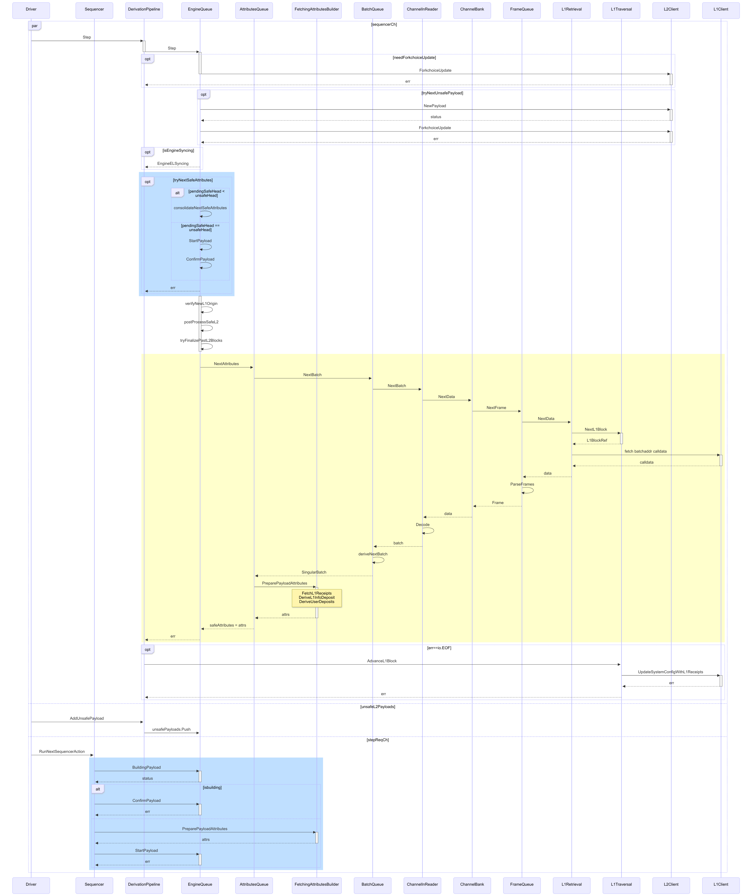

<details>
    <summary>mermaid</summary>

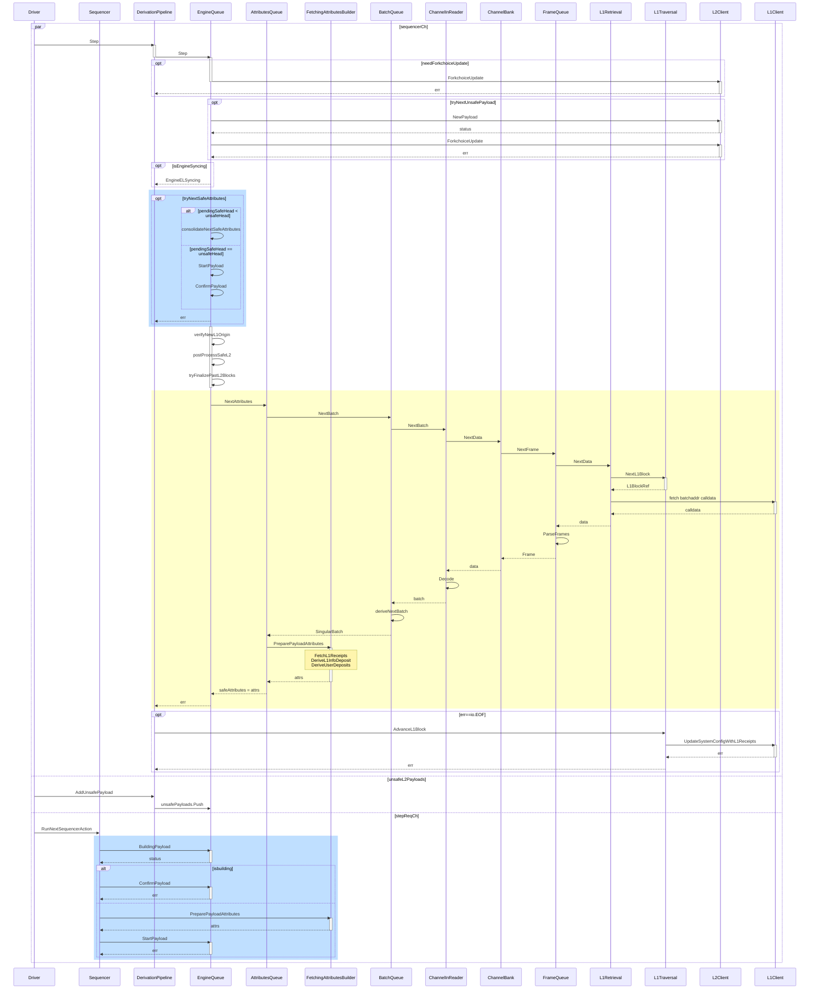
```mermaid
sequenceDiagram
    participant Driver 
    participant Sequencer
    participant DerivationPipeline
    participant EngineQueue
    participant AttributesQueue
    participant FetchingAttributesBuilder
    participant BatchQueue
    participant ChannelInReader
    participant ChannelBank
    participant FrameQueue
    participant L1Retrieval
    participant L1Traversal
    participant L2Client
    participant L1Client

    par sequencerCh
        Driver->>DerivationPipeline: Step
        activate DerivationPipeline
        DerivationPipeline->>EngineQueue: Step
        deactivate DerivationPipeline
        activate EngineQueue
        opt needForkchoiceUpdate
            EngineQueue->>L2Client: ForkchoiceUpdate
            deactivate EngineQueue
            activate L2Client
            L2Client-->>DerivationPipeline: err
            deactivate L2Client
        end

        opt tryNextUnsafePayload
            EngineQueue->>L2Client: NewPayload
            activate L2Client
            L2Client-->>EngineQueue: status
            deactivate L2Client
            EngineQueue->>L2Client: ForkchoiceUpdate
            activate L2Client
            L2Client-->>EngineQueue: err
            deactivate L2Client
        end
        opt isEngineSyncing
            EngineQueue-->>DerivationPipeline: EngineELSyncing
        end
        rect rgb(191, 223, 255)
        opt tryNextSafeAttributes
        alt pendingSafeHead < unsafeHead
            EngineQueue->>EngineQueue: consolidateNextSafeAttributes
        else pendingSafeHead == unsafeHead
            EngineQueue->>EngineQueue: StartPayload
            EngineQueue->>EngineQueue: ConfirmPayload
        end
            EngineQueue-->>DerivationPipeline: err
        end
        end
        activate EngineQueue
        EngineQueue->>EngineQueue: verifyNewL1Origin
        EngineQueue->>EngineQueue: postProcessSafeL2
        EngineQueue->>EngineQueue: tryFinalizePastL2Blocks
        deactivate EngineQueue

        rect rgb(255, 255, 204)
        EngineQueue->>AttributesQueue: NextAttributes
        AttributesQueue->>BatchQueue: NextBatch
        BatchQueue->>ChannelInReader: NextBatch
        ChannelInReader->>ChannelBank: NextData
        ChannelBank->>FrameQueue: NextFrame
        FrameQueue->>L1Retrieval: NextData
        L1Retrieval->>L1Traversal: NextL1Block
        activate L1Traversal

        L1Traversal-->>L1Retrieval: L1BlockRef
        deactivate L1Traversal
        L1Retrieval->>L1Client: fetch batchaddr calldata
        activate L1Client
        L1Client-->>L1Retrieval: calldata
        deactivate L1Client
        L1Retrieval-->>FrameQueue: data
        FrameQueue->>FrameQueue: ParseFrames
        FrameQueue-->>ChannelBank: Frame
        ChannelBank-->>ChannelInReader: data
        ChannelInReader->>ChannelInReader: Decode
        ChannelInReader-->>BatchQueue: batch
        BatchQueue->>BatchQueue: deriveNextBatch
        BatchQueue-->>AttributesQueue: SingularBatch

        AttributesQueue->>FetchingAttributesBuilder: PreparePayloadAttributes
        activate FetchingAttributesBuilder
        Note over  FetchingAttributesBuilder: FetchL1Receipts<br/>DeriveL1InfoDeposit<br/>DeriveUserDeposits 
        FetchingAttributesBuilder-->>AttributesQueue: attrs
        deactivate FetchingAttributesBuilder
        AttributesQueue-->>EngineQueue: safeAttributes = attrs

        EngineQueue-->>DerivationPipeline: err
        end
    opt err==io.EOF
        DerivationPipeline->>L1Traversal: AdvanceL1Block
        L1Traversal->>L1Client: UpdateSystemConfigWithL1Receipts
        activate L1Client
        L1Client-->>L1Traversal: err
        deactivate L1Client
        L1Traversal-->>DerivationPipeline: err
    end

    and unsafeL2Payloads
        Driver->>DerivationPipeline: AddUnsafePayload
        DerivationPipeline->>EngineQueue: unsafePayloads.Push
    and stepReqCh
        Driver->>Sequencer: RunNextSequencerAction
        rect rgb(191, 223, 255)
        Sequencer->>EngineQueue: BuildingPayload
        activate EngineQueue
        EngineQueue-->>Sequencer: status
        deactivate EngineQueue
        alt isbuilding
        Sequencer->>EngineQueue: ConfirmPayload
        activate EngineQueue
        EngineQueue-->>Sequencer: err
        deactivate EngineQueue
        else 
        Sequencer->>FetchingAttributesBuilder: PreparePayloadAttributes
        activate FetchingAttributesBuilder
        FetchingAttributesBuilder-->>Sequencer: attrs
        deactivate FetchingAttributesBuilder
        Sequencer->>EngineQueue: StartPayload
        activate EngineQueue
        EngineQueue-->>Sequencer: err
        deactivate EngineQueue
        end
        end
    end
```

</details>

## op-batcher

The most minimal batcher implementation can be defined as a loop of the following operations:

1. See if the `unsafe` L2 block number is past the `safe` block number: `unsafe` data needs to be submitted.
2. Iterate over all unsafe L2 blocks, skip any that were previously submitted.
3. Open a channel, buffer all the L2 block data to be submitted, while applying the encoding and compression as defined in the [derivation spec](https://github.com/ethereum-optimism/specs/blob/main/specs/derivation.md).
4. Pull frames from the channel to fill data transactions with, until the channel is empty.
5. Submit the data transactions to L1

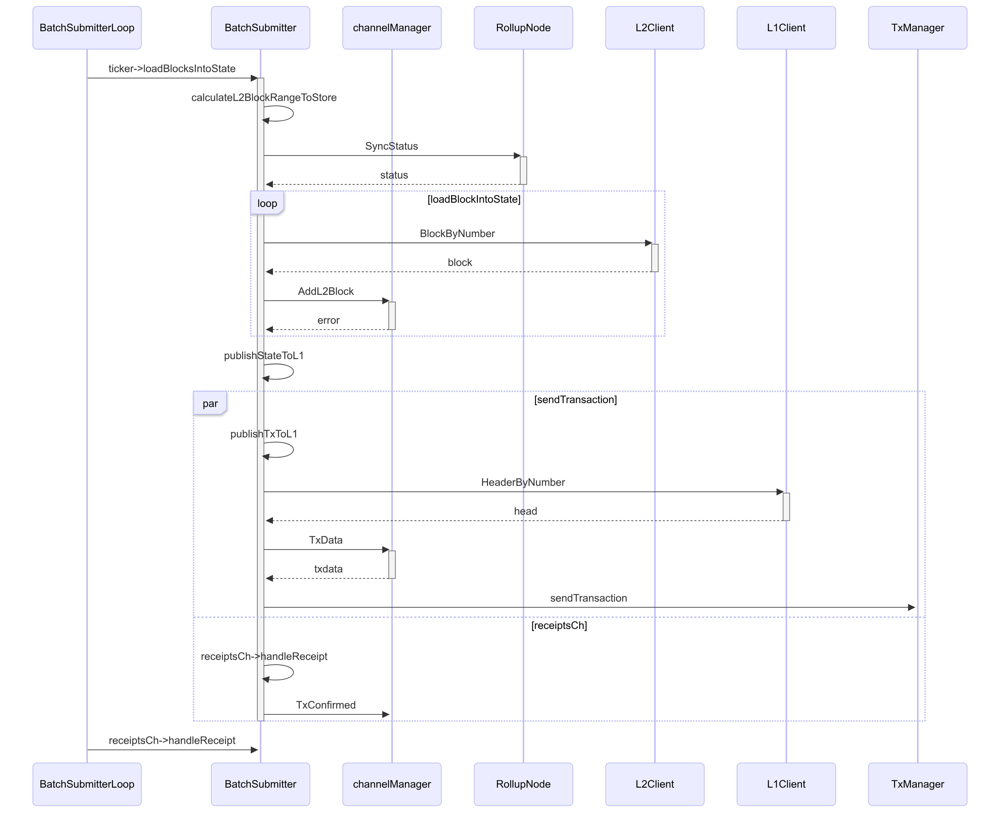

<details>
    <summary>mermaid</summary>

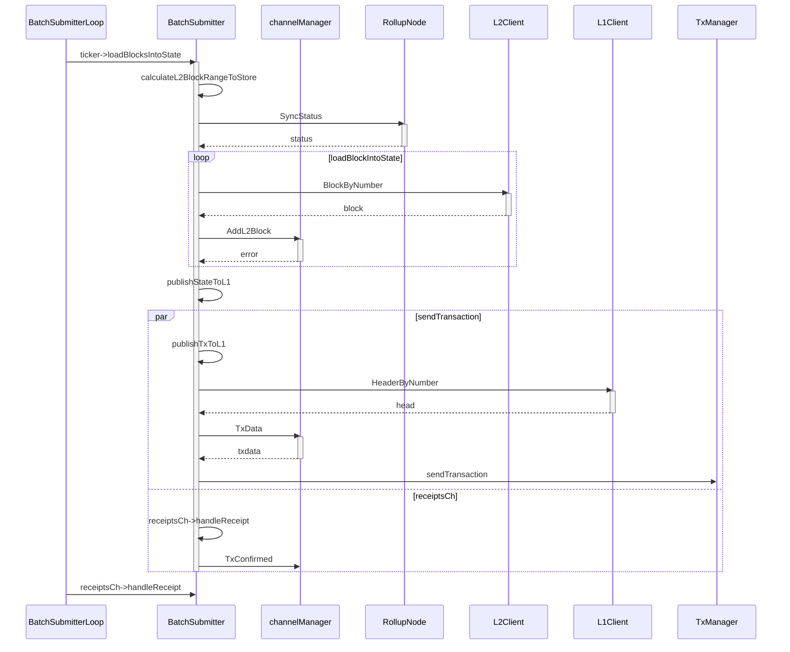
```mermaid
sequenceDiagram
    participant BatchSubmitterLoop 
    participant BatchSubmitter
    participant channelManager
    participant RollupNode
    participant L2Client
    participant L1Client
    participant TxManager

    BatchSubmitterLoop->>BatchSubmitter: ticker->loadBlocksIntoState
    activate BatchSubmitter
    BatchSubmitter->>BatchSubmitter: calculateL2BlockRangeToStore

    BatchSubmitter->>RollupNode: SyncStatus
    activate RollupNode
    RollupNode-->>BatchSubmitter: status
    deactivate RollupNode

    loop loadBlockIntoState
        BatchSubmitter->>L2Client: BlockByNumber
        activate L2Client
        L2Client-->>BatchSubmitter: block
        deactivate L2Client

        BatchSubmitter->>channelManager: AddL2Block
        activate channelManager
        channelManager-->>BatchSubmitter: error
        deactivate channelManager
    end
   
    BatchSubmitter->>BatchSubmitter: publishStateToL1

    par sendTransaction
        BatchSubmitter->>BatchSubmitter: publishTxToL1
        BatchSubmitter->>L1Client: HeaderByNumber
        activate L1Client
        L1Client-->>BatchSubmitter: head
        deactivate L1Client

        BatchSubmitter->>channelManager: TxData
        activate channelManager
        channelManager-->>BatchSubmitter: txdata
        deactivate channelManager

        BatchSubmitter->>TxManager: sendTransaction
    and receiptsCh
        BatchSubmitter->>BatchSubmitter: receiptsCh->handleReceipt
        BatchSubmitter->>channelManager: TxConfirmed
    end
    deactivate BatchSubmitter
    BatchSubmitterLoop->>BatchSubmitter: receiptsCh->handleReceipt

```

</details>

## op-proposer

The `output_root` is a 32 byte string, which is derived based on the a versioned scheme:

```
output_root = keccak256(version_byte || payload)
payload = state_root || withdrawal_storage_root || latest_block_hash

function proposeL2Output(
      bytes32 _l2Output,
      uint256 _l2BlockNumber,
      bytes32 _l1Blockhash,
      uint256 _l1BlockNumber
)
```

where:

1. The `latest_block_hash` (`bytes32`) is the block hash for the latest L2 block.
2. The `state_root` (`bytes32`) is the Merkle-Patricia-Trie ([MPT](https://github.com/ethereum-optimism/specs/blob/main/specs/glossary.md#merkle-patricia-trie)) root of all execution-layer accounts. This value is frequently used and thus elevated closer to the L2 output root, which removes the need to prove its inclusion in the pre-image of the `latest_block_hash`. This reduces the merkle proof depth and cost of accessing the L2 state root on L1.
3. The `withdrawal_storage_root` (`bytes32`) elevates the Merkle-Patricia-Trie ([MPT](https://github.com/ethereum-optimism/specs/blob/main/specs/glossary.md#merkle-patricia-trie)) root of the [Message Passer contract](https://github.com/ethereum-optimism/specs/blob/main/specs/withdrawals.md#the-l2tol1messagepasser-contract) storage. Instead of making an MPT proof for a withdrawal against the state root (proving first the storage root of the L2toL1MessagePasser against the state root, then the withdrawal against that storage root), we can prove against the L2toL1MessagePasser's storage root directly, thus reducing the verification cost of withdrawals on L1.

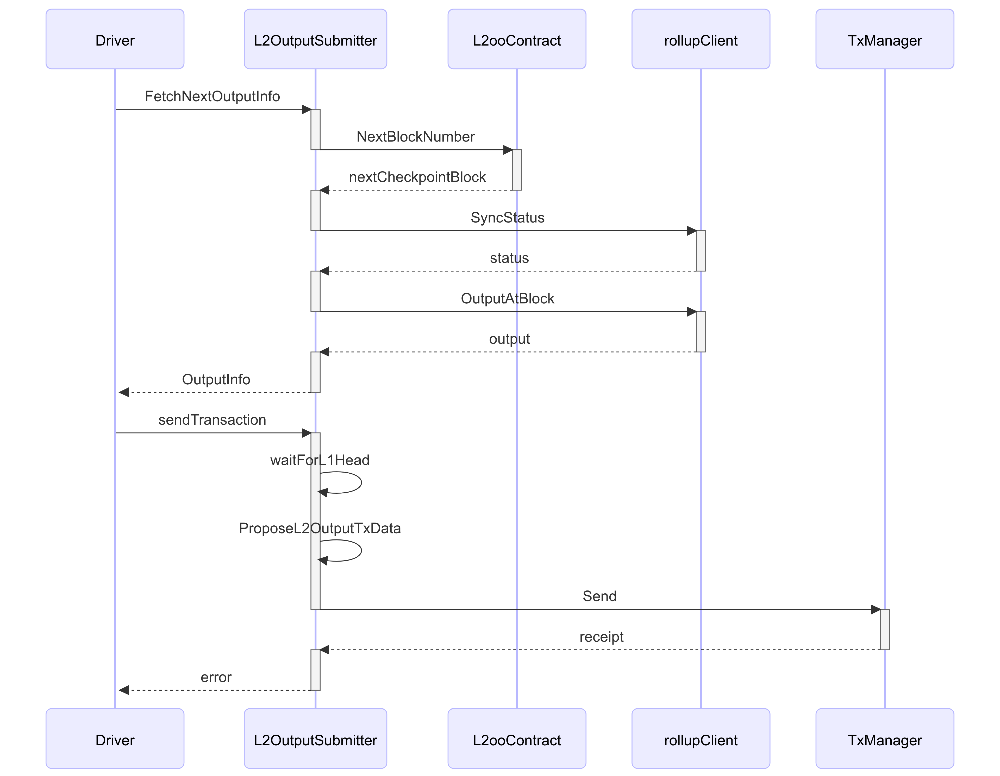

<details>
    <summary>mermaid</summary>

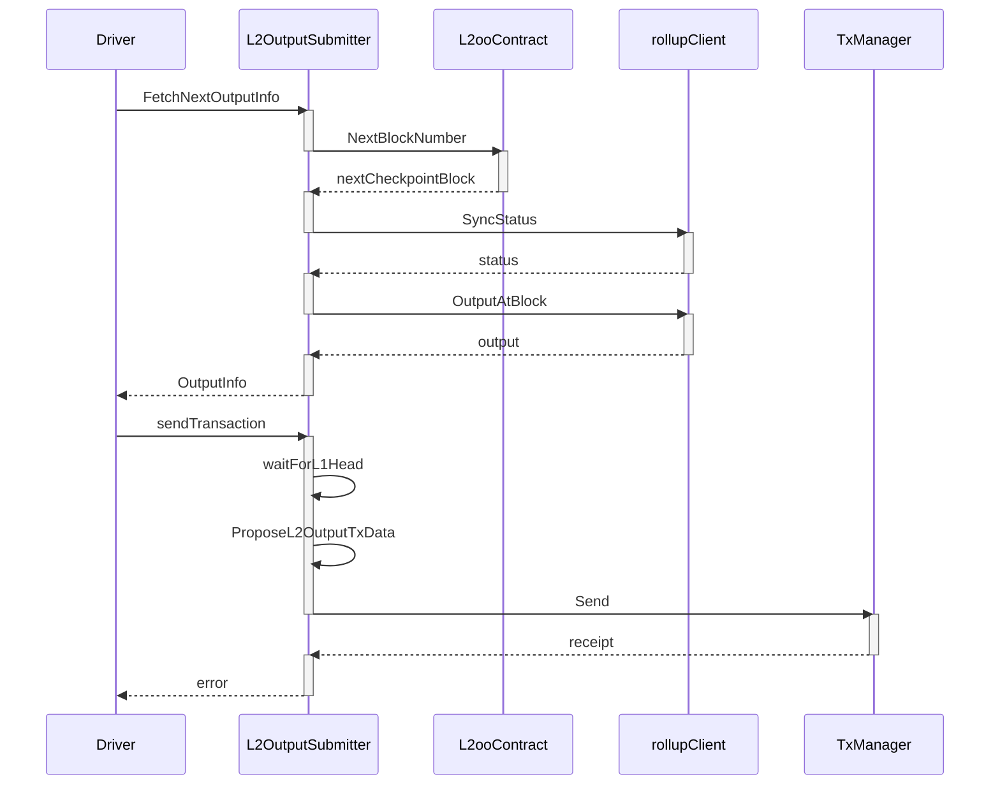
```mermaid
sequenceDiagram
    participant Driver
    participant L2OutputSubmitter
    participant L2ooContract
    participant rollupClient
    participant TxManager

    Driver->>L2OutputSubmitter: FetchNextOutputInfo
    activate L2OutputSubmitter
    L2OutputSubmitter->>L2ooContract: NextBlockNumber
    deactivate L2OutputSubmitter
    activate L2ooContract
    L2ooContract-->>L2OutputSubmitter: nextCheckpointBlock
    deactivate L2ooContract

    activate L2OutputSubmitter
    L2OutputSubmitter->>rollupClient: SyncStatus
    deactivate L2OutputSubmitter
    activate rollupClient
    rollupClient-->>L2OutputSubmitter: status
    deactivate rollupClient

    activate L2OutputSubmitter
    L2OutputSubmitter->>rollupClient: OutputAtBlock
    deactivate L2OutputSubmitter
    activate rollupClient
    rollupClient-->>L2OutputSubmitter: output
    deactivate rollupClient

    activate L2OutputSubmitter
    L2OutputSubmitter-->>Driver: OutputInfo
    deactivate L2OutputSubmitter

    Driver->>L2OutputSubmitter: sendTransaction
    activate L2OutputSubmitter

    L2OutputSubmitter->>L2OutputSubmitter: waitForL1Head
    L2OutputSubmitter->>L2OutputSubmitter: ProposeL2OutputTxData

    L2OutputSubmitter->>TxManager: Send
    deactivate L2OutputSubmitter

    activate TxManager
    TxManager-->>L2OutputSubmitter: receipt
    deactivate TxManager

    activate L2OutputSubmitter
    L2OutputSubmitter-->>Driver: error
    deactivate L2OutputSubmitter
```

</details>

## L1 Reorgs

If the L1 has a reorg after an output has been generated and submitted, the L2 state and correct output may change leading to a faulty proposal. This is mitigated against by allowing the proposer to submit an L1 block number and hash to the Output Oracle when appending a new output; in the event of a reorg, the block hash will not match that of the block with that number and the call will revert.  

```solidity
if (_l1BlockHash != bytes32(0)) {
            // This check allows the proposer to propose an output based on a given L1 block,
            // without fear that it will be reorged out.
            // It will also revert if the blockheight provided is more than 256 blocks behind the
            // chain tip (as the hash will return as zero). This does open the door to a griefing
            // attack in which the proposer's submission is censored until the block is no longer
            // retrievable, if the proposer is experiencing this attack it can simply leave out the
            // blockhash value, and delay submission until it is confident that the L1 block is
            // finalized.
            require(
                blockhash(_l1BlockNumber) == _l1BlockHash,
                "L2OutputOracle: block hash does not match the hash at the expected height"
            );
        }
```

## Fault proof

A fault proof, also known as fraud proof or interactive game, consists of 3 components:

- [Program](https://github.com/ethereum-optimism/specs/blob/main/specs/fault-proof.md#Fault-Proof-Program): **Fault Proof Program(FPP),** given a commitment to all rollup inputs (L1 data) and the dispute, verify the dispute statelessly.
- [VM](https://github.com/ethereum-optimism/specs/blob/main/specs/fault-proof.md#Fault-Proof-VM): **Fault Proof Virtual Machine(FPVM),** given a stateless program and its inputs, trace any instruction step, and prove it on L1.
- [Interactive Dispute Game](https://github.com/ethereum-optimism/specs/blob/main/specs/fault-proof.md#Fault-Proof-Interactive-Dispute-Game):**Fault Dispute Game(FDG),** bisect a dispute down to a single instruction, and resolve the base-case using the VM.

### Process

1. Compile the core derivation function (op-program) to MIPS(Fault Proof Program)
2. Generate the instruction trace (Fault Proof VM) 
3. Bisect the instruction trace to find a disagreement on the specific instruction (Dispute Game)
4. Execute the single instruction on-chain to validate the claimed post-state (Cannon)
5. Keep or remove proposed output depending on the result of the game

### op-program

The Fault Proof Program defines the verification of claims of the state-transition outputs of the L2 rollup as a pure function of L1 data.

```makefile
op-program-host:
	env GO111MODULE=on GOOS=$(TARGETOS) GOARCH=$(TARGETARCH) go build -v $(LDFLAGS) -o ./bin/op-program ./host/cmd/main.go
op-program-client:
	env GO111MODULE=on GOOS=$(TARGETOS) GOARCH=$(TARGETARCH) go build -v $(LDFLAGS) -o ./bin/op-program-client ./client/cmd/main.go
op-program-client-mips:
	env GO111MODULE=on GOOS=linux GOARCH=mips GOMIPS=softfloat go build -v $(LDFLAGS) -o ./bin/op-program-client.elf ./client/cmd/main.go
```

```bash
./bin/op-program \
--l1.trustrpc \
--l1.rpckind alchemy \
--l1 https://eth-sepolia.g.alchemy.com/v2/  \
--l2 http://127.0.0.1:8545 \
--l1.head 0x33dc65e2e8a49255d919d012943776b0431ccddb44c5dbb2f341701627fe9b29 \
--l2.head 0xf8920b9f5f837019a410bf67a3047fd1831e3aeb56c76df072e77fe4e82fbac3 \
--l2.outputroot AA7DDB0142CEE1DC77D31A8F27372ABBF136D65EA04177388044D7918E7A6588 \
--l2.claim 0x530658ab1b1b3ff4829731fc8d5955f0e6b8410db2cd65b572067ba58df1f2b9 \
--l2.blocknumber 245 \
--datadir /tmp/fpp-database \
--rollup.config ../op-node/rollup.json \
--l2.genesis ../op-node/genesis.json
```

#### **Pre-image Oracle**

The pre-image oracle is the only form of communication between the [Program](https://github.com/ethereum-optimism/specs/blob/main/specs/fault-proof.md#Fault-Proof-Program) (in the [Client](https://github.com/ethereum-optimism/specs/blob/main/specs/fault-proof.md#client) role) and the [VM](https://github.com/ethereum-optimism/specs/blob/main/specs/fault-proof.md#Fault-Proof-VM) (in the [Server](https://github.com/ethereum-optimism/specs/blob/main/specs/fault-proof.md#server) role).

The program uses the pre-image oracle to query any input data that is understood to be available to the user:

- The initial inputs to bootstrap the program. See [Bootstrapping](https://github.com/ethereum-optimism/specs/blob/main/specs/fault-proof.md#bootstrapping).
- External data not already part of the program code. See [Pre-image hinting routes](https://github.com/ethereum-optimism/specs/blob/main/specs/fault-proof.md#pre-image-hinting-routes).

The communication happens over a simple request-response wire protocol, see [Pre-image communication](https://github.com/ethereum-optimism/specs/blob/main/specs/fault-proof.md#pre-image-communication).

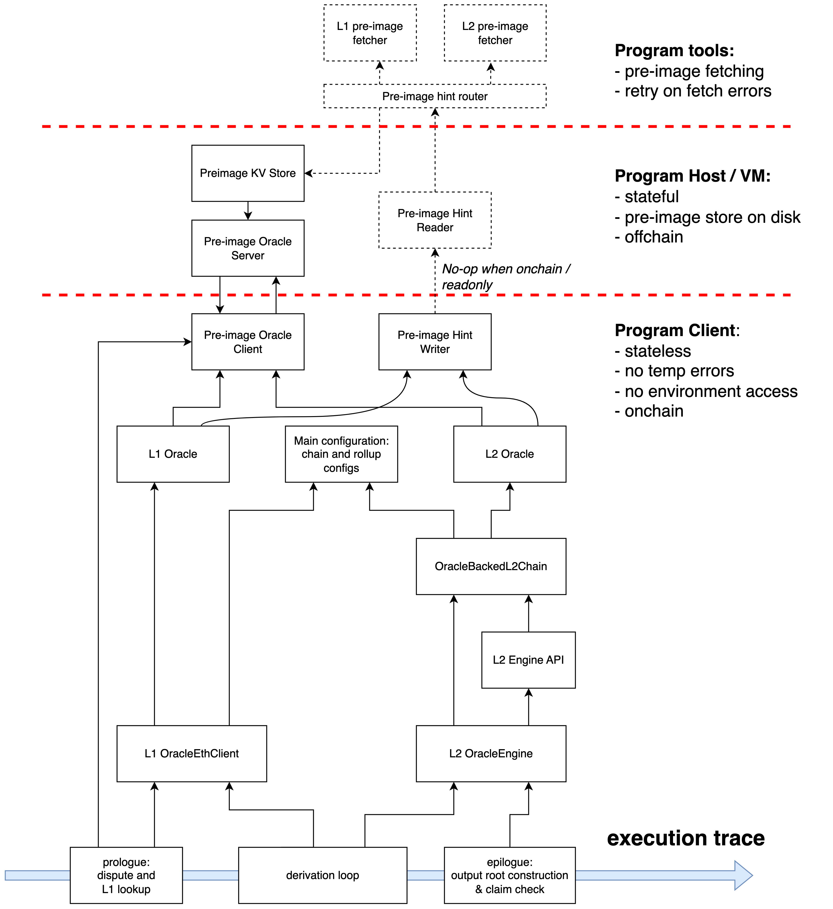

### cannon

- a smart-contract to verify a single execution-trace step, e.g. a single MIPS instruction.
- a CLI command to generate a proof of a single execution-trace step.
- a CLI command to compute a VM state-root at step N

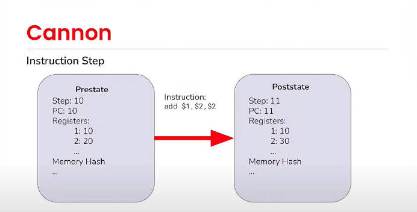

Operationally, the FPVM is a state transition function. This state transition is referred to as a

*Step*, that executes a single instruction. We say the VM is a function $f$, given an input state$S_{pre}$

, steps on a single instruction encoded in the state to produce a new state$S_{post}$.

$$
f(S_{pre}) \rightarrow S_{post}
$$

There are 3 types of witness data involved in onchain execution:

- [Packed State](https://github.com/ethereum-optimism/optimism/tree/develop/cannon/docs#packed-state)
- [Memory proofs](https://github.com/ethereum-optimism/optimism/tree/develop/cannon/docs#memory-proofs)
- [Pre-image data](https://github.com/ethereum-optimism/optimism/tree/develop/cannon/docs#pre-image-data)

The memory access is specifically:

- instruction (4 byte) read at `PC`
- load or syscall mem read, always aligned 4 bytes, read at any `addr`
- store or syscall mem write, always aligned 4 bytes, at the same `addr`

#### Implementation

onchain step verify

- It's Solidity code
- ...emulating a MIPS machine
- ...running compiled Go code
- ...that runs an EVM

offchain generate proof

- It's Go code
- ...emulating a MIPS machine
- ...running compiled Go code
- ...that runs an EVM

offchain step verify

(for test)

- It's Go code
- ...that runs an EVM(use MIPS.sol)
- ...emulating a MIPS machine
- ...running compiled Go code
- ...that runs an EVM

#### State

The virtual machine state highlights the effects of running a Fault Proof Program on the VM. It consists of the following fields:

1. `memRoot` - A `bytes32` value representing the merkle root of VM memory.
2. `preimageKey` - `bytes32` value of the last requested pre-image key.
3. `preimageOffset` - The 32-bit value of the last requested pre-image offset.
4. `pc` - 32-bit program counter.
5. `nextPC` - 32-bit next program counter. Note that this value may not always be $pc+4$ when executing a branch/jump delay slot.
6. `lo` - 32-bit MIPS LO special register.
7. `hi` - 32-bit MIPS HI special register.
8. `heap` - 32-bit base address of the most recent memory allocation via mmap.
9. `exitCode` - 8-bit exit code.
10. `exited` - 1-bit indicator that the VM has exited.
11. `registers` - General-purpose MIPS32 registers. Each register is a 32-bit value.

The state is represented by packing the above fields, in order, into a 226-byte buffer.

#### State Hash

The state hash is computed by hashing the 226-byte state buffer with the Keccak256 hash function and then setting the high-order byte to the respective VM status.

```solidity
// @param _stateData The encoded state witness data.
// @param _proof The encoded proof data for leaves within the MIPS VM's memory.
// @param _localContext The local key context for the preimage oracle. Optional, can be set as a constant if the caller only requires one set of local keys.
function step(bytes calldata _stateData, bytes calldata _proof, bytes32 _localContext) public returns (bytes32)
//The proof of a single execution-trace step:MerkleProof of state.PC and read/write memory addr
```

```go
type Proof struct {
    Step         uint64        `json:"step"`
    Pre          common.Hash   `json:"pre"`
    Post         common.Hash   `json:"post"`
    StateData    hexutil.Bytes `json:"state-data"`
    ProofData    hexutil.Bytes `json:"proof-data"`
    OracleKey    hexutil.Bytes `json:"oracle-key,omitempty"`
    OracleValue  hexutil.Bytes `json:"oracle-value,omitempty"`
    OracleOffset uint32        `json:"oracle-offset,omitempty"`
}
```

#### Memory

4-byte aligned

AddrSize:32bit

PageSize:4KB(12bit)

PageNumberSize:20bit

`Merkleize`：A binary merkle tree, has a fixed-depth of 27 levels, with leaf values of 32 bytes each. This spans the full 32-bit address space:$2^{27}*32=2^{32}$

proof:[28 * 32]byte, the first two are  leaf node, others are`Keccak256Hash` 

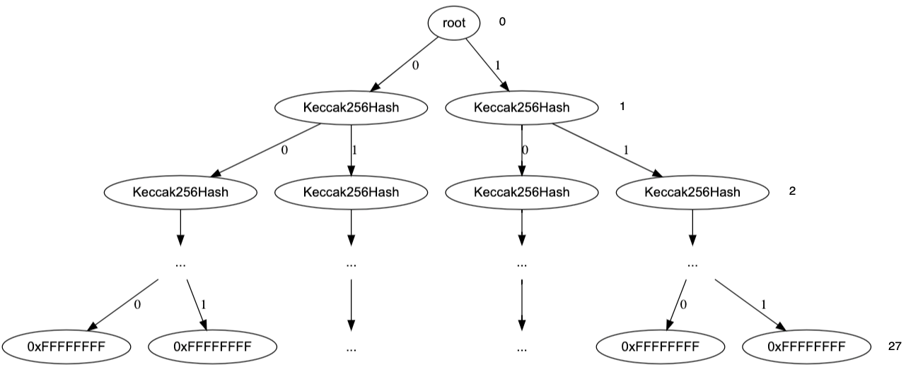

```go
type Memory struct {
	// generalized index -> merkle root or nil if invalidated
	nodes map[uint64]*[32]byte
	// pageIndex -> cached page
	pages map[uint32]*CachedPage
	// Note: since we don't de-alloc pages, we don't do ref-counting.
	// Once a page exists, it doesn't leave memory
	// two caches: we often read instructions from one page, and do memory things with another page.
	// this prevents map lookups each instruction
	lastPageKeys [2]uint32
	lastPage     [2]*CachedPage
}
```

#### Syscalls

Syscalls work similar to [Linux/MIPS](https://www.linux-mips.org/wiki/Syscall), including the syscall calling conventions and general syscall handling behavior. However, the FPVM supports a subset of Linux/MIPS syscalls with slightly different behaviors. The following table list summarizes the supported syscalls and their behaviors.

| $v0 | system call | $a0 | $a1 | $a2 | Effect |
| --- | --- | --- | --- | --- | --- |
| 4090 | mmap | uint32 addr | uint32 len |  | Allocates a page from the heap. See [heap](https://github.com/ethereum-optimism/specs/blob/main/specs/cannon-fault-proof-vm.md#heap) for details. |
| 4045 | brk |  |  |  | Returns a fixed address for the program break at `0x40000000` |
| 4120 | clone |  |  |  | Returns 1 |
| 4246 | exit_group | uint8 exit_code |  |  | Sets the Exited and ExitCode states to `true` and `$a0` respectively. |
| 4003 | read | uint32 fd | char *buf | uint32 count | Similar behavior as Linux/MIPS with support for unaligned reads. See [I/O](https://github.com/ethereum-optimism/specs/blob/main/specs/cannon-fault-proof-vm.md#io) for more details. |
| 4004 | write | uint32 fd | char *buf | uint32 count | Similar behavior as Linux/MIPS with support for unaligned writes. See [I/O](https://github.com/ethereum-optimism/specs/blob/main/specs/cannon-fault-proof-vm.md#io) for more details. |
| 4055 | fcntl | uint32 fd | int32 cmd |  | Similar behavior as Linux/MIPS. Only the `F_GETFL` (3) cmd is supported. Sets errno to `0x16` for all other commands |

#### I/O

Map the fd returned by the parent process pipe to the pre-set fd of the child process:

```go
// in cannon
// call os.Pipe()
cmd.ExtraFiles = []*os.File{
		hOracleRW.Reader(),
		hOracleRW.Writer(),
		pOracleRW.Reader(),
		pOracleRW.Writer(),
	}
// in op-program-host
func CreatePreimageChannel() oppio.FileChannel {
	r := os.NewFile(PClientRFd, "preimage-oracle-read")
	w := os.NewFile(PClientWFd, "preimage-oracle-write")
	return oppio.NewReadWritePair(r, w)
}
```

The VM does not support Linux open(2). However, the VM can read from and write to a predefined set of file descriptors.

| Name | File descriptor | Description |
| --- | --- | --- |
| stdin | 0 | read-only standard input stream. |
| stdout | 1 | write-only standard output stream. |
| stderr | 2 | write-only standard error stream. |
| hint response | 3 | read-only. Used to read the status of [pre-image hinting](https://github.com/ethereum-optimism/specs/blob/main/specs/fault-proof.md#hinting). |
| hint request | 4 | write-only. Used to provide [pre-image hints](https://github.com/ethereum-optimism/specs/blob/main/specs/fault-proof.md#hinting) |
| pre-image response | 5 | read-only. Used to [read pre-images](https://github.com/ethereum-optimism/specs/blob/main/specs/fault-proof.md#pre-image-communication). |
| pre-image request | 6 | write-only. Used to [request pre-images](https://github.com/ethereum-optimism/specs/blob/main/specs/fault-proof.md#pre-image-communication). |

### **PreimageOracle**

**Local key**

This type of key is used for program bootstrapping, to identify the initial input arguments by index or name.****

| Identifier | Description |
| --- | --- |
| `0` | Parent L1 head hash at the time of the proposal |
| `1` | Starting output root hash (commits to block # `n`) |
| `2` | Disputed output root hash (commits to block # `n + 1`) |
| `3` | Starting L2 block number (block # `n`) |
| `4` | Chain ID |

**Global keccak256 key**

This type of key uses a global pre-image store contract, and is fully context-independent and permissionless.For global `keccak256` preimages, there are two routes for players to submit:

1. Small preimages atomically.
2. Large preimages via streaming.

```go
func (d *StateMatrix) StateCommitment() common.Hash {
	buf := d.PackState()
	return crypto.Keccak256Hash(buf)
}
func (d *StateMatrix) PackState() []byte {
	buf := make([]byte, 0, len(d.s.a)*uint256Size)
	for _, v := range d.s.a {
		buf = append(buf, math.U256Bytes(new(big.Int).SetUint64(v))...)
	}
	return buf
}
```

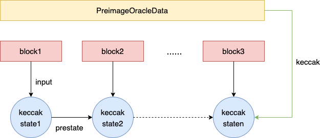

Once the full preimage and all intermediate state commitments have been posted, the large preimage proposal enters a challenge period. During this time, a challenger can reconstruct the merkle tree that was progressively built on-chain locally by scanning the block bodies that contain the proposer's leaf preimages. If they detect that a commitment to the intermediate state of the hash function is incorrect at any step, they may perform a single-step dispute for the proposal in the `PreimageOracle` .

The depth of the keccak256 merkle tree is 16. Supports up to 65,536 keccak blocks, or ~8.91MB preimages.

```solidity
function _hashLeaf(Leaf memory _leaf) internal pure returns (bytes32 leaf_) {
        leaf_ = keccak256(abi.encodePacked(_leaf.input, _leaf.index, _leaf.stateCommitment));
    }
```

**merkleize onchain**

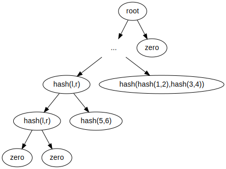

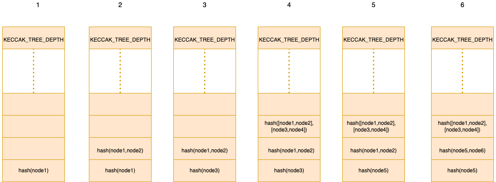

```solidity
/// @notice Mapping of claimants to proposal UUIDs to the current branch path of the merkleization process.
mapping(address => mapping(uint256 => bytes32[KECCAK_TREE_DEPTH])) public proposalBranches;

for { let i := 0 } lt(i, inputLen) { i := add(i, 136) } {
  // Copy the leaf preimage into the hashing buffer.
  // ...
  // Hash the leaf preimage to get the node to add.
  let node := keccak256(hashBuf, 0xC8)

  // Increment the number of blocks processed.
  blocksProcessed := add(blocksProcessed, 0x01)

  // Add the node to the tree.
  let size := blocksProcessed
  for { let height := 0x00 } lt(height, shl(0x05, KECCAK_TREE_DEPTH)) { height := add(height, 0x20) } {
      if and(size, 0x01) {
          mstore(add(branch, height), node)
          break
      }

      // Hash the node at `height` in the branch and the node together.
      mstore(0x00, mload(add(branch, height)))
      mstore(0x20, node)
      node := keccak256(0x00, 0x40)
      size := shr(0x01, size)
  }
}
```

```solidity
function getTreeRootLPP(address _owner, uint256 _uuid) public view returns (bytes32 treeRoot_) {
        uint256 size = proposalMetadata[_owner][_uuid].blocksProcessed();
        for (uint256 height = 0; height < KECCAK_TREE_DEPTH; height++) {
            if ((size & 1) == 1) {
                treeRoot_ = keccak256(abi.encode(proposalBranches[_owner][_uuid][height], treeRoot_));
            } else {
                treeRoot_ = keccak256(abi.encode(treeRoot_, zeroHashes[height]));
            }
            size >>= 1;
        }
 }
```

```solidity
function challengeFirstLPP(
        address _claimant,
        uint256 _uuid,
        Leaf calldata _postState,
        bytes32[] calldata _postStateProof
    )
        external
    {
        bytes32 root = getTreeRootLPP(_claimant, _uuid);
        if (!_verify(_postStateProof, root, _postState.index, _hashLeaf(_postState))) revert InvalidProof();

        if (_postState.index != 0) revert StatesNotContiguous();
        LibKeccak.StateMatrix memory stateMatrix;
        LibKeccak.absorb(stateMatrix, _postState.input);
        LibKeccak.permutation(stateMatrix);

        if (keccak256(abi.encode(stateMatrix)) == _postState.stateCommitment) revert PostStateMatches();

        proposalMetadata[_claimant][_uuid] = proposalMetadata[_claimant][_uuid].setCountered(true);
    }
```

## op-challenger

The honest challenger is an agent interacting in the [Fault Dispute Game](https://github.com/ethereum-optimism/specs/blob/main/specs/fault-dispute-game.md) (FDG) that supports honest claims and disputes false claims.

### **Game Tree**

The Game Tree is a binary tree of positions.The Game Tree has a split depth and maximum depth.The split depth defines the maximum depth at which claims about [output roots](https://github.com/ethereum-optimism/specs/blob/main/specs/glossary.md#L2-output-root) can occur, and below it, execution trace bisection occurs.

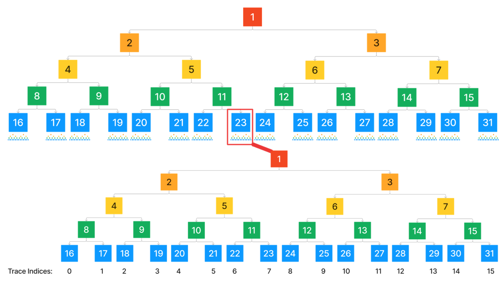

### **Position**

A position represents the location of a claim in the Game Tree. This is represented by a "generalized index" (or **gindex**) where the high-order bit is the level in the tree and the remaining bits is a unique bit pattern, allowing a unique identifier for each node in the tree.

The**gindex**of a position $n$ can be calculated as $2^{d(n)} + idx(n)$

- $d(n)$is a function returning the depth of the position in the Game Tree
- $idx(n)$ is a function returning the index of the position at its depth (starting from the left).

### **Actors**

The game involves two types of participants (or Players): **Challengers** and **Defenders**.

### **Attack**

A logical move made when a claim is disagreed with.

### **Defend**

The logical move against a claim when you agree with both it and its parent.

### **Step**

At `MAX_GAME_DEPTH` ,the FDG is able to query the VM to determine the validity of claims.

### **Resolution**

Resolving the FDG determines which team won the game.In order for a claim to be considered countered, only one of its children must be uncountered.

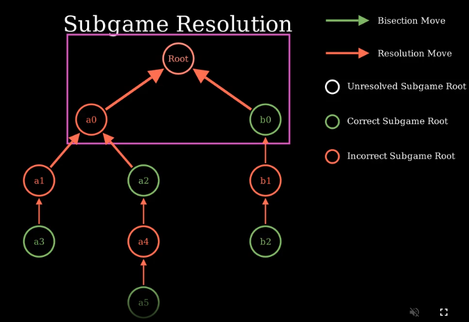

## Alphabet Game

challenger:ABCDEFGH

proposer:ABCDEXYZ

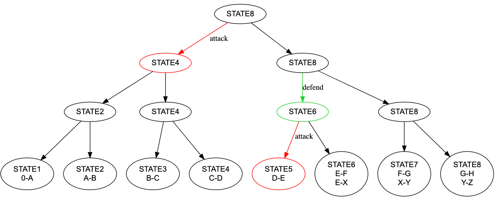

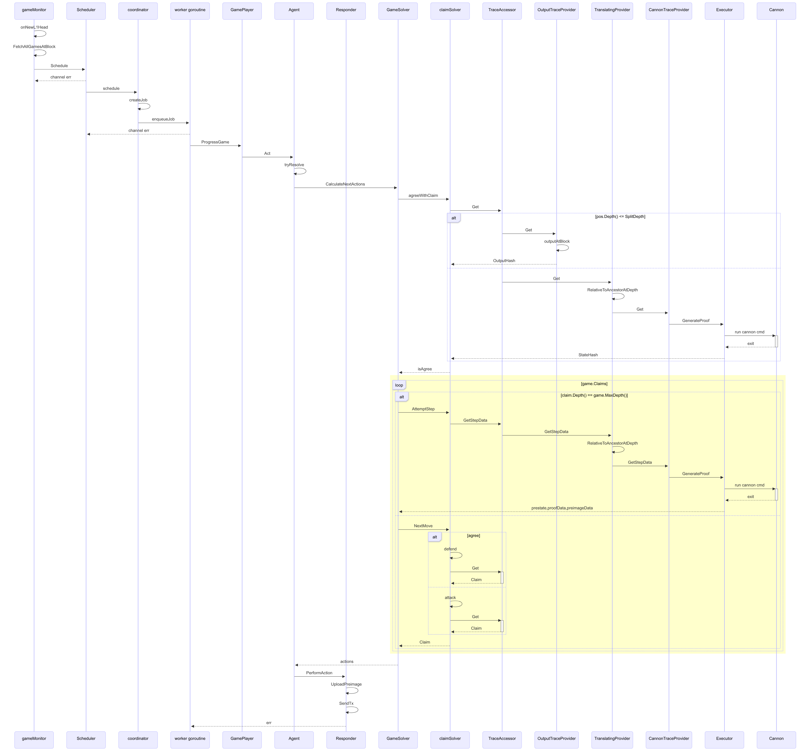

<details>
    <summary>mermaid</summary>

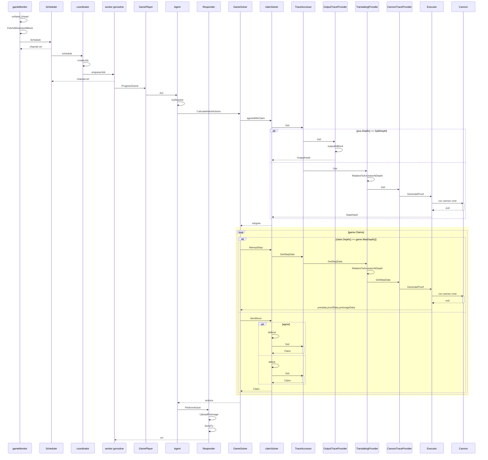
```mermaid
sequenceDiagram
    participant gameMonitor
    participant Scheduler 
    participant coordinator
    participant worker goroutine
    participant GamePlayer
    participant Agent
    participant Responder
    participant GameSolver
    participant claimSolver
    participant TraceAccessor
    participant OutputTraceProvider
    participant TranslatingProvider
    participant CannonTraceProvider
    participant Executor
    participant Cannon

    gameMonitor->>gameMonitor: onNewL1Head
    gameMonitor->>gameMonitor: FetchAllGamesAtBlock

    gameMonitor->>Scheduler: Schedule
    Scheduler-->>gameMonitor: channel err

    Scheduler->>coordinator: schedule
    coordinator->>coordinator: createJob
    coordinator->>worker goroutine: enqueueJob
    worker goroutine-->>Scheduler: channel err

    worker goroutine->>GamePlayer: ProgressGame
    GamePlayer->>Agent: Act
    Agent->>Agent: tryResolve
    Agent->>GameSolver: CalculateNextActions
    GameSolver->>claimSolver: agreeWithClaim
    claimSolver->>TraceAccessor: Get
    alt pos.Depth() <= SplitDepth
        TraceAccessor->>OutputTraceProvider: Get
        OutputTraceProvider->>OutputTraceProvider: outputAtBlock
        OutputTraceProvider-->>claimSolver: OutputHash
    else 
        TraceAccessor->>TranslatingProvider: Get
        TranslatingProvider->>TranslatingProvider: RelativeToAncestorAtDepth
        TranslatingProvider->>CannonTraceProvider: Get
        CannonTraceProvider->>Executor: GenerateProof
        Executor->>Cannon: run cannon cmd
        activate Cannon
        Cannon-->>Executor: exit
        deactivate Cannon
        Executor-->>claimSolver: StateHash
    end
    claimSolver-->>GameSolver: isAgree
    rect rgb(255, 255, 204)
    loop game.Claims
    alt claim.Depth() == game.MaxDepth()
        GameSolver->>claimSolver: AttemptStep
        claimSolver->>TraceAccessor: GetStepData
        TraceAccessor->>TranslatingProvider: GetStepData
        TranslatingProvider->>TranslatingProvider: RelativeToAncestorAtDepth
        TranslatingProvider->>CannonTraceProvider: GetStepData
        CannonTraceProvider->>Executor: GenerateProof
        Executor->>Cannon: run cannon cmd
        activate Cannon
        Cannon-->>Executor: exit
        deactivate Cannon
        Executor-->>GameSolver: prestate,proofData,preimageData
    else 
        GameSolver->>claimSolver: NextMove
        alt agree
            claimSolver->>claimSolver: defend
            claimSolver->>TraceAccessor: Get
            activate TraceAccessor
            TraceAccessor-->>claimSolver: Claim
            deactivate TraceAccessor
        else
            claimSolver->>claimSolver: attack
            claimSolver->>TraceAccessor: Get
            activate TraceAccessor
            TraceAccessor-->>claimSolver: Claim
            deactivate TraceAccessor
        end
        claimSolver-->>GameSolver: Claim
    end
    end
    end
    GameSolver-->>Agent: actions
    Agent->>Responder: PerformAction
    Responder->>Responder: UploadPreimage
    Responder->>Responder: SendTx
    Responder-->>worker goroutine: err
```

</details>

## ZKP

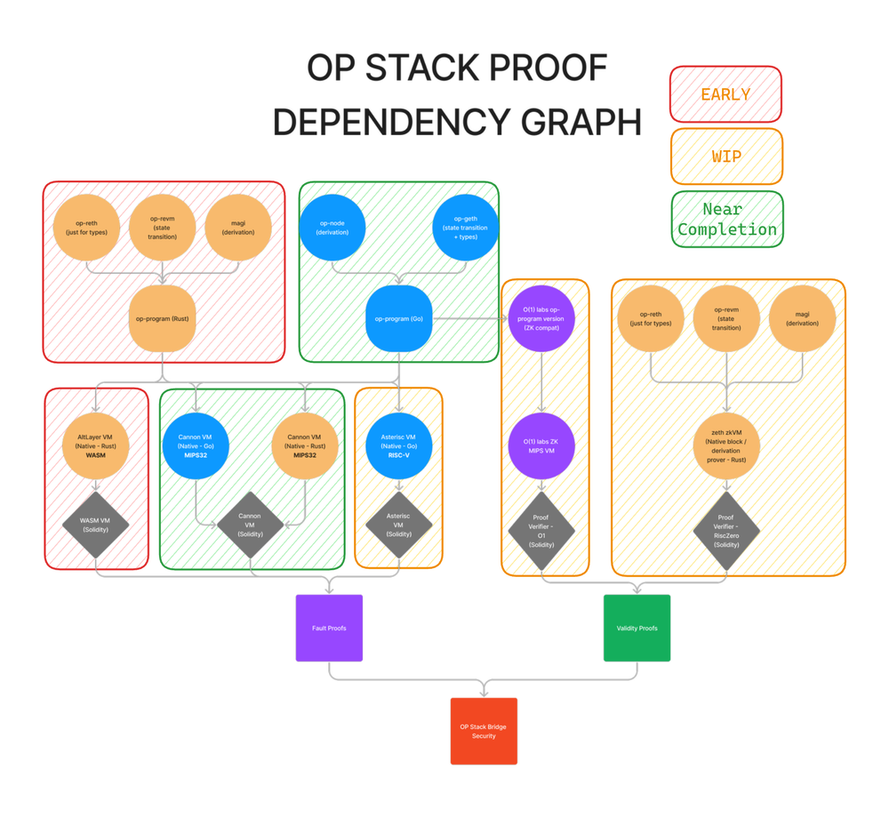

[https://github.com/ethereum-optimism/ecosystem-contributions/issues/61](https://github.com/ethereum-optimism/ecosystem-contributions/issues/61)

### O(1) Labs

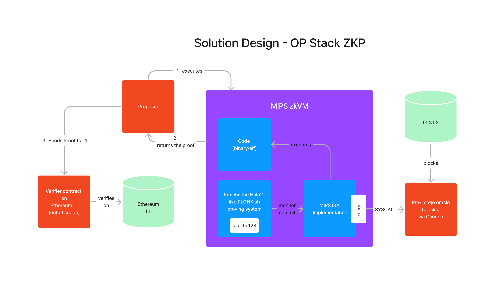

### RISC Zero

- To modify our Ethereum ZK client to have first-class support for Optimism. This will make it possible to prove that a given Optimism block is valid, in the sense that it was obtained by starting from a given “parent” block, together with a sequence of transactions (see next bullet).
- To implement Optimism’s *L1 -> L2 derivation logic* within our zkVM. This will make it possible to prove that a given sequence of transactions was generated by the Optimism sequencer.
- To implement an **epoch union**. This will make it possible to prove that a sequence of Optimism epochs (each consisting of L2 blocks generated by our ZK client) is (1) sequentially consistent and (2) constructed using the L2 transactions obtained by the L1 -> L2 derivation logic.
