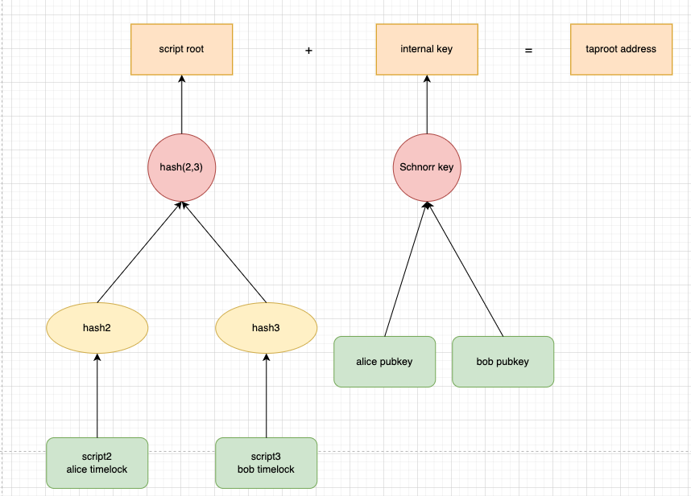
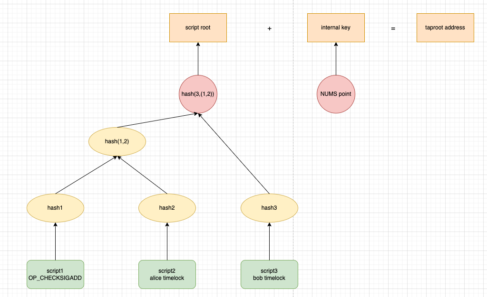

## Taproot

P2PKH和P2PSH可以分别通过私钥和脚本花费，但是这两种方式可以很容易通过hash长度区分出来，那么有没有一种方法能够将两种方式结合起来呢？

Taproot就可以实现这个能力，简单来说，可以通过两种方式来花费一个taproot地址，每个taproot地址对应一个内部公钥，如果你有其内部公钥对应的私钥，则可以像P2PKH的方式来花费，同时，taproot地址还可以对应一系列的脚本，通过花费其中任意一个脚本，就可以花费taproot地址。这两种方式对应的地址是无法区分的，当你通过私钥花费时，taproot地址对应的脚本不会被暴露，当你花费其中任意一个脚本时，其他的脚本也不会被暴露，这大大增强了交易的隐私性和灵活性。

Taproot 升级包含3个BIP，Schnorr 签名（BIP 340），Taproot（BIP 341）和 TapScript（BIP 342），它的实现就对应着这3个技术：Schnorr签名，MAST，以及Tapscript，我们来逐个看一下：

## Schnorr签名

Schnorr算法是由德国密码学家ClausSchnorr于1991年提出的，它是一种数字签名方案，具备高效率，高隐私性的同时，保留了 ECDSA 的所有功能和安全假设。相较于ECDSA，Schnorr 签名可以实现更小的签名大小、更快的验证时间，并且对某些类型的攻击具有更强的抵抗能力。

Schnorr 签名最大的特点是密钥聚合（key aggregation）相当于多个公钥变为一个聚合公钥，多个签名聚合为一个签名，此时签名算法仍然成立，因此其验证很高效，如果N个签名采用ECDSA的话，验证N个签名需要做N次，使用Schnorr，N个签名叠加为一个签名后，一次验证即可，同时从外部也无法分辨出这个签名到底是单一签名还是多个签名聚合得到的，实现了极高的隐私性，使得外部观察者更难通过查看链上信息来确定哪些参与者在交易中签名，哪些没有签名。


安全性上，比特币在SegWit激活之前一直存在延展性攻击，所谓延展性攻击是指攻击者能够修改签名，使得修改后的签名仍然有效，而Schnorr签名则无延展性问题。

## MAST

MAST全称Merklized Abstract Syntax Tree（默克尔抽象语法树）**，**它其实是将编程语言中AST的概念结合了Merkle tree，把 AST 树 Merkle 化，先将多个脚本组合为AST，将其Merkle化后，通在链上提交Merkle root，后续通过提交Merkle proof+单个脚本，证明我要花费的脚本属于之前提交的merkle root，而不暴露其他脚本。比如我要花费下面的script1，我只需要提供script1的内容和hash2，hash3作为merkle proof就可以了，script2和script3不需要暴露。


这种方式极大的改进了原来的P2SH脚本花费的方式，在P2SH中，花费脚本时需要完整公开脚本的内容，而使用MAST，只需要公开花费的某个脚本节点就可以，其他人无法得知整个MAST中的其他脚本内容，这极大增强了隐私性。

MAST还能显著减小交易体积，在P2SH脚本花费中，完全无关的脚本部分也需要提供，这些未使用到的部分增大了交易的体积。而MAST仅需要提供要花费的脚本内容，其余的脚本都通过merkle proof来表达，这样交易体积就大大减少。

MAST还能让比特币脚本摆脱目前 1 万字节的大小上限，因为可以将非常大的脚本拆分为多个叶节点，而且由于未被花费的脚本并不直接包含在签名中，签名校验所消耗的CPU资源也仅与被花费的脚本大小相关，因此通过MAST可以构建出非常大非常复杂的脚本。

## Tapscript

由于我们引入了Schnorr签名，在MAST树中的脚本与普通的btc脚本的实现会有一些不同，原来的操作码 `OP_CHECKSIG` 和 `OP_CHECKSIGVERIFY` 验证的是ECDSA签名，而在taproot中，他们的功能变为了验证Schnorr签名。同时， `OP_CHECKMULTISIG` 和 `OP_CHECKMULTISIGVERIFY` 操作码被禁用。引入了一个新的操作码 `OP_CHECKSIGADD` ，它基于Schnorr签名可以实现批量验证，提高了多签方案的验证效率。

## Taproot构建

通过上面3个技术，我们现在可以实现taproot地址的构建了，假设现在alice和bob要fund一笔资金到一个taproot地址，这笔资金的花费条件为：1.可以由两人共同多签来花费，2.alice可以1个月后花费，3.bob可以2个月后花费，我们来看如何构建：

我们知道taproot有两种花费方式，密钥路径花费和脚本路径花费，构建的第一步是确定内部公钥和其余脚本，我们第一个花费条件是多签，所以利用Schnorr签名，我们可以把两个人的聚合公钥，作为其内部公钥，用密钥路径花费的方式来实现条件1。



还有另一种方法，我们不用密钥路径的方法，用tapscript中的`OP_CHECKSIGADD`实现一个多签脚本，放到MAST中，同样可以实现条件1，那这种情况下其内部公钥怎么确定呢？我们只想通过脚本来花费，需要禁止掉密钥路径花费，这时可以选择一个“Nothing Up My Sleeve”（NUMS）点作为内部密钥，NUMS 点是一个特殊的点，它没有已知的私钥，也就没人任何人能够通过密钥路径来花费。



这两种方式在隐私性和灵活性上其实有一些差别，如果用第一种方法，其他人是无法看出来这个内部公钥是由两个人聚合出来的，也就无法得知有两个参与方，但它需要双方在链下协商得到聚合签名。而方式二，用`OP_CHECKSIGADD`的方式，其他人可以看出来签名的参与方，但不需要双方在链下协商签名。

而条件2和条件3，我们可以分别在tapscript中实现时间锁脚本，提交到MAST中，此时MAST已构建完成，再加上之前确定的内部公钥，我们就可以构建出taproot地址。可以看到，利用Taproot我们可以非常灵活的构建出复杂的脚本。

我们再用一个2-of-3多签的例子来对比一下P2SH和Taproot：

## 实现2-of-3多签

通过传统P2SH实现：

```rust
script:
<2> <pubkey1> <pubkey2> <pubkey3> <3> CHECKMULTISIG
witness:
<sig1> <sig2> <script content>
```

可以看到，使用传统的P2SH需要提交整个script内容，同时暴露了所有相关的参与方，其他人可以知道这是一个2-of-3多签。

使用taproot，可以根据我们对隐私性和灵活性的要求，用多种方法来实现2-of-3多签。

1.基于`OP_CHECKSIGADD`的单个脚本实现：

```rust
script:
<pubkey1> CHECKSIG <pubkey2> CHECKSIGADD <pubkey3> CHECKSIGADD 2 NUMEQUAL
witness:
<sig1> <empty> <sig3> <script content> <merkle proof>
```

用这种方式，其实和用P2SH中的CHECKMULTISIG没什么太大区别，我们肯定不会这样用，而是用下面的方式

2.将脚本拆分为3个2-2多签，来实现2-3多签：


```rust
script1:
<pubkey_1> CHECKSIGVERIFY <pubkey_2> CHECKSIG
script2:
<pubkey_1> CHECKSIGVERIFY <pubkey_3> CHECKSIG
script3:
<pubkey_2> CHECKSIGVERIFY <pubkey_3> CHECKSIG
witness1:
<sig1> <sig2> <script content> <merkle proof>
```

通过将原来的脚本拆分为1,2多签，1,3多签，2,3多签，同样可以实现2-3多签，这样拆分后不仅减少了区块空间消耗，而且只会暴露最终花费的相关公钥，提高了隐私性。

3.利用Schnorr签名的特性，将2中的3个2-2多签变为3个2-2聚合的单签：

```rust
script1:
<pubkey_1> CHECKSIG 
script2:
<pubkey_2> CHECKSIG
script3:
<pubkey_3> CHECKSIG
witness1:
<sig1> <script content> <merkle proof>
```

将2中脚本的2个公钥，通过Schnorr签名的聚合机制生成聚合公钥，变成单签名验证，这种方式进一步提高了隐私性，其他人无法得知签名的参与方，而且脚本更短，进一步减少了区块空间消耗，但同时它需要签名参与方在链下生成聚合公钥和签名。

## Summary

Taproot作为比特币协议的一次重大升级，通过结合Schnorr签名、MAST和Tapscript技术，实现了更高的隐私性、灵活性和扩展性。Schnorr签名提供了高效的签名验证和聚合密钥的能力，显著提高了隐私性和安全性；MAST使得复杂脚本可以通过默克尔树的结构只暴露需要花费的部分，极大增强了隐私性并减小了交易体积；Tapscript则通过优化的操作码进一步提升了多签方案的验证效率。

Taproot的这些改进不仅增强了比特币的隐私性和安全性，还提高了链上交易的效率和灵活性。这些特性使得Taproot在未来的区块链应用中具有广阔的前景，包括但不限于智能合约、多重签名钱包、隐私保护交易等。随着Taproot的广泛应用，比特币网络将更加健壮、高效，为用户提供更加安全和隐私的交易体验，推动比特币生态系统的进一步发展。