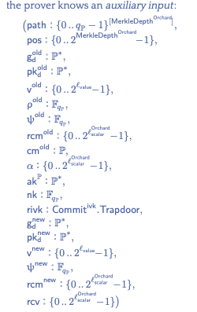

## Zcash

Anonymous transfer, sender address, recipient address, and amount all invisible.


## Transactions example:

Public:[https://zcashblockexplorer.com/transactions/55f91f7480ec53a84908e72cc6158382f0fbd8784c9ea9279d2ca4fb75e5a610/raw](https://zcashblockexplorer.com/transactions/55f91f7480ec53a84908e72cc6158382f0fbd8784c9ea9279d2ca4fb75e5a610/raw)

Shield:[https://zcashblockexplorer.com/transactions/4db4c8d3197aa9d36fa3d8c58dbd1b0b5f4534fb6f08444f2fc3bd41ece48ed2/raw](https://zcashblockexplorer.com/transactions/4db4c8d3197aa9d36fa3d8c58dbd1b0b5f4534fb6f08444f2fc3bd41ece48ed2/raw)

Deshield:[https://zcashblockexplorer.com/transactions/289da424637c66a7e343ea56bf6b7f149aa3315368c17977ec3e77dc6ce0bf7f/raw](https://zcashblockexplorer.com/transactions/289da424637c66a7e343ea56bf6b7f149aa3315368c17977ec3e77dc6ce0bf7f/raw)

Private:[https://zcashblockexplorer.com/transactions/c083a6b24f074812c1656c672f4104f12ae42c4e7ea8885bcc1049adc6061c4f/raw](https://zcashblockexplorer.com/transactions/c083a6b24f074812c1656c672f4104f12ae42c4e7ea8885bcc1049adc6061c4f/raw)

## Zero knowledge proof


The verifier could confirm that the prover computes some functions ‘F(w) = y’ correctly even without knowing the input ‘w’.


## Algorithms


$CRH, H = \text{SHA}256$

$\text{PRF}^{\text{addr}}_{x}(z) := H\left( x \right\|00 \left\| z \right),\text{PRF}^{\text{sn}}_{x}(z) := H\left( 01 \right\|  x  \left\| z \right), \text{PRF}^{\text{pk}}_{x}(z) := H\left( 11 \right\|  x  \left\| z \right)$ 

$k := \text{COMM}_{r}(a_{pk}\|\rho) \text{ as } H\left( r \| \left[ H(a_{pk}\|\rho )\right]_{128} \right)$

$\text{cm} := \text{COMM}_{s}(v\|k) \text{ as } H\left(k \| 0^{192} \| v \right)$

### CreateAddress


### Mint


mint the public coin to a cm,the $k$ hide $a_{pk}$, $\rho$, so that we don't know the owner of the coin. the  $cm$ allow us to verify the value of the corresponding coin is v.

### Pour


The new coin is tied to the $a_{pk}$. Without the corresponding private key, it cannot be spent. $tx_{pour}$ also does not display how the value of new coin is allocated, nor does it display the corresponding public key.

<aside>
❓ Question:How to ensure the correctness of $C_1,C_2$?

</aside>

### Proof

instance:$x = \left( rt, sn^{old}_1, sn^{old}_2, cm^{new}_1, cm^{new}_2, v_{pub}, h_{sig}, h_1, h_2 \right)$

witness:$a = \left( \text{path}_1, \text{path}_2, c^{old}_1, c^{old}_2, \text{addr}^{old}_{sk,1}, \text{addr}^{old}_{sk,2}, c^{new}_1, c^{new}_2 \right)$


- why need a?  Ensure the correctness of cm and prevent the creation of non-existent cm.
- why b? Ensure that the prover have the private key of the coin’s pk.
- why c? Ensure that the serial number of the coin correct.
- why d? Ensure that the coin information  is legitimate and can be associated with cm.
- why e? Same to d.
- why f? Ensure  that the $a_{pk}$ is indeed the signture public key and has not been changed.

### VerifyTransaction


### Receive


### Summary


## Orchard

Rust Implementation of the Zcash Orchard Protocol

## Key&Address


## Class


<details>
     <summary>mermaid</summary>


</details>


## Transcation

```rust
let shielding_bundle: Bundle<_, i64> = {
        // Use the empty tree.
        let anchor = MerkleHashOrchard::empty_root(32.into()).into();

        let mut builder = Builder::new(Flags::from_parts(false, true), anchor);
        assert_eq!(
            builder.add_recipient(None, recipient, NoteValue::from_raw(5000), None),
            Ok(())
        );
        let unauthorized = builder.build(&mut rng).unwrap();
        let sighash = unauthorized.commitment().into();
        let proven = unauthorized.create_proof(&pk, &mut rng).unwrap();
        proven.apply_signatures(rng, sighash, &[]).unwrap()
    };

fn verify_bundle(bundle: &Bundle<Authorized, i64>, vk: &VerifyingKey) {
    assert!(matches!(bundle.verify_proof(vk), Ok(())));
    let sighash: [u8; 32] = bundle.commitment().into();
    let bvk = bundle.binding_validating_key();
    for action in bundle.actions() {
        assert_eq!(action.rk().verify(&sighash, action.authorization()), Ok(()));
    }
    assert_eq!(
        bvk.verify(&sighash, bundle.authorization().binding_signature()),
        Ok(())
    );
}
```


<details>
     <summary>mermaid</summary>


</details>





## Reference

> [https://eprint.iacr.org/2014/349.pdf](https://eprint.iacr.org/2014/349.pdf)
> 

> [https://electriccoin.co/](https://electriccoin.co/)
> 

> [https://zips.z.cash/protocol/protocol.pdf](https://zips.z.cash/protocol/protocol.pdf)
> 

> [https://github.com/zcash](https://github.com/zcash)
> 

> [https://github.com/zcash/orchard](https://github.com/zcash/orchard)
> 

> [https://zcash.github.io/orchard/index.html](https://zcash.github.io/orchard/index.html)
> 

> [https://zcash.github.io/halo2/index.html](https://zcash.github.io/halo2/index.html)
> 
