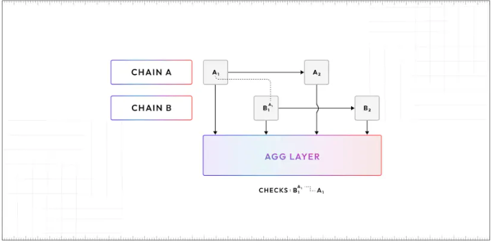

## zklink

我们以一个在op上存入ETH资产的例子来详细讲一下zklinknova的实现原理。

首先用户向二级链上的 zkLink 合约发送交易（例如充值 ETH）（步骤 1），该交易将被 zklink Nova 排序器实时转发到主链上的 zkLink 合约（步骤 2）。用户也可以直接向主链上的 zkLink 合约发送交易（步骤 3）。排序器监控主链上 zkLink 合约中接收到的交易，并将这些交易（步骤 4 ）转发到 Nova 网络执行，到这里就完成了资产跨到nova的过程，这里有一个问题，如何防止定序器向L3发送一个在L2上根本不存在的交易？这就依赖其整个多链同步的状态结算过程：

当二级链的的zklink合约收到用户ETH的存款交易时，会生成一个状态同步哈希：

每一个新的状态都根据之前的同步哈希值计算该交易的同步哈希值，同步哈希计算完成后，会通过该L2的官方桥将哈希值和ETH传递至以太坊(步骤2)，也就相当于在该L2上用二级链的官方桥进行一次提款，将ETH和同步哈希带到了以太坊，以op为例，其提款操作需要等待7天，7天后，在以太坊上的官方桥完成提款交易，将ETH及同步哈希发送至仲裁合约（步骤3），

用户也可选择在以太坊上的zkLink合约进行存款，这样可以跳过L2同步哈希值的过程。

仲裁者合约随后会将二级链的所有同步哈希值及ETH转发至主链(Linea)的官方桥(步骤4)，相当于通过Linea官方桥进行一次存款交易(步骤5)，此时，ETH及同步哈希至被带到了主链的官方桥上，最后官方桥将ETH及同步哈希值发送至主链上的zklink合约(步骤6)。至此，所有二级链上的状态哈希值及存入的ETH，都已经带到了主链上的zklink合约。

一旦收到来自二级链的同步哈希，zkLink合约将验证它是否与之前由排序器中继到主链的交易一致，主链上的zkLink合约对一个交易批次执行ZKP验证后，会根据同步哈希值检查该批次的所有链上交易是否已被验证，这确保了排序器无法发送虚假的交易。

成功验证ZKP和链上交易一致性后，就可以进行状态结算的过程。主链上的zklink合约完成zkp验证和同步哈希验证后，通过主链的官方桥，将batchroot发送至以太坊(步骤9)，至此，主链的状态已经被确定，进而zklinknova的状态也被确定。

之后的过程与存款的过程相反，batchroot被发送至仲裁合约后，通过各个二级链的官方桥将batchroot同步到二级链上的zklink合约，相当于在各个二级链上发起了存款交易。最终batchroot被同步到所有二级链的合约中。收到batchroot后，各个二级链上的 zkLink 合约中就可以执行提现请求。

我们跟踪一下整个资产转移的过程，首先ETH被发送至二级链的zklink合约，然后通过该二级链的官方桥，提款至以太坊，进入以太坊上的仲裁合约，然后通过主链的官方桥，存款至主链上的zklink合约。所以，所有的ETH其实是ETH被最终锁定在主链上的zkLink合约中。

当用户从Nova 提现ETH到二级链时，必须等待包含自己体现交易的批次已通过 ZKP 验证且该批次中的所有链上交易已基于同步哈希进行验证后，ETH资金将与batchroot一起转移到二级链（步骤8-13）。

## 提款时间

为了防止存款欺诈问题，提款请求之前的所有链上交易都必须通过同步哈希一致性检查进行验证，我们上面的过程讲到，由于一些op等一些二级链的机制，同步哈希需要等7天才能传递到主链上的合约，因此，提现至 Linea 大约需要 7 天。提现到二级链时，又多了一步交易通过以太坊从 Linea 传输到二级链的过程，这可能需要大约额外 1 天的时间。因此，向二级链执行提现交易大约需要8天的时间。

## 与polygon agglayer对比

zklinknova的做法是建立一条L3，将各个链的流动性统一聚合到L3上，而polygon agglayer的做法，是建立一个聚合层，可以快速，安全的在各个接入到agglayer的L2中转移资产。

比如AggChain1 上持有 DAI 的用户可以在 Polygon zkEVM 上购买 NFT，而无需先将资金桥接到 Polygon zkEVM。从最终用户的角度来看，这感觉就像使用单个链。

AggLayer 引入了一个名为bridgeAndCall() 的智能合约库，旨在实现无缝跨链功能，使开发人员能够在智能合约中嵌入跨链操作。上述在不同链的多次操作，使用bridgeAndCall()，所有这些操作都被合并到一个事务中，只需点击一下即可完成。

Agglayer通过3个阶段保证了跨链交易的安全

聚合层分为三个阶段。假设链 A 是在 Polygon 生态系统中运行的 ZK 链。

1. 预确认：链 A 向 AggLayer 提交一个新区块 A1的区块头，以及一个轻客户端证明。区块头包括依赖𝐴1 的所有其他区块的承诺（ 𝐵𝑖 ， 𝐶𝑖 等）。此时A1被 AggLayer 视为“预确认”。
2. 确认：链 A 生成 A1 的证明并将其提交给 AggLayer。一旦 AggLayer 验证了证明，如果A1所有依赖的区块也已确认， A1将被确认。
3.  最终化：在 A1确认后，其证明将与其他 Rollups 的区块一起聚合成一个单一证明，然后发布到以太坊。聚合证明保证链状态的一致性。

假设在链 A 上的 Alice 想要在区块$𝐴_1$中锁定或销毁一些代币，以便在链 B 上铸造并转账代币给 Bob。链 B 可以暂时假定$𝐴_1$是有效的，甚至无需等待其在以太坊上最终确定。链 B 的排序器创建区块B1，并将的链 A 状态根A1作为依赖项提交到agglayer。这种方式使得链 B 构建B1所需的延迟从 20 分钟减少到最多几秒。

在确认过程中，agglayer为每个提交的块构建一个依赖图，例如，如果A1依赖B1，B1依赖C1，之后提交了证明C，C1被确认，即使此时收到了证明A，A1也不能被确认，只有证明B，证明C都存在时，A1才能被确认，这种机制确保如果链 A 提交了无效块，比如A1′，那么依赖于A1‘的任何批次都无法在以太坊上最终结算。

目前agglayer最大的局限性是只能接入polygoncdk构造的链，无法适配op rollup。