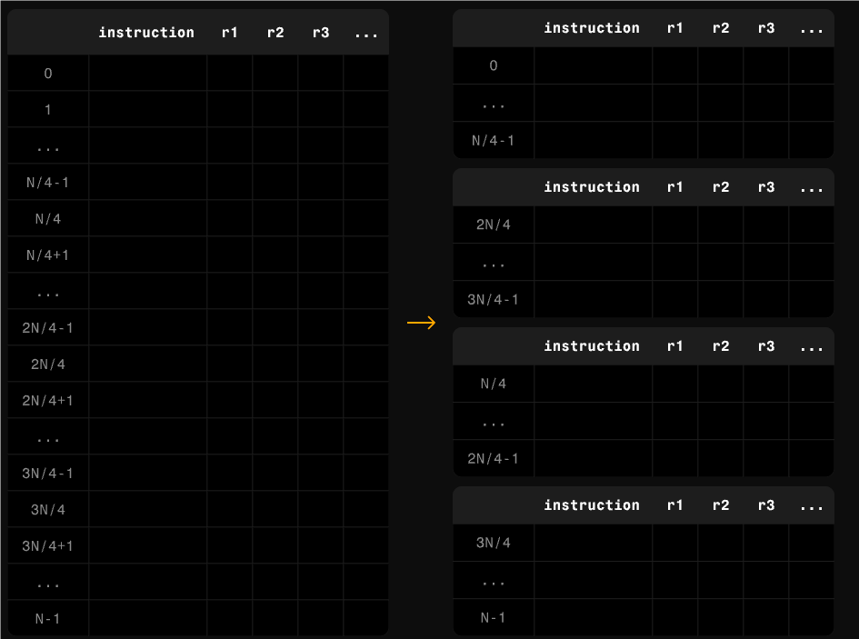

在过去的2-3年里，伴随着以太坊Layer 2和零知识证明技术的发展，诞生了一大批利用零知识证明对以太坊进行扩容的zkrollup，得益于zk技术的独特性，zkrollup成为了公认高效且安全的扩展方案。

zkrollup能够实现的关键是zkEVM技术的成熟，由以太坊PSE小组开发的zkevm circuit项目，starknet团队的starkware等，在多个zkrollup项目中都得到了落地。随着zk技术的进一步发展，新的zk证明系统被提出，其中包括polygon的plonky2等算法，带来了递归证明等一系列优化，使得实现更加通用的zkvm成为可能，在效率达到接近zkevm的情况下，zkvm能够运行任何指定的程序并生成证明，同时避免了以太坊opcode的更改造成zkevm需要适配的问题，相比zkevm其复杂性更低、可审计性更好、维护更容易，稳定性，灵活性，扩展性都更强。[以太坊PSE小组也转向了zkvm方向的开发](https://mirror.xyz/privacy-scaling-explorations.eth/hqLMwLfKmQLj773QCRLTOT-Z8sSUaTEfQpBSdTbitbs)，不再维护zkevm。

在zkvm赛道中，已经有一些明星项目，比如risc0，实现了支持riscV指令集的zkvm，还有succinct开发的SP1，同样是riscV指令集的zkvm，他们还开发了SP1 Reth，这是一个使用 SP1 构建的type1 zkEVM，本质上是在 zkVM 中运行以太坊客户端。a16z也提出了jolt项目，目标同样是实现riscv指令集的zkvm，目前还在开发。这些项目都在快速发展中，竞争非常激烈，甚至每家在benchmark中都号称自己是最快的zkvm。

与上面这些项目不同，ZKM实现了一个面向MIPS指令的zkvm，并提出了Hybrid Rollup，Entangled Rollup等方案，目标是解决现有Layer2的提款速度，跨链互操作性等场景中的问题痛点。

## ZKMIPS

zkmips是一个支持MIPS指令集的zkvm，任何用 C、Go、Rust 等编写的程序都可以使用通用的 MIPS 编译器编译为 MIPS ELF 可执行文件，生成的 ELF 文件通过 ELF 加载器加载到 MIPS VM 中。 VM 执行输入的可执行文件，生成对应的ZK证明。

## ZKVM vs ZKEVM

zkEVM是专门为以太坊生态系统设计的，它旨在实现以太坊虚拟机（EVM）的功能，并生成零知识证明，我们知道evm运行的程序由一系列的opcode组成，比如ADD,MUL等，只能用solidity等语言来编写，zkevm通过对每个opcode编写circuit电路等方式，对每个opcode进行约束，在执行opcode程序的同时会生成一个零知识证明，这个证明就代表了计算的有效性，验证方不需要重新执行opcode，只要验证证明通过，就代表计算是正确的，zkevm的实现代表是PSE的zkevm-circuit项目，一些著名的zk layer2就采用这种方案，比如scroll。

由于zkevm只面向evm的opcode，使其在应用场景上有一定的局限性，不仅存在evm兼容性的问题，随着opcode的修改zkevm也需要进行相应的修改来适配，而zkVM是一种通用的虚拟机，面向底层的指令设计，其指令集非常稳定，可以运行目前已有的大部分应用程序，比如现在个人pc，手机，服务器等采用的cpu都是x86，arm指令集，使用更普遍的C,C++等高级语言编写再编译到这些指令集来执行，这些指令集就相当于evm中的opcode，实现一个zkvm就是要适配一种指令集，假如我实现了x86指令集的zkvm，那么其就可以运行当下几乎所有pc软件并对其生成零知识证明，有了zkvm，就可以直接用zkvm去运行现有的以太坊客户端比如geth，达到zkevm的效果。由于x86 arm指令集的复杂性，还有两种指令集更适合来实现zkvm，就是MIPS 和RISC V，这两种指令集同样支持C C++ RUST GO等高级语言，并且指令集较为精简，zkm就选择了MIPS作为zkvm的支持对象，而最近兴起的另外一些zkvm知名项目，比如risc0,jolt,sp1，则采用了RISCV。

## MIPS vs RISC V

mips和risc v都属于RISC(精简指令集)，MIPS具有高性能、易于实现等特点。指令集相对简单，且指令执行速度较快，因此在嵌入式系统、网络通信等领域得到了广泛应用。而RISC-V 允许用户定义指令扩展，可以根据具体应用添加自定义指令，更加灵活和模块化，MIPS 已经存在近 40 年，在行业中拥有强大的影响力，拥有许多遗留应用程序，因此MIPS提供了更高的稳定性以及与高级语言的兼容性，更容易实现zkvm。

## Architecture

zkvm的实现需要解决的问题有很多，最大的问题是效率问题，zkvm运行程序并生成证明的时间非常长，这也是阻碍其应用的最大障碍，随着zk算法的不断进化和硬件性能的提高，这个问题逐渐得到解决。在算法方面，通过使用并行度更高的算法，引入递归证明等方式，能够显著降低证明生成的时间，zkMIPS通过分层的方式来优化生成证明的效率，整个证明过程划分为三个相互依赖的层，为了平衡证明生成时间和证明大小，不同的层使用了不同的证明系统，整个证明系统使用Plonky2实现，通过在不同层应用递归证明，lookup协议，模块划分等方式，最大化并行生成证明能力，并压缩最终的证明大小方便进行链上验证：

plonky2是polygon实现的综合了STARK和Plonk证明系统的变体，与传统的STARK算法对比，其约束表示方式混合了基于CPU和基于电路的方式，与传统PLONK算法对比，其多项式承诺方案使用了FRI，Plonky2综合了STARK和SNARK证明系统的优势，实现了非常强的灵活性，当证明生成速度很重要时，Plonky2可以生成较大的证明，换来较快的证明生成速度，当证明的大小很重要时，Plonky2可以牺牲证明的大小，换来较快的证明生成速度。

整个证明生成的过程大致如下：

1. 将程序划分为一个一个小的段，并行证明每个段。
2. 将每个段再划分为不同的模块，比如算术模块，控制模块等，将每个模块的执行trace编码为多项式，并生成一个独立的证明。
3. 有了每个模块的证明，我们还需要证明某个模块是属于某个段的，这一步使用lookup协议证明2中的模块属于某个段，同时将属于一个段的所有模块的证明合并为这个段的一个证明。
4. 生成一个连续性证明，因为我们最初将程序划分为了段，现在还需要证明每一个段和前一个段的连续性，即第后一个段的初始状态与前一个段的最终状态匹配，同时将每个段的证明合并，得到一个最终的证明。
5. 为了方便在1层合约上验证，链上的验证合约采用了Groth16证明系统，因此最后一步将4中的证明转化为Groth16的证明形式。

我们来一步一步看一下整个证明的生成过程：

zkMIPS首先将程序的执行过程转换为执行trace，执行trace是运行程序所执行的计算的完整记录。执行trace通常以trace记录来表示，其中每一列都是一个表示固定 CPU 变量状态的列表，行表示计算的每个步骤，然后通过检查执行trace的每一行是否与程序的相应指令匹配来验证程序。

例如对于第i行，指令是加法。这个指令的功能是，将寄存器 5 (13) 中的值与寄存器 6 (21) 中的值相加，把计算结果存储在寄存器7 (34)中。每条指令执行后（左侧表格），我们将获得每个寄存器的值，最终得到右侧的跟踪表。

然后将指令进行分段，通过这种分段的方式，能够最大化程度进行并行处理，对每一段都独立的生成证明，大大减少证明生成的时间。

其中每一段再把指令划分为模块，分别为算术、逻辑、内存和控制，

将表中的每一行都转化为约束多项式，然后对每个模块都使用 STARK 证明系统生成一个独立的证明。每段会按指令功能划分，生成这四个证明：算术、逻辑、内存和控制证明，这些证明基于Starky实现。

为了进一步压缩证明大小，这一步使用一种基于lookup技术的LogUp协议将上一步的模块化证明合并为每个段的一个证明，到此，每个段得到了唯一的证明，这个证明基于Starky实现。

最终，再次压缩证明大小，将每段的证明递归组合为一个单一的连续性证明，得到整个程序执行的最终证明，这个证明基于Plonky实现。

为了使得最终证明能够更快地在 L1 上得到验证，还需要将基于哈希的Plonky证明编译成基于椭圆曲线的 Groth16 证明，因为验证Groth16证明对EVM更加友好，链上的验证合约使用了linea的Gnark框架来实现Plonky2验证器。

通过这一系列的并行及压缩算法，zkMIPS极大提升了生成证明的效率，并且最大程度降低了生成的证明在链上验证的成本，使得zkVM的落地成为了可能。

## Hybrid Rollup

基于zkMIPS，ZKM同时提出了混合rollup方案，并将其应用在以太坊Layer2项目metis当中。我们知道现在的主流rollup方案是Optimistic Rollup和ZK Rollup，Optimistic Rollup最大的缺点是由于使用了乐观的欺诈证明机制，提款时间需要等待7天，其优点是实现简单，提款成本更低，而zk rollup的提款时间可以缩短至小时，但是生成和验证零知识证明的计算复杂度较高，需要大量的计算资源，实现和维护更加困难，提款成本更高。

使用混合 Rollup，可以结合 Optimistic Rollups 的低成本和zk的简洁性和可验证性，从而在提款过程中能够在快速但费用较高和较慢但费用更低之间进行选择，用户可以选择自己喜欢的提款方式。

Optimism也在这方面进行了探索，他们与risc0，O(1)Labs等团队合作，将zk集成入[opstack](https://github.com/ethereum-optimism/ecosystem-contributions/issues/61#issuecomment-2255731968)

利用 zkMIPS，可以以非常低的开发成本，与任何的Optimistic L2 集成来构建 Hybrid Rollup，在原有的Optimistic流程外新增一套zk处理机制，实现更快的状态确认，给用户提供灵活的选择权，最大程度提升用户体验。

## Entangled Rollup

ZKM还提出了一种跨链互操作性的解决方案，随着layer2和各种公链的蓬勃发展，各种区块链基础设施快速激增，这些项目的诞生丰富了区块链生态，但也带来了一些问题，例如流动性碎片化以及开发者和用户的入驻成本。其中跨链交易是最典型的用户使用场景，跨链交易依赖于五花八门的跨链桥，这些跨链桥的实现方式有很多种，最普遍的是引入多签委员会来验证跨链交易，其中心化的方式带来了一定的安全风险，另外一些项目则将zk引入到跨链桥当中，比如Polyhedra的zkbridge，它们主要的实现方式是链上轻客户端协议，虽然安全性得到了提升，但在扩展性和验证成本上有一定的局限性。

在跨链场景中，同样存在一个不可能三角：安全性、可扩展性和通用性，安全性是指无需对任何中介或第三方进行额外信任，可扩展性是指与其他链交互的能力，能否支持更多的链，通用性是指跨链桥处理更多通用应用程序的能力，不仅仅是普通的交易，还包括其他一些dapp的功能，比如转移NFT，身份验证等。多签桥显然不满足安全性，轻客户端的方案也有缺点，不是所有链的轻客户端都能在链上运行，任何一种跨链方案都需要在这三个属性之间找到合适的平衡。

ZKM基于zkmips提出了一种新的多链互操作性方案，Entangled Rollup，利用zkRollups本身的L1 和 L2 之间的互操作机制，实现跨链桥的功能，而无需实际创建一个跨链桥。

Entangled Rollup与普通的Rollup最大的区别是使用了共享排序器，将两个Rollup连接起来，资金可以在四个链之间任意桥接，比如可以从Layer2A提款到Layer1B，从Layer1A存款到Layer2B，其核心是使用了一套共享的通用证明机制，一个链上生成证明可以在另一个链上进行验证。 跨链桥的本质是在目标链上证明我在源链存在一笔跨链交易，已有的zkrollup官方提款机制就是使用zkproof的方式，在L1链上证明L2上有一笔提款交易，在Entangled Rollup，两个rollup内部的跨链解决了，问题是两个rollup之间如何实现跨链？我们只需要解决两个L1之间的跨链就可以，就是在一条L1上去验证另一条L1上存在一笔跨链交易。

以L2-L2的一次跨链为例，整个流程如下：

1. 在源 L2 上向 Rollup 合约提交交易 tx1 来触发提款流程。
2. 排序器处理交易后将其发送至prover生成证明(2b)，在得到zkproof后将proof与tx1提交至L1的rollup合约(2c)
3. rollup合约会对zkproof进行验证，至此，相当于完成了一次普通zkrollup的提款流程。在验证成功后，将交易tx1转换为跨链交易格式tx3发送至shadow合约。
4. relayers会监控shadow合约的交易tx3，关键的一步在这里，他会将源L1链的相关信息给到prover，生成一个zkproof，证明tx3在源L1上存在(4b)，随后将tx3和生成的zkproof给到目标L2上的shadow合约(4c)。
5. shadow合约会对zkproof进行验证，一旦验证通过，证明源L1上确实有这笔交易，至此两个L1之间的跨链即完成，将tx3转换为一笔存款交易tx5发送至rollup合约。
6. 排序器从目标L2中的rollup合约中获得存款交易tx5，最终在目标L2上执行tx5交易完成存款，至此，整个L2-L2跨链交易完成。

纵观整个跨链流程，从源L2-源L1-目标L1-目标L2，第一步和最后一步使用了zkrollup自身的跨链机制，而第二步，其本质与第一步其实并无区别，你可以把源L2认为是一个L3，源L1是一个L2，而目标L1是最终的L1，我们只是用zkrollup的机制进行了两次提款操作，其安全性由zkproof保证，在可扩展性方面，得益于其共享排序器池，不同 Layer 2之间可以进行可扩展且高效的交互，在通用性上，整套架构也不受限于特定类型的交易或数据，其本质是一种跨链的消息传递机制，可以传递任意信息。

## Other Applications

除了在区块链方面的应用，zkvm在其他领域也有广泛的应用场景。

## IOT

由于MIPS指令集的处理器在物联网、VR 和可穿戴设备场景中被广泛使用，zkmips可以将zk技术应用到这些领域中。在物联网领域，zkMIPS 可以为连接设备提供安全且保护隐私的通信协议，实现物联网网络中的安全数据交换、身份验证，确保敏感信息保持隐私性，并防止未经授权的访问。

此外，在使用 MIPS 架构的可穿戴设备中，zkMIPS 可以提供隐私增强功能，保证连接设备和网络的安全和私密交互。这对于处理敏感用户数据（例如个人的健康相关信息）的可穿戴设备尤其重要。

## Decentralized Cloud Computing

zkMIPS能够实现去中心化云计算。在云端的计算节点运行zkmips，尽管这些云端节点不受信任，但我们可以通过验证其生成的proof，来保证计算结果仍然可以信任。

## ZKML

在机器学习 (ML) 领域，由于 ML 模型中的权重值保存在服务提供商，并且不对外公布，但是客户应该能够在不访问训练模型的情况下验证结果的正确性。上图展示了医疗系统中的一种场景，其中患者将他们的心电图发送到 ML 服务提供商，处理后的结果送回到他们的医生，这一过程需要保证用正确的模型进行处理，在不获得模型的情况下，医生可以利用zkmips proof来验证该过程的正确性。