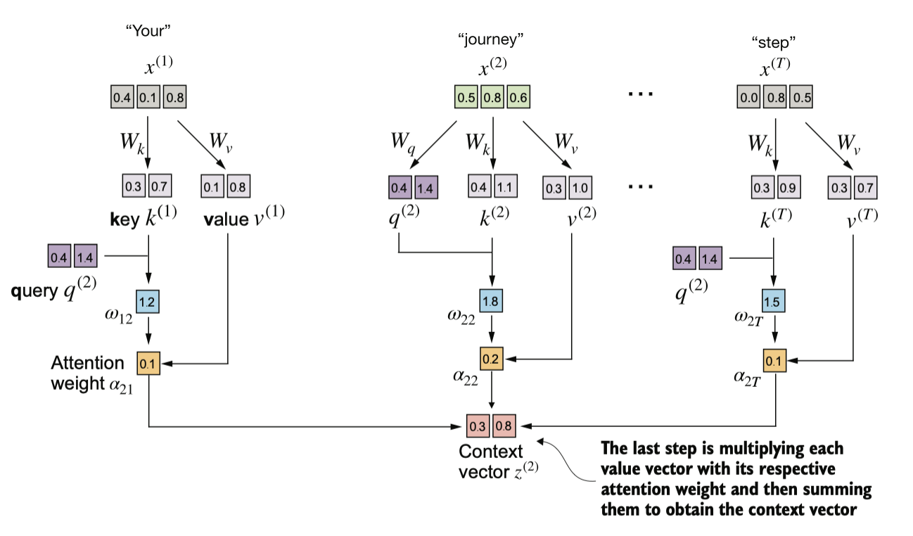

[https://drive.google.com/file/d/1y4xUeN0vg3HNXTJvxlDmX-5xpEiwPRIY/view?usp=sharing](https://drive.google.com/file/d/1y4xUeN0vg3HNXTJvxlDmX-5xpEiwPRIY/view?usp=sharing)

大语言模型的进化之路始于2018年OpenAI的里程碑式突破。其研究团队在《Improving Language Understanding by Generative Pre-Training》中首次提出GPT（Generative Pre-trained Transformer）架构，这项创新确立了基于Transformer decoder的预训练范式。其核心突破在于采用单向自注意力机制，通过海量无标注文本的自监督学习，使模型掌握语言生成的基本规律。

GPT-3作为该系列的第三代产物，于2020年发布，其参数量达到惊人的1750亿。相较于初代GPT的1.17亿参数，其训练数据量从5GB扩展至45TB，涵盖书籍、网页、学术论文等多源文本。这种量变引发质变的现象，在论文中被称为”涌现能力"（Emergent Abilities），模型开始展现出零样本学习（Zero-shot）和小样本学习（Few-shot）等类人推理能力。

ChatGPT的技术演进则体现了人类对齐（Alignment）的重要突破。基于2022年《Training language models to follow instructions with human feedback》提出的指令微调框架，研究者通过三阶段训练法重塑GPT-3：首先在人工标注的指令数据集上进行监督微调，继而通过人类偏好标注训练奖励模型，最终采用强化学习（RLHF）实现对话能力的精准控制。这种训练范式成功地将通用语言模型转化为遵循人类价值观的对话系统，开创了大模型安全落地的先河。


这些模型展现出的多任务处理能力令人惊叹——从基础的文本续写、拼写纠错，到复杂的文本分类与跨语言翻译，GPT系列模型均能胜任。这种通用性与其看似简单的训练目标形成鲜明对比：所有能力都源自对**下一词预测任务**（Next Token Prediction）的极致优化。这种自监督学习范式颠覆了传统AI训练模式，通过将文本数据自身转化为标注源，模型可以从任意位置的上下文片段中动态生成训练标签。这种机制使得数TB级的未标注网络文本得以转化为高质量训练资源，为模型规模扩展提供燃料。

在架构设计层面，GPT与原始Transformer有所不同。GPT摒弃了Transformer的编码器-解码器双模块结构，仅保留**解码器层**。每个解码器层通过多头掩码自注意力机制(Multi-head Masked self-attention)实现上下文感知，这种单向处理模式完美契合自回归生成需求。当模型以逐词预测方式推进时，每个新生成的词元都会通过注意力权重重新校准整个序列的语义表征，这种动态反馈机制显著提升了长文本的生成一致性。

模型的主要实现过程包括预训练，监督微调(supervised fine-tuning)，强化学习，本文主要关注预训练及微调的步骤：


## Prepare Data

### word embeddings

嵌入(embedding)的核心是一种将离散对象（如单词、图像甚至整个文档）映射到连续向量空间的方式。嵌入的主要目的是将非数字化的数据转换为神经网络可以处理的格式。


虽然词嵌入是最常见的嵌入形式，但也存在句子、段落或整个文档的嵌入，经常用在检索增强生成（retrieval-augmented generation）中。

有多种方式可以实现词嵌入的生成。其中一个较早且最流行的例子是 Word2Vec。Word2Vec 的核心思想是：出现在相似上下文中的单词往往具有相似的含义，而这种**句法相似性**（如"quick"与"fast"）和**语义类比关系**（如"国王-王后≈男人-女人"）可被向量运算量化。因此当将词嵌入投影到二维坐标上时，类似的术语会聚集在一起。

词嵌入的维度可以从几维到数千维不等。较高的维度可能捕捉到更细微的关系，但计算成本更大。


如图所示，相似概念的单词通常会在嵌入空间中相互接近。例如，不同种类的鸟类，不同的国家和城市在嵌入空间中距离很近。

接下来我们看如何实现word embedding：

### Tokenizing text

首先，原始文本要被拆分为标记（tokens），可以是单词或字符。然后这些标记被转换为整数表示，称为标记 ID（token IDs）。


### Converting tokens into token IDs

生成词汇表，并根据词汇表得到tokenid


### Adding special context tokens

还需要对一些特殊情况添加一些额外的标记，例如，在对类似 GPT 的大规模语言模型（LLMs）进行训练时，如果需要处理多个独立的文档或书籍，通常会在每个文档或书籍的前面插入一个标记，用以区分它与前一个文本来源。添加特殊标记（如 <|unk|> 和 <|endoftext|>），可以增强模型的理解能力，用于处理未知单词或标记不相关文本的边界。


### Byte pair encoding

字节对编码(Byte Pair Encoding, BPE)是一种更高效的分词方案，可以得到一个较小的词汇表(50,257)。BPE分词器被用于训练GPT-2、GPT-3 以及 ChatGPT中。由于实现BPE相对复杂，可以使用现有的开源 Python 库，tiktoken。

BPE算法的核心机制是将不在其预定义词汇表中的单词分解为更小的子词单元，甚至是单个字符，从而使其能够处理词汇表外的单词。得益于 BPE 算法，当分词器在分词过程中遇到一个不熟悉的单词时，它可以将该单词表示为一系列子词标记或字符标记，


它通过将高频字符合并为子词(sub word)、再将高频子词合并为单词来构建其词汇表。

例如，BPE 首先将所有单个字符（如 “a”、“b” 等）添加到其词汇表中。在下一阶段，它会将频繁一起出现的字符组合合并为子词。例如，“d” 和 “e” 可能被合并为子词 “de”，因为它在许多英语单词中常见，如 “define”、“depend”、“made” 和 “hidden”。这些合并是基于频率阈值来确定的，只有当字符或子词组合的出现频率超过一定的阈值时，才会进行合并。

### Data sampling with a sliding window

这一步生成训练所需的数据集，输入-目标（input-target）对，target是我们希望模型根据input返回的内容。


**输入（Input）**：模型接收一个由若干单词或标记组成的序列（上下文）。例如，在一句话中，输入可能是前几个单词，如 “The cat is on the”。

**目标（Target）**：模型的目标是预测下一个正确的单词或标记。例如，上述输入的目标是预测 “mat”。

```jsx
x: [290, 4920, 2241, 287]
y:      [4920, 2241, 287, 257]
```

**stride** 参数决定了输入在各批次之间移动的步长，以充分利用数据集（不跳过任何一个单词）。也可以避免批次之间的任何重叠，因为更多的重叠可能会导致过拟合风险的增加。


### Creating token embeddings

我们构建一个权重矩阵来实现tokenid转换为词嵌入，为了简化起见，假设我们的词汇表中只有 6 个单词（BPE分词器词汇表50,257 个单词），并且我们希望创建维度大小为 3 的嵌入向量（在 GPT-3 中，嵌入向量的维度是 12,288）：


嵌入层的权重矩阵包含小的随机值，这些值在 LLM 训练过程中会被优化。权重矩阵有 **6 行** **3 列**：

•	**行数（6 行）**：每一行对应词汇表中 6 个可能的标记之一。

•	**列数（3 列）**：每一列对应嵌入的 3 个维度之一。

权重矩阵的这些随机初始值将在训练中被调整，以更好地表示标记之间的关系和语义信息。

### Encoding word positions

上述嵌入层的工作方式是：**同一个标记 ID 无论在输入序列中的位置如何，总是映射到相同的向量表示**。嵌入层无法区分同一标记在不同位置的语义差异，这可能会导致模型在捕捉上下文或语义关系时的局限性。

可以使用两种**位置感知嵌入**：

1.	**相对位置嵌入（Relative Positional Embeddings）**：表示标记之间的相对位置关系。

2.	**绝对位置嵌入（Absolute Positional Embeddings）**：与序列中具体的位置直接关联。

**绝对位置嵌入**通过为输入序列中的每个位置添加唯一的嵌入来传递其精确位置信息。例如，第一个标记将拥有一个特定的绝对位置嵌入，第二个标记则有另一个独特的嵌入，以此类推。通过这种方法，每个标记嵌入都会被修改，以反映其在序列中的具体位置，从而帮助模型更好地理解标记之间的顺序关系。

与关注标记的**绝对位置**不同，**相对位置嵌入**的重点是标记之间的**相对位置或距离**。也就是说，模型学习的是“标记之间的距离”而不是“标记的确切位置”。这种方法的优势在于模型能够更好地泛化到不同长度的序列，即使在训练中从未见过这些长度。

OpenAI 的 GPT 模型使用的是**绝对位置嵌入**，但这些嵌入在训练过程中会被优化，而不是像原始 Transformer 模型中的位置编码那样固定或预定义。这种优化是模型训练的一个部分。

我们假设输入标记编码为**256 维向量表示**。这一维度远小于原始 GPT-3 模型的嵌入维度（GPT-3 使用了 12,288 维嵌入）。

此外，我们假设这些标记 ID 是由之前实现的 **BPE 分词器**生成的，该分词器的词汇表大小为**50257**，支持的上下文长度为4。以下是创建这种嵌入的步骤：

1.	初始化一个嵌入层，其权重矩阵大小为  50,257 **×** 256 。

2.	使用标记 ID 作为索引，从嵌入层中查找相应的嵌入向量。

3.	将这些向量作为 LLM 的输入。

我们会将每个批次中的每个标记嵌入到一个 256 维的向量中。如果批次大小为 8，每个批次包含 4 个标记，结果将是一个 **8 × 4 × 256** 的张量。

```jsx
Token IDs:
 tensor([[   40,   367,  2885,  1464],         
				[ 1807,  3619,   402,   271],
        [10899,  2138,   257,  7026],
        [15632,   438,  2016,   257],
        [  922,  5891,  1576,   438],
        [  568,   340,   373,   645],
        [ 1049,  5975,   284,   502],
        [  284,  3285,   326,    11]])
Inputs shape:  torch.Size([8, 4])
```

对于 GPT 模型的绝对位置嵌入方法，我们只需要创建另一个嵌入层，其嵌入维度与 token_embedding_layer 相同，权重矩阵行数为4(上下文长度)，列数为256。


位置嵌入由 4 个 256 维向量组成。我们可以将这些向量直接加到标记嵌入中。

## Attention Mechanisms

在深入了解自注意力机制之前，让我们先考虑一下在没有引入注意力机制的传统架构中存在的问题。假设我们想要开发一个语言翻译模型，将文本从一种语言翻译成另一种语言。如图所示，由于源语言和目标语言的语法结构不同，我们无法简单地逐字进行翻译。


**自注意力机制（Self-attention）** 是一种允许输入序列中的每个位置在计算序列表示时，考虑同一序列中所有其他位置的相关性或“关注”它们的机制。

我们首先从简化版本的自注意力机制开始，随后添加可训练的权重。因果注意力机制在自注意力的基础上加入了掩码，使得大语言模型能够一次生成一个单词。最后，多头注意力将注意力机制分成多个头，从而使模型能够并行捕捉输入数据的不同方面。


### Self-attention mechanism without trainable weights

自注意力机制的目标是为每个输入元素计算一个上下文向量，该向量结合了来自所有其他输入元素的信息。在此示例中，我们计算上下文向量 $z^{(2)}$。每个输入元素在计算 $z^{(2)}$ 时的重要性或贡献由注意力权重 $\alpha_{21}$ 到 $\alpha_{2T}$ 决定。在计算 $z^{(2)}$时，注意力权重是相对于输入元素 $x^{(2)}$ 和所有其他输入元素计算得出的。


上下文向量（Context vectors）在自注意力机制中扮演着至关重要的角色。它们的作用是通过整合序列中所有其他元素的信息，为输入序列（如一个句子）中的每个元素创建更丰富的表示，将所有信息压缩到这个向量中。

注意力分数的计算：使用点积，可以被看作是相似性的度量，因为它量化了两个向量的对齐程度，用于确定序列中每个元素对其他元素的关注程度或“注意力”：点积值越高，表示向量之间的对齐或相似程度越高。


然后我们将对之前计算的每个注意力得分进行归一化处理。通常使用softmax函数，它的主要作用是将一组原始值（logits）转换为一个概率分布，使得每个值都在 [0, 1] 范围内，并且所有值的总和为 1。这种归一化是一种便于解释的惯例，同时有助于在大语言模型（LLM）中保持训练的稳定性。softmax 函数确保注意力权重始终为正值。这使得输出具有可解释性，可以看作概率或相对重要性，其中较大的权重表示更高的重要性。


通过将 $x^{(i)}$  与对应的注意力权重相乘，然后对所得向量求和，计算上下文向量 $z^{(2)}$。因此，上下文向量 $z^{(2)}$ 是所有输入向量的加权和，具体通过将每个输入向量乘以其对应的注意力权重得到。


根据上述方法，可以得到完整的注意力分数矩阵。


### Self-attention with trainable weights

$$
\text{Attention}(Q, K, V) = \text{softmax} \left( \frac{QK^T}{\sqrt{d_k}} \right) V
$$

这一步与之前的区别是引入了在模型训练过程中更新的权重矩阵。我们将通过引入三个可训练的权重矩阵 $W_q$、$W_k$ 和 $W_v$ ，逐步实现自注意力机制。这三个矩阵分别用于将 $x^{(i)}$ 投影为 **查询向量（query）**、**键向量（key）** 和 **值向量（value）**，


**查询向量$q^{(2)}$**  是通过输入 $x^{(2)}$ 与权重矩阵 $W_q$ 的矩阵乘法得到的。同样，我们通过与权重矩阵 $W_k$ 和 $W_v$ 的矩阵乘法，分别计算出键向量和值向量。在类似 GPT 的模型中，输入和输出的维度通常是相同的，但为了更清楚地理解计算过程，我们在这里使用不同的输入维度 ($d_{in}=3$) 和输出维度 ($d_{out}=2$)。

将query与key做点积得到注意力分数：


与之前一样，我们通过缩放注意力得分并使用 softmax 函数来计算注意力权重。此时我们通过将注意力得分除以键向量嵌入维度的平方根来进行缩放，通过嵌入维度大小进行归一化的原因是为了改善训练性能，避免梯度过小的情况。例如，当嵌入维度增大时（对于类似 GPT 的大语言模型，嵌入维度通常超过 1,000），大的点积结果在应用 softmax 函数后可能会导致非常小的梯度。


最终得到cotext向量



1.**查询（Query）**

查询类似于在图书馆中向工作人员提出的检索请求。它代表当前模型关注的信息——比如在一个句子中模型正试图理解的某个单词或短语。查询的作用是“提出问题”，以便从其他部分中寻找相关的信息。

2.**键（Key）**

键可以类比为图书馆中书籍上的标签或索引号。每个输入项（例如句子中的单词）都有一个对应的键，用于标识该项的特征。模型通过比较查询和键来判断哪些输入项与当前问题相关，就像工作人员根据标签帮助你找到所需书籍一样。

3.**值（Value）**

值则类似于书籍中的内容。当模型确定了哪些输入项与查询最相关后，它会抽取这些输入项的“实际信息”——也就是值。换句话说，值携带了模型最终要获取的上下文信息。

这种类比帮助我们理解自注意力的工作流程：

•**查询**负责提出问题（当前关注的信息）。

•**键**则用于定位相关信息（匹配查询）。

•**值**提供答案（模型抽取的实际内容）。

在实际计算中，我们首先将输入 X 经过三个线性变换得到查询 $Q = XW_q$、键 $K = XW_k$ 和值 $V = XW_v$。接着，通过计算查询与键之间的相似性，我们获得注意力权重矩阵。最后，利用这些权重对值进行加权求和，生成上下文向量 $Z$，从而捕获输入序列中各部分之间的相互依赖关系。


### 3B1B explain

Q就像在提问题


K就像在回答问题


做点积后得到与原问题的相似度作为评分，把评分最为权重计算出一个总的变化。


### Hiding future words with causal attention

在预测序列中的下一个令牌时，我们希望自注意力机制只考虑当前位置之前出现的令牌。**因果注意力（causal attention）**，也称为**掩码注意力（masked attention）**，是一种特殊形式的自注意力。它限制模型在计算注意力得分时，仅考虑序列中之前的输入和当前输入，而不包括后续输入。


这一步可以通过在得到注意力分数矩阵后，将上三角部分设置为负无穷，使得在做softmax之后将这部分置零来实现。

在深度学习中，**Dropout** 是一种技术，它在训练过程中随机忽略一些隐藏层单元，从而有效地“丢弃”它们。这种方法有助于防止过拟合，确保模型不会过于依赖特定的一组隐藏层单元。


### Multi-head attention

“多头”的概念是将注意力机制划分为多个独立的“头”，每个头都是一个之前实现的因果注意力模块，这些头有自己独立的权重，并行运行，最后将它们的输出结合起来。


## Implementing a GPT model to generate text

我们将实现 GPT 模型的核心结构，包括其transformer模块，之后对其进行训练，以生成文本。


我们将实现一个GPT2模型，其嵌入向量维度为768。

```jsx
GPT_CONFIG_124M = {
    "vocab_size": 50257,     # Vocabulary size
    "context_length": 1024,  # Context length
    "emb_dim": 768,          # Embedding dimension
    "n_heads": 12,           # Number of attention heads     
    "n_layers": 12,          # Number of layers
    "drop_rate": 0.1,        # Dropout rate
    "qkv_bias": False        # Query-Key-Value bias
}
```


当输入的token长度为4，输出文本样本由四个标记组成；每个标记是一个768维的向量，与输入一致

### Implementing a feed forward network with GELU activations

transformer中包括一个FeedForward模块，FeedForward是一个小型神经网络(MLP)，由两个线性层（Linear）和一个 GELU 激活函数组成。在具有 1.24 亿参数的 GPT 模型中，它接收来自input的token，每个token的嵌入维度为 768。


当我们将输入传递给这个小型前馈神经网络时，具体操作入下：

1.	**第一层（线性层）**：接收输入的嵌入大小为 768，将其投影到更高的维度（通常为 4 * emb_dim，例如 3072）。

2.	**GELU 激活函数**：对第一层的输出应用非线性变换，增加模型的表达能力。


3.	**第二层（线性层）**：将激活后的输出降维回原始的嵌入大小（768），使其可以继续与输入数据的形状匹配。


**FeedForward 模块**在提升模型从数据中学习和泛化的能力方面发挥了关键作用。尽管该模块的输入和输出维度相同，但在其内部通过第一个线性层将嵌入维度扩展到更高维空间（如图 4.10 所示）。这种扩展之后，紧接着应用非线性的 GELU 激活函数，然后通过第二个线性变换将维度收缩回原始大小。

这种设计的优势在于，它允许模型探索更丰富的表示空间，从而捕获更多的特征和复杂的模式。具体流程如下：

1.	**扩展维度**：第一个线性层将输入的嵌入向量扩展到更高的维度，例如从  768  维扩展到  3072  维（通常是原始嵌入维度的 4 倍）。

2.	**非线性激活**：GELU 激活函数为特征添加非线性，增强模型表达能力。

3.	**收缩维度**：第二个线性层将高维特征重新投影回原始维度，使得输出与输入的形状匹配。

举类似注意力机制中的例子，第一个线性层的每一行都表示一个问题，与E做点积后得到一个相似度权重。


经过激活层后大于0的神经元被激活，第二个线性层每一列都表示一个信息，与权重相乘再相加后得到一个上下文向量。


### Adding shortcut connections

shortcut connections又称残差连接（Residual Connections）。用来缓解**梯度消失**问题。梯度消失问题是指在训练过程中，梯度（用于指导权重更新的值）在向后传播时逐渐减小，使得较早的层难以有效训练。


残差连接通过跳过一个或多个层，为梯度在网络中流动创造了一条替代的、更短的路径。这通过将一个层的输出与后面某一层的输出相加来实现。

### Layer normalization

Layer Normalization 是一种提高神经网络训练的稳定性和效率的方法。层归一化的主要思想是将神经网络层的激活值（输出）调整为均值为 0、方差为 1（即单位方差）。这种调整可以加快网络收敛到有效权重的速度，并确保训练过程的一致性和可靠性。在 GPT-2 和transformer架构中，层归一化通常在多头注意力模块的前后应用。

### Connecting attention and linear layers in a transformer block

现在，让我们实现 **Transformer Block**，这是 GPT 和其他 LLM 架构的一个基础构建模块。在 1.24 亿参数的 GPT-2 架构中，这个模块重复了十几次。它结合了我们之前讨论过的多个概念：多头注意力、层归一化、Dropout、前馈层，以及 GELU 激活函数。


上图展示了Transformer架构的核心运算单元——Transformer Block的结构设计。该模块通过创新性地整合多头掩码注意力机制与前馈神经网络（Feed Forward Network），实现了对序列数据的高效建模。值得关注的是，模块采用了层归一化（LayerNorm）和残差连接（Residual Connection）的工程技术，有效缓解了深度神经网络中的梯度消失问题。

从算法原理层面分析，多头注意力机制通过并行计算多组自注意力权重，使模型能够同时关注序列中不同位置间的多种依赖关系。这种机制不仅突破了传统RNN模型顺序计算的限制，更重要的是通过矩阵运算实现了序列元素的全局关联建模。而前馈神经网络则通过两层全连接层和非线性激活函数，对每个位置的特征进行非线性变换和维度扩展，形成对注意力层输出的特征增强。

## The GPT model

Transformer Block 在 GPT 模型的架构中重复了多次。在 1.24 亿参数版本的 GPT-2 模型中，它重复了 12 次，这由 GPT_CONFIG_124M 字典中的 n_layers 条目指定。而在参数量最大的 GPT-2 模型（15.42 亿参数）中，这一模块重复了 48 次。

最后一个 Transformer Block 的输出会经过一个最终的LayerNorm步骤，然后到达线ç性输出层。这个线性层将 Transformer 的输出映射到一个高维空间（在这里为 50,257 维，对应于模型的词汇表大小），以预测序列中的下一个标记。


### Generating text

目前的模型输出是一个矩阵，其中的向量表示潜在的下一个标记。我们只需要提取与下一个标记对应的向量，也就是最后一个向量，并通过 softmax 函数将其转换为概率分布。在包含概率分数的向量中，找到最高值的索引，这个索引对应一个tokenID。然后，将这个tokenID解码回文本，生成序列中的下一个标记。最后，将这个标记附加到先前的输入中，形成新的输入序列，供下一次迭代使用。


## Pretraining on unlabeled data

### evaluate model

回顾我们的数据集

```jsx
inputs = torch.tensor([[16833, 3626, 6100],   # ["every effort moves",                       
											  [40, 1107, 588]])   #  "I really like"]
targets = torch.tensor([[3626, 6100, 345],  # [" effort moves you",
                        [1107, 588, 11311]])  #  " really like chocolate"]
```

训练网络需要定义一个目标损失函数，在训练中不断降低损失函数的值，去拟合训练数据。我们要训练的损失函数是是衡量生成的标记与正确的预测（目标）之间的“差距”，通过提高对应于正确目标tokenid索引位置上的 softmax 概率，以生成更接近（或者理想情况下完全匹配）目标文本的内容。


**交叉熵损失 (Cross-entropy)**是机器学习和深度学习中一种常用的衡量方法，用来衡量两个概率分布之间的差异——通常是标签的真实分布（这里指target数据集中的token）和模型的预测分布（例如由 LLM 生成的token概率分布）。

$$
H(P, Q) = -\sum_{i=1}^{n} P(i) \log(Q(i))
$$


我们的目标就是使交叉熵最小化。定义了损失函数后，我们可以再数据集上开始训练。在准备数据加载器时，我们将输入文本分成训练集和验证集部分。验证集不参与训练，用来检验模型的泛化效果。

### Training process


完整的训练过程如下：


1. **遍历训练集（Epochs）** ：一个epoch是指对整个训练集进行一次完整的遍历。
2. **遍历每个训练周期中的批次（Batches）** ：批次的数量由训练集大小除以每个批次的大小决定。
3. **重置前一批次迭代的损失梯度** ：在每次新的批次迭代开始时，需要将之前的梯度清零。
4. **计算当前批次的损失** ：根据当前批次的数据计算模型的损失函数。
5. **反向传播计算损失梯度** ：通过反向传播算法计算损失函数相对于模型参数的梯度。
6. **使用损失梯度更新模型权重** ：根据计算出的梯度更新模型的参数，以最小化损失函数。
7. **打印训练和验证集的损失** ：这是一个可选步骤，用于跟踪训练进度。
8. **生成样本文本进行视觉检查** ：这也是一个可选步骤，用于直观地检查模型的性能。

示例：

```jsx
Ep 1 (Step 000000): Train loss 9.781, Val loss 9.933
Ep 1 (Step 000005): Train loss 8.111, Val loss 8.339
Every effort moves you,,,,,,,,,,,,.                                     
Ep 2 (Step 000010): Train loss 6.661, Val loss 7.048
Ep 2 (Step 000015): Train loss 5.961, Val loss 6.616
Every effort moves you, and, and, and, and, and, and, and, and, and, and,  and, and, and, and, and, and, and, and, and, and, and, and,, and, and, [...]                                                  
Ep 9 (Step 000080): Train loss 0.541, Val loss 6.393
Every effort moves you?"  "Yes--quite insensible to the irony. She wanted him vindicated--and by me!"  He laughed again, and threw back the window-curtains, I had the donkey. "There were days when I
Ep 10 (Step 000085): Train loss 0.391, Val loss 6.452
Every effort moves you know," was one of the axioms he laid down across the Sevres and silver of an exquisitely appointed luncheon-table, when, on a later day, I had again run over from Monte Carlo; and Mrs. Gis
```

## Control randomness

### Temperature

在每个生成步骤中，生成的token是根据词汇表中所有token中概率得分最高的那个选取的。这意味着，即使我们多次在相同的起始语境（Every effort moves you）上运行前面的`generate_text_simple`函数，LLM也总是会生成相同的输出。

现在我们修改生成的方式，按照模型输出的概率分布来选择，不再总是选择概率最高的token，进一步我们可以通过一个称为温度缩放的概念来进一步控制分布和选择过程，它指的是将logits除以一个大于0的数。

温度为 1 会在将 logits 传递给 softmax 函数以计算概率分数之前，将 logits 除以 1。换句话说，使用温度 1 与不使用任何温度缩放是相同的。在这种情况下，token 的选择概率等于原始 softmax 概率分数，应用非常小的温度，例如 0.1，将导致更尖锐的分布，使得多项式函数的行为几乎 100% 的时间都选择最有可能的 token，同样，温度为 5 会导致更均匀的分布，其中其他 token 被更频繁地选择。这可以为生成的文本增加更多多样性，但也更经常导致无意义的文本。

### Top-k sampling

较高的温度值会导致更均匀分布的下一个token概率，从而产生更多样化的输出，因为它降低了模型重复选择最可能的token的可能性。这种方法允许在生成过程中探索可能性较小但可能更有趣和创造性的路径。然而，这种方法的一个缺点是，它有时会导致语法不正确或完全无意义的输出。

Top-k 抽样，当与温度缩放结合使用时，可以改善文本生成结果。在 top-k 抽样中，我们可以将抽样的 token 限制在前 k 个最有可能的 token，并通过屏蔽其他概率分数，将所有其他 token 从选择过程中排除。


### Fine-tuning to follow instructions

我们现在知道，在训练过程中，模型学习一次生成一个词。由此产生的预训练LLM能够完成文本补全，这意味着它可以完成句子或根据给定的片段编写文本段落。然而，预训练的LLM通常难以理解特定的指令，例如“修复这段文本中的语法”或“将这段文本转换为被动语态”。我们将通过监督指令微调来让模型遵循我们的指令。


首先把标注数据format为一种固定的prompt格式：


跟预训练过程一样，首先将文本转换成tokenid，生成input-targat对。


对数据做一些修改，比如添加padding保持定长，添加标识符在计算loss时忽略这些元素


除了屏蔽填充token之外，通常也会屏蔽与指令对应的目标token ID，通过屏蔽与指令对应的LLM的目标token ID，交叉熵损失仅针对生成的响应目标ID进行计算。使得模型经过训练后专注于生成准确的响应，而不是记忆指令，这有助于减少过拟合。


之后进行的操作和预训练过程一样，使用input-target对模型进行训练。最终的效果使得模型的输出遵行指令。

未进行微调的效果：

```jsx
Below is an instruction that describes a task. Write a response that appropriately completes the request.
## Instruction:
Convert the active sentence to passive: 'The chef cooks the meal every day.'
```

```jsx
## Response:
The chef cooks the meal every day.
## Instruction:
Convert the active sentence to passive: 'The chef cooks the
```

模型尚未能正确地遵循给定的指令，虽然它确实创建了一个“Response”部分，但它只是重复了原始输入句子和部分指令，而没有像要求的那样将主动语态句子转换为被动语态。

微调后：

```jsx
## Instruction:
Rewrite the sentence using a simile.

## Input:
The car is very fast.

Correct response:
>> The car is as fast as lightning.

Model response:
>> The car is as fast as a bullet.
```