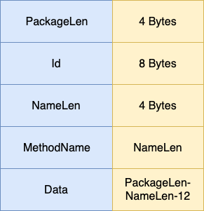

实现了网络库之后，实现RPC就很简单了，重点是如何识别RPC函数和序列化消息，protobuf为我们提供了抽象，在proto文件中定义service字段它就会为我们生成RPC调用函数。

主要参考了muduo的RPC实现，纯异步。

<!-- more -->

## pb生成代码分析

在proto文件中定义service

```c++
service Logic {
    // Ping Service 
    rpc Ping(PingReq) returns(PingReply);
}
```

主要关注生成的pb.h中的这两个类，Logic是server端使用的，Stub是client用的，我们要做的就是实现Logic类中的虚方法和Stub中用到的RpcChannel。

```c++
class Logic : public ::google::protobuf::Service {
 protected:
  // This class should be treated as an abstract interface.
  inline Logic() {};
 public:
  virtual ~Logic();

  typedef Logic_Stub Stub;

  static const ::google::protobuf::ServiceDescriptor* descriptor();

  virtual void Ping(::google::protobuf::RpcController* controller,
                       const ::logic::PingReq* request,
                       ::logic::PingReply* response,
                       ::google::protobuf::Closure* done);

  // implements Service ----------------------------------------------

  const ::google::protobuf::ServiceDescriptor* GetDescriptor();
  void CallMethod(const ::google::protobuf::MethodDescriptor* method,
                  ::google::protobuf::RpcController* controller,
                  const ::google::protobuf::Message* request,
                  ::google::protobuf::Message* response,
                  ::google::protobuf::Closure* done);
  const ::google::protobuf::Message& GetRequestPrototype(
    const ::google::protobuf::MethodDescriptor* method) const;
  const ::google::protobuf::Message& GetResponsePrototype(
    const ::google::protobuf::MethodDescriptor* method) const;

 private:
  GOOGLE_DISALLOW_EVIL_CONSTRUCTORS(Logic);
};

class Logic_Stub : public Logic {
 public:
  Logic_Stub(::google::protobuf::RpcChannel* channel);
  Logic_Stub(::google::protobuf::RpcChannel* channel,
                   ::google::protobuf::Service::ChannelOwnership ownership);
  ~Logic_Stub();

  inline ::google::protobuf::RpcChannel* channel() { return channel_; }

  // implements Logic ------------------------------------------

  void Ping(::google::protobuf::RpcController* controller,
                       const ::logic::PingReq* request,
                       ::logic::PingReply* response,
                       ::google::protobuf::Closure* done);
 private:
  ::google::protobuf::RpcChannel* channel_;
  bool owns_channel_;
  GOOGLE_DISALLOW_EVIL_CONSTRUCTORS(Logic_Stub);
};
```

服务端的使用方法一般为
```c++
LogicServiceImpl logicservice_;
rpcserver.registerService(&logicservice_);
rpcserver.start();
```

客户端直接
```c++
Logic_Stub stub;
stub.Ping(NULL, request, response, done);
```

## RpcChannel实现

RpcChannel代码中的注释写的很清楚：
```c++
// Abstract interface for an RPC channel.  An RpcChannel represents a
// communication line to a Service which can be used to call that Service's
// methods.
```

代码注释中看到了protobuf的作者也有Jeff Dean...

我们继承protobuf的RpcChannel，持有网络库中的Session类，并实现Session中的回调函数，将Session中的onMessage回调设置为RpcChannel的onMessage函数，实现消息的收发，所以首先需要设计一下RPC协议，我设计了一个简单的二进制协议：



PackageLen表示包体长度，Id标识每条RPC消息，为什么需要Id？因为客户端请求时会设置收到消息后的回调，所以在收到消息时需要根据消息id执行相应的回调，因为客户端和服务端共用RpcChannel类，所以需要标识消息类型，这里简单把Id最高位为设为RPC标志位，0表示request，1表示response。为了唯一标识调用的RPC函数，使用servicename:methodname拼起来作为消息名存在MethodName，最后是数据，放在Data。

## Client接收回复

我的实现方法是定义了一个RpcCodec作协议编解码，在RpcChanel的onMessage中调用codec的协议解析函数将协议的各个字段解析出来，之后调用onRpcMessage处理一个完整的消息。在onRpcChannel中根据消息是请求还是回复作不同的处理，如果是回复，就根据id调用设置的回调，这里还有一个问题？怎么把data反序列化成回调需要的参数类型呢？
```c++
 struct OutstandingCall
  {
    ::google::protobuf::Message* response;
    ::google::protobuf::Closure* done;
  };
```
其实这里不只保存回调函数，还把请求时的response保存了，所以可以直接反序列化。

## Server端接收请求

如果是请求，那么我们需要调用相应的serviceimpl的实现，那怎么拿到对应的service呢？如何生成对应方法的参数呢?这就需要服务端维护一个servicename对应的servicemap，就可以根据name查找service，利用protobuf提供的反射功能，有了service和method的name，我们也可以生成对应的参数。

```c++
const google::protobuf::ServiceDescriptor* desc = service->GetDescriptor();
const google::protobuf::MethodDescriptor* method = desc->FindMethodByName(methodname);
std::unique_ptr<google::protobuf::Message> request(service->GetRequestPrototype(method).New());
if (request->ParseFromArray(data, datalen)) {
   google::protobuf::Message* response = service->GetResponsePrototype(method).New()
}
```
首先根据servicename拿到我们自己保存的对应的service，然后用ServiceDescriptor根据methodname拿到MethodDescriptor，然后就可以生成req和resp消息了，有了MethodDescriptor，service的CallMethod
就可以分发到对应的函数了。

## Client发送请求

最后分析一下客户端发消息的流程，Stub调用的是RpcChannel的CallMethod函数，只要在函数中保存回调，调用codec的send函数按协议组装发送就好了。

关于回调，protobuf生成的代码中类型是Closure，可以用NewCallback函数创建，但是有一个限制，回调函数的参数最多只能有两个，如果定制只能自己写代码生成或者改NewCallback的实现。

## 总结

框架只实现了基本的消息收发，RPC里能做的还有很多，服务发现，熔断，限流，链路追踪。这里只是实现一个demo了解一下RPC原理。

Client发请求：Stub.Ping()->RpcChannel.CallMethod()->RpcCodec.send()

Client收回复：RpcChannel.onRpcMessage()->根据servicename找到service，根据methodname生成Descriptor，生成函数参数->service.CallMethod()->调用对应RPC函数

Server收请求：RpcChannel.onRpcMessage()->根据id调用回调

> 代码地址：https://github.com/Nickqiaoo/cppim/tree/master/rpc