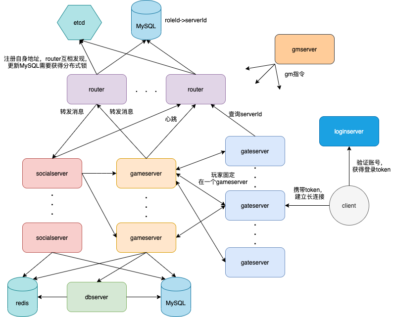
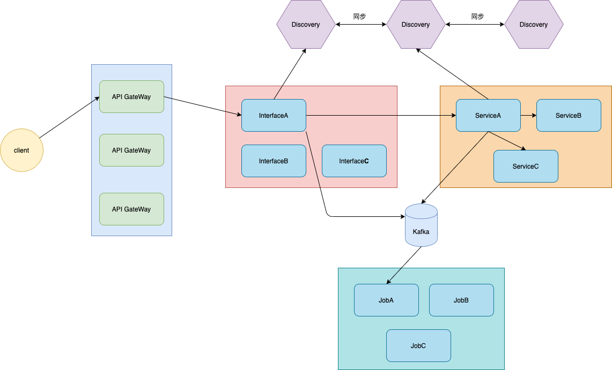

到项目组支援差不多半年，这半年什么乱七八糟的东西都干过，写过c++，golang，改过PHP，敲过lua，整过前端，最近又给了我个改router的活，，，这router是拿c#写的。。。。（c#的await真香！），现在对游戏服务器的整个架构和实现算是比较了解，游戏不同于web，不同的游戏类型架构差距应该也很大，，我就拿我在的这个项目组做个简单的总结。

<!-- more -->
## 游戏服务器

先说说游戏服务器的整体架构，以我在的这个项目为例，这是个经营养成游戏，主要是做主线，玩养成，有少量的玩家间交互，比如社团会同屏，还有海上巡演，就是类似崩3的那种3人组队玩法。游戏业务的特点是对延迟比较敏感，数据变动频繁，玩家数据都在内存中维护，数据库相当于玩家某个时刻的存档。玩家上线将数据拉到内存中，之后的操作都对内存数据操作，隔一段时间刷新到数据库去。



整个架构比较简单，服务器绝大部分逻辑用C++实现，少量活动之类的业务使用lua实现。客户端通过loginserver的http接口验证账号，拿到登录token和gatesever的地址然后和gateserver建立长连接，gateserver会请求router把玩家分配到一个gameserver上，玩家之后所有的操作都固定在这台gameserver上，有一些其他交互操作比如工会，拆分一个独立的socialserver上，其实我觉得这个router在这完全没必要。。。直接静态哈希不就完了？跟项目组的讨论他们也觉得没必要，，，稀里糊涂上面就要做个这东西。玩家的数据不是实时更新的，而是定时向dbserver发送请求保存一下玩家的数据。实时扩展的话只支持gameserver，因为服务器之间通过配置文件需要有一方主动连接，然后在connected的回调函数中完成信息交换。

代码层面，整个服务器完全是事件驱动的异步机制，业务开发都通过异步+回调来实现，写起来真的恶心。。。
总体来说，我觉得从各方面都是比较落后的，业务逻辑C++开发，调试麻烦，效率极低，几十G的客户端太重，测试困难，系统扩展性差，监控什么的也没有，总之就是很难受。

### 服务器框架

整个框架其实比较简单，大体思想是每一个业务模块是一个Module，所有的Module继承IModule基类，这个IModule大概长这样：
```c++
class IModule{
    virtual  beforeInit() = 0;
    virtual  init() = 0;
    virtual  afterInit() = 0;
    virtual  update() = 0;
    ...
};
```
然后还有一个ModuleManager，它负责创建Module，用一个map维护Module名到Module的映射，大概长这样：
```c++
class ModuleManager{
    registerModule(IModule*);
    unregisterModule(IModule*);
    findModule(name);
    beforeInit();
    init();
    afterInit();
    update();
    ...
};
```
ModuleManger在main函数中创建，然后根据类名注册创建Module，之后调用init函数，就是遍历map调用各个Module的init，这样就完成了各个模块的装载，初始化，之后就进入while循环：
```c++
while(!terminate){
    ModuleManager->update();
}
```
update函数同理就是调用各个Module的update，整个框架的逻辑就是这么简单，除了网络消息的读写，异步任务的执行这两个，包括业务逻辑的处理函数，异步任务的回调函数，都通过这里的update函数放在主线程中处理，也就是说在业务开发中不用考虑多线程的问题。

实现一个业务逻辑模块大概这么做：
```c++
class DemoModule{
    XxxModule * xxxmodule;
};

DemoModule::init(){
    xxxmodule = findModule();
}

DemoModule::handle(int sessionId, SSMsgHead head, PBMSG::DemoRequest){
    //use xxxmodule
    //业务逻辑
}
```

下面说一下几个重点的Module。

### 几个重要的Module

通过上面的介绍我们看到了其实服务器就是在不断的调用各个Module的update，抛开业务逻辑，服务器需要有网络消息处理，数据库操作这些基本的功能，这些同样也是做成了一个Module，下面介绍几个重要的Module：

#### EventModule

EventModule实现pb消息与相应处理函数的维护，它的功能就是注册消息处理函数，还有就是消息的分发。NetModule根据协议判断收到一个完整的包后
会回调EventModule的消息分发函数。
注册函数如下：
```c++
template<class BaseClass, class MsgHeadType, class MsgType>
regMsgHandler(int cmdId, BaseClass* Base, void(BaseClass::*func)(int, MsgHeadType, MsgType)){
    EventCenter.regMsgHandler(...)
}
```
这里的MsgHeadType是消息头类型，分为CS和SS也就是客户端与服务器交互以及服务器之间交互，cmdId是消息号，MsgType就是pb消息类型，BaseClass就是实现处理函数的类，regMsgHandler调用EventCenter的注册函数，EventCenter封装了各类消息的处理器，比如csEventProcessor，ssEventProcessor,根据MsgHeadType去注册
```c++
template<class BaseClass, class MsgType>
regMsgHandler(int cmdId, BaseClass* Base, void(BaseClass::*func)(int, CSMsgHead, MsgType)){
    csEventProcessor.regMsgHandler(...);
}
```
分发函数如下：
```c++
void dispatchNetEvent(int sessionId, NetEventType type, Buffer buf){
    EventCenter.dispatchNetEvent()
}
```
这里的NetEventType分为CS,SS消息还有服务器连接等事件，EventCenter根据type类型再调用不同processor的分发函数，
```c++
void dispatch(int sessionId, char* buffer, size_t len){
    //解包 buf解析为pb 回调注册的处理函数
}
```
这样就完成了消息的处理。

#### NetModule

NetModule实现网络连接的管理，消息的收发，维护服务器之间，客户端的连接信息，调用EventModule实现消息的分发，封装各种SendToGame，SendToGate之类的函数，之前写过一篇asio实现网络库的文章，有兴趣可以看看。

#### AsyncModule

异步模块实现异步操作的封装,主要有AsyncThread，AsyncTask这几个模块，其实就是一个线程池。

AsyncTask大概长这样：
```c++
class AsyncTask{
    void execute(){
        success = onExecute();
    }
    void callback(){
        if(success){
            onSuccess();
        }else{
            onFailed();
        }
        onReleas();
    }

    virtual onExecute() = 0;
    virtual onSuccess() = 0;
    virtual onFailed() = 0;
    virtual onRelease() = 0;

    //异步操作执行完的结果定义为成员变量在callback中使用
}
```
所有异步操作比如redis，MySQL都继承这个基类封装成一个Task。

```c++
class AsyncThread{
    void run(){
        while(!terminate)
            //从waitQueue中取任务，调用execute，放入completeQueue
        }
    }
    bool AddTask(AsyncTask*){
        //放入waitQueue中
    }
    void loop(){
        //从completeQueue中取任务，调用callback
    }
    queue<AsyncTask*> waitQueue;
    queue<AsyncTask*> completeQueue;
}
```
AsyncThread是异步线程，建立的时候执行run函数不断处理异步任务，AsyncModule的update函数会调用loop函数在主线程中执行异步任务完成后的回调。

有了这几个组件，整个服务器最基本的功能其实就差不多了，其他功能都可以通过增加Module的方式来添加。

## 互联网服务器

我这里想要说的互联网指的是一般的web服务器，API服务器，客户端与服务器一般使用HTTP交互，服务器之间使用RPC通信，服务器自身无状态。现在微服务架构基本已经普及了，以我看到的B站代码为例==，微服务模式下的架构如下：

这里只是一个简单的架构图，实际架构应该要复杂很多，比如会有配置中心，收集日志的agent，收集trace信息的agent，监控组件，各种数据库集群，中间件集群再加上k8s，还有很多OLAP的数据分析等等。

最前面是API GateWay,比如Kong，完成负载均衡，鉴权，限流等功能，随后转发到Interface中，这里完成参数的一些校验，往后调用Service完成业务逻辑，一些异步任务写到kafka中，job负责订阅对应的topic去消费。服务之间使用服务发现组件获得其他服务的信息，使用RPC通信，调用链路会很长。不同于游戏直接操作内存中的玩家数据，服务器一般是无状态的，数据都从redis或者MySQL中直接获取。

代码层面，以go为例，由于它的协程机制，一个连接一个协程，业务逻辑都以同步的方式写，代码看起来就清晰多了，相比较下，感觉互联网的业务逻辑是简单一点的。

最后 

不想做游戏了。。。