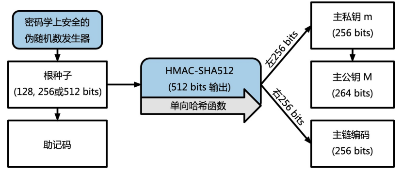
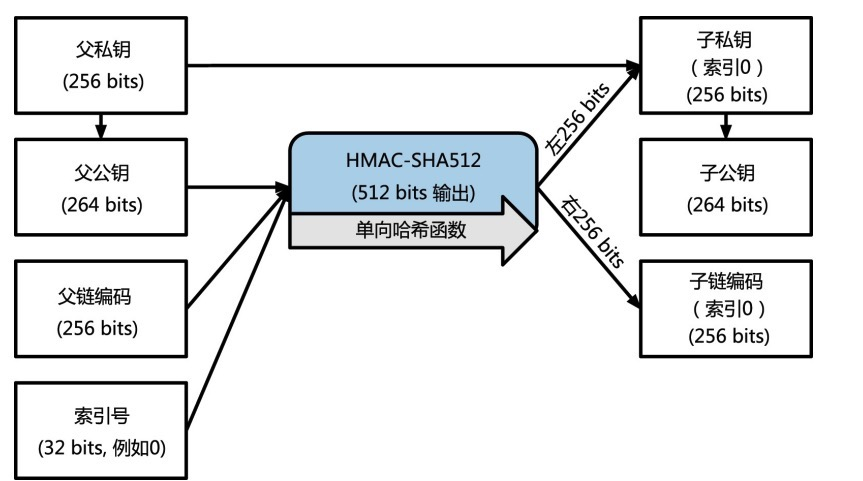
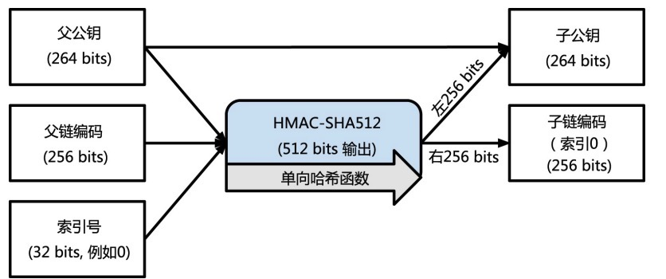
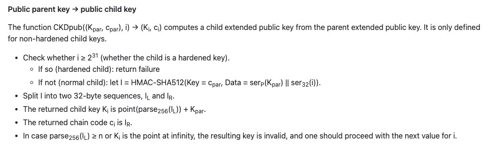
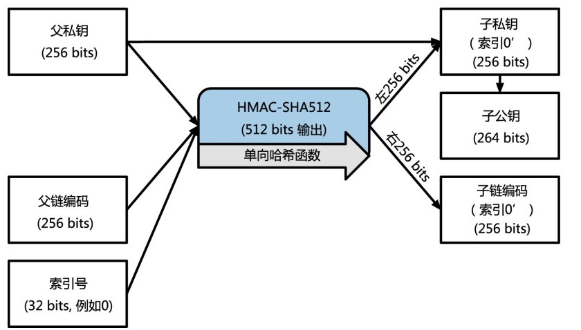

<!-- more -->

## 分层确定性钱包
平常我们使用钱包时，每个账户都要导入一个私钥，当我们需要很多账户时，管理众多的私钥就成了一个问题，分层确定性钱包就是为了解决这个问题，乍一看这个原理好像很简单，使用一个随机数生成私钥和一个编码，然后所有的子秘钥都可以用这两个衍生出来。这里的编码作为一个salt值，只有同时获得密钥和编码，我们才能进行下一层的衍生。密钥和编码就组成了所谓的扩展密钥，使用扩展密钥就可以衍生子秘钥。下面是扩展私钥的生成方法：

## 扩展公钥
上面这两张图还很好理解，扩展密钥还有一个特性，就是有扩展私钥，还有扩展公钥，只要有父公钥和编码，就可以直接衍生出子公钥，这里一开始不太理解，为什么在没有子私钥的情况下就能直接获得子公钥？

对比一下私钥和公钥的生成方式，子私钥是用父私钥，父公钥，父链编码，索引号算出来的，子公钥是用父公钥，父链编码，索引号算出来的。去翻了一下[BIP0032](https://github.com/bitcoin/bips/blob/master/bip-0032.mediawiki#child-key-derivation-ckd-functions)的文档才弄明白，下面是具体的算法

先简单介绍一下secp256k1椭圆函数加密算法，就是一个公式K=k*G，这里的G是二维坐标的一个点(x,y)，公式里的k就是私钥，是一个数字，K就是公钥，是一个点(x,y)，其中生成点G是固定的，公钥K可以简单理解为k个G相加得到的在椭圆函数上的某个点，椭圆函数上的加法有其固定的规则。

解释下关键步骤，这里的I就是用上面图的hmac算法生成，关键是下一步Ki的生成，Ki = point(parse256(IL)) + Kpar，这一步比较绕，我们一个一个看，首先Kpar就是我们的父公钥，它的数学含义就是椭圆曲线上的一个点(x,y)，parse256(IL)就是把IL转成一个256位的二进制数字，point(parse256(IL))就是用secp256k1椭圆函数算法获得parse256(IL)*G的点。令kpar为父私钥，我们推导一下公式

Ki = point(parse256(IL)) + Kpar

Ki = parse256(IL) * G + kpar * G

Ki = (parse256(IL) + kpar) * G

这里我们发现此时子公钥Ki对应的子私钥ki就是parse256(IL) + kpar，其对应我们子私钥的生成算法：用hmc算出来的数字+父私钥，这样就推导出来，确实可以用父公钥和父编码直接生成子公钥。

## 硬化子密钥

上面的算法中，子私钥是用hmac(父公钥，父编码)直接与父私钥相加生成出来的，如果父编码和子私钥泄漏，父私钥就可以直接被推出来，这就造成了一定的风险。

硬化子密钥算法使用父私钥与父编码去生成子私钥，这样就避免了父编码泄漏后父私钥被泄漏的风险。

## 参考

> https://bitcoinbook.info/wp-content/translations/cmn/book.pdf
> https://github.com/bitcoin/bips/blob/master/bip-0032.mediawiki#child-key-derivation-ckd-functions