## 详解bitlayer跨链桥

传统的跨链桥一般采用n/m多签机制，其安全性由n个诚实见证人保障。Bitlayer 引入了双通道双向资产桥，包括同时运行的 OP-DLC（基于欺诈证明的 DLC）桥和 BitVM 桥。提供了不同的安全性保障，以满足不同的用户偏好。OP-DLC 桥使用户能够以无信任和受自己控制的方式锁定 BTC。通过整合欺诈证明挑战协议，OP-DLC 有效地解决了原始 DLC 协议中与预言机相关的作恶问题。BitVM桥则进一步降低了最低信任，仅需要 1 /N 诚实见证人。通过结合OP-DLC的安全性及 BitVM桥的灵活性和速度，bitlayer能够给用户带来极致的跨链体验。

## DLC

DLC（Digital Currency Initiative）谨慎日志合约，由MIT的Digital Currency Initiative提出，旨在比特币上实现一种轻量级合约，解决可扩展性和隐私问题，并尽量减少对提供外部数据的预言机（oracle）的信任需求。

### 案例：赌球队胜出

假设Alice与Bob要对3天后举行的皇马和巴萨的比赛结果打赌，两人各出1个btc，如果皇马胜出，则Alice拿1.5btc，Bob拿0.5btc(这个奇葩的分配方式是为了表示双方都分得资产的情况)，如果巴萨胜出，Alice拿0.5btc，Bob拿1.5btc，如果平局，两人各自拿回1个btc。双方还需要一个第三方预言机，保证在比赛结束后公布正确的结果。

首先第一步，双方创建一笔fund交易，将各自的1btc锁在一个2/2的多签地址上，这意味着之后的任何花费都需要双方共同签名。这笔交易现在还不需要上链。

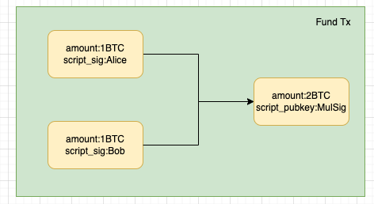

第二步，创建CET，双方为之后可能公布的结果生成多笔合约执行交易（Contract Execution Transaction），这个交易花费多签地址，按照上面的规则划分资产。

根据3种情况，Alice和Bob创建各自的CET：

Alice创建：

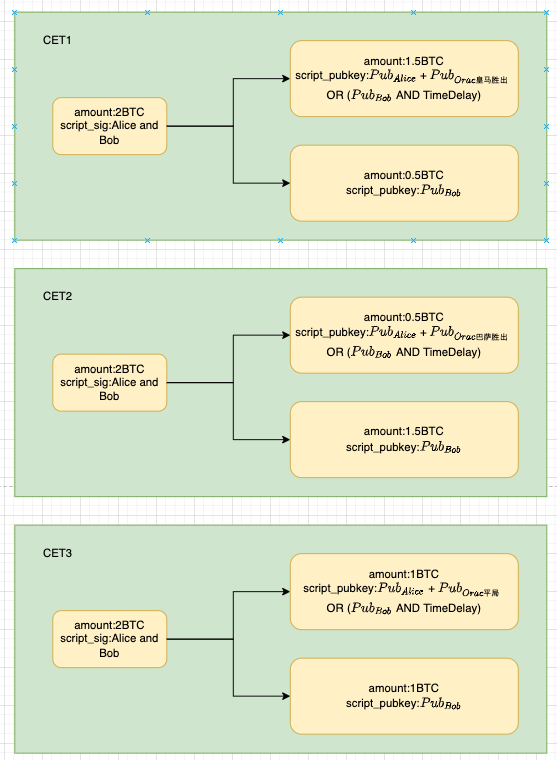

Bob创建

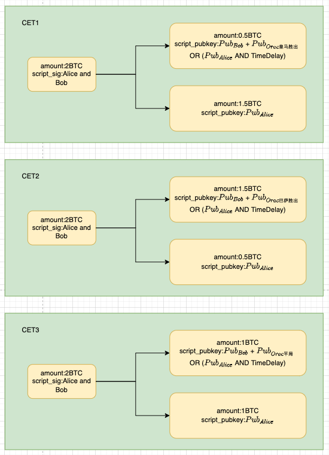

双方构造的交易输出对象分别为对方公钥地址和自己的脚本地址，我们以Alice的CET1为例：

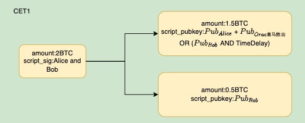

可以看到这笔交易的锁定地址是Alice和预言机结果的共同地址，使得Alice无法立即花费该交易，必须等待预言机的结果签名，如果他提前广播了这个交易，或者在巴萨胜出的情况下，依然广播这个交易，由于拿不到预言机结果签名，他并不能花费这个交易。并且由于第二个条件的存在，Bob可以在时间锁过后拿走所有资产。这样来保证双方都发送正确的交易。

这里的预言机公钥地址的实现，是对schnorr签名的一种改进，可以理解为利用预言机的公钥+结果，可以提前对每个结果构造出一个预言机地址，只有等待预言机公布结果对应的签名，才能花费结果对应的地址。

第三步，双方交换cet交易的签名并校验，校验完成后再交换对fund交易的签名，因为此时已经确定可以花费fund多签地址的资金了。最后将fund交易广播上链。

第四步，等待预言机公布结果，拿到预言机结果签名后，任意一方可以发送正确的CET上链，取回多签地址中的资产，广播错误的交易会导致对手在时间锁过后取走所有资产。

比如皇马胜出：Alice将cet1广播上链，并消费第1个输出，转到自己的地址。

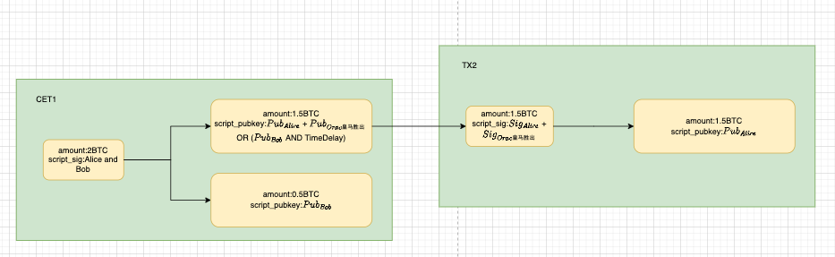

如果在巴萨胜出的情况下，Alice仍强行将cet1广播上链，因为没有预言机的签名，他并不能花费第一个输出，同时由于时间锁机制，Bob可以取走所有资产：

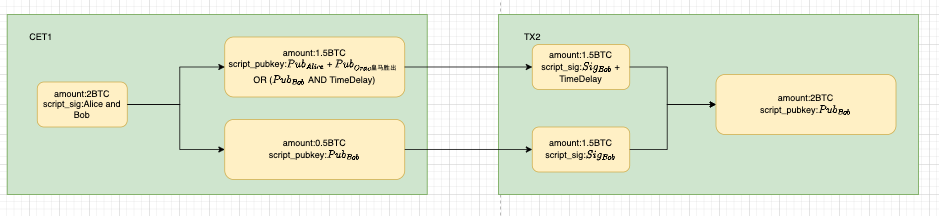

### 安全风险

主要是预言机作恶的几种情况：

1. 预言机可能会错误报告数据。如果预言机确实错误报告，所有用户都将能够识别错误并停止使用该预言机。
2. 如果预言机公开报告两个不同的数据，预言机将会暴露其私钥。
3. 如果预言机本身是交易的对手方（例如Alice是预言机），她可以在不公布预言机结果签名的情况下执行cet。这是可以检测到的，被欺诈的一方 Bob 可以提供欺诈证明，以便所有其他用户都可以停止使用这个预言机。她只有一次机在她参与的交易中作恶，然后她将立即失去所有用户的信任。
4. 预言机可能根本就不公布任何结果签名，为了应对这种可能性，DLC可以有一笔退款交易，这笔交易可以利用时间锁在结果产生后的几天内由任何一方广播。退款交易将默认退还各方其初始存款。

为了应对预言机风险，可以使用多个预言机，这可以大幅降低预言机作恶的风险，但代价是可能无法达成确切的共识数据；例如 Oracle1 报告 1050，而 Oracle2 报告 1049，则无法安全使用执行交易，这时可以利用上面的退款交易机制，完成退款。

## BitLayer跨链桥实现

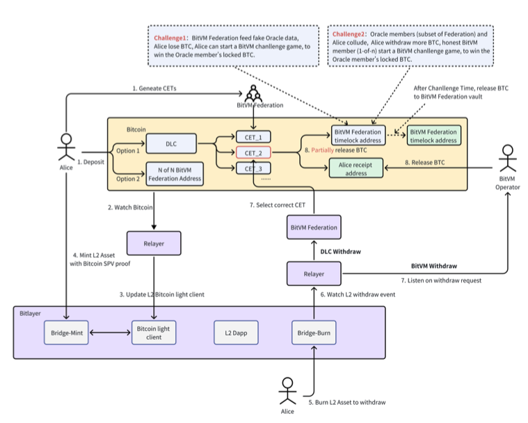

Bitlayer 资产桥提供用户控制的去中心化托管，以及基于 BitVM+DLC 技术的高流动性比特币第 2 层跨链解决方案。Bitlayer 提供双通道双向资产桥，不仅满足第 1 层用户对 BTC 存款和取款的资助控制需求，还满足原生第 2 层用户的平滑取款需求。资产桥的核心组件包括 BitVM Federation、DLC 组件、Layer2智能合约和Relayer：

### BitVM Federation

BitVM Federation的节点作为验证网络，确保二层交易的安全执行和Bitlayer桥的稳定运行。经过验证的组织可以通过存入一定数量的BTC加入Federation。Federation会动态调整并增加其成员数量以增强安全性和去中心化。在跨链桥中，BitVM Federation共同管理BitVM桥的去中心化资产托管，利用op欺诈证明机制，可以达到1/N的安全级别，即只需要一个诚实节点来保证网络安全性。此外，BitVM Federation还充当OP-DLC桥的预言机网络，只需部分成员同意（t of N）即可产生合法的预言机签名。

### DLC 组件

使用DLC进行存取款确保用户对资产的自主控制，DLC组件支持细粒度的CET以满足用户多样的提款需求。DLC组件的第一个功能是创建fund交易，将fund资产锁定到到一个2/2的多签输出，分别为用户和BitVM Federation（N/N）地址。第二个功能是管理CET，它预创建多个满足未来提款需求的DLC。

### Layer2智能合约

桥和轻客户端是Layer2上的两个核心智能合约，共同实现了trustless的桥。桥合约管理Layer2上BTC资产的发行和销毁。轻客户端合约在Layer2维护比特币区块头信息，并使用基于ZKP的比特币状态证明来更新和维护区块头信息。轻客户端合约还提供了一个验证函数，通过提交交易的简化支付验证（SPV）证明到轻客户端合约来验证比特币交易的合法性。桥合约调用轻客户端的验证函数来验证用户在比特币上的锁定交易的合法性，确保Layer2上所有BTC资产的发行都是trustless的。

### Relayer

Relayer在Bitlayer资产桥中扮演关键的角色，他是trustless的，主要任务是监控Layer1和Layer2，并更新Layer2上的轻客户端数据状态。当比特币网络提交新区块时，Relayer提交状态更新交易给轻客户端，附带一个零知识证明。每当跨链桥发生交易时，Relayer将其转发给智能合约（L1 to L2）或BitVM Federation节点（L2 to L1）进行进一步处理。这种trustless的中继系统确保了资产桥的持续运行；只要有一个Relayer在运行，跨链桥就能保持正常运行。

## 双桥机制

OP-DLC在DLC基础上引入BitVM挑战机制，解决了原始DLC方案种预言机节点作恶的问题，

BitVM桥在传统的跨链多签见证人机制基础上，引入BitVM挑战机制，使得信任程度从n/m降低为1/m。只要有一个诚实节点，就能保证安全性。

### Peg-In (L1 to L2)

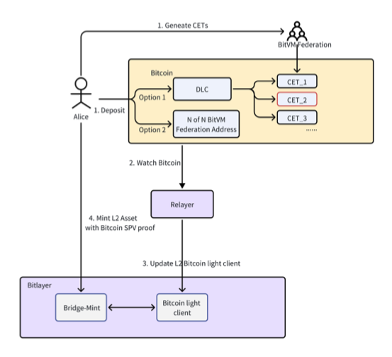

当向Layer2发起存款时，有两种选择，以上图为例：

1. 通过 OP-DLC 通道存款 - Alice 将 BTC 锁定到 DLC 合约中，并与BitVM Federation创建 CET 以满足各种提款需求（最小单位为 0.1 BTC），这里不同的CET对应的提款数额不同。
2. 通过 BitVM 桥通道存款 - Alice 直接将 BTC 锁定到 BitVM Federation的 N of N 多签地址即可。

此时relayer会监控bitcoin链的状态，与L2的轻客户端合约交互，更新最新的区块状态(步骤2，3)，当用户的存款锁定交易达到所需的确认区块数（通常为 7 个区块）后，用户可以向 Layer 2 桥合约提交铸币交易，并附带 SPV 证明以验证交易(步骤4)。桥合约将验证铸币交易的合法性。在确认锁定交易有效后，它将执行铸币操作，从而在 Layer 2 上铸造等值的 BTC 到 Alice 指定的地址。为了防止双花攻击，桥合约会记录每个 Peg-In 交易的状态。

### 存款安全保障

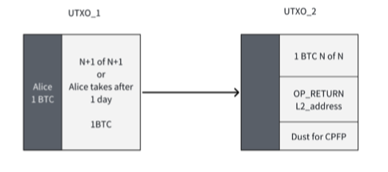

BitVM 桥和OP-DLC桥的存款交易都将拆分为两笔交易来对抗审查。

假设用户 Alice 将 1 BTC 锁定到 UTXO_1 中，该 UTXO_1 只能由N+1/N+1个多重签名中或 n 天后由Alice花费，这里面的N+1包括N - 1个BitVM Federation验证者、1 个BitVM Federation桥执行者和用户自己。然后，Alice 和 BitVM Federation共同签名来花费 UTXO_1 并获得 UTXO_2，其中包括一个Layer2地址，用于在L2中接收BTC。

如果 BitVM Federation拒绝了 Alice 的 Peg-In，不共同签名来花费 UTXO_1，那么在 1 天后，Alice 可以自己取回她的资金。如果 BitVM Federation共同签名花费 UTXO_1 得到 UTXO_2，那么 Alice 可以使用比特币 SPV 证明在L2铸造UTXO_2 中的锁定金额对应数量的btc。

同时，在Layer2上OP-DLC 和 BitVM 桥都依赖于轻客户端合约来确保安全性，客户端合约采用零知识证明。确保仅当比特币网络上存在由轻客户端合约验证的有效锁定交易时，才会在 Bitlayer 网络上铸造等值的 BTC。

### Peg-Out (L2 to L1)

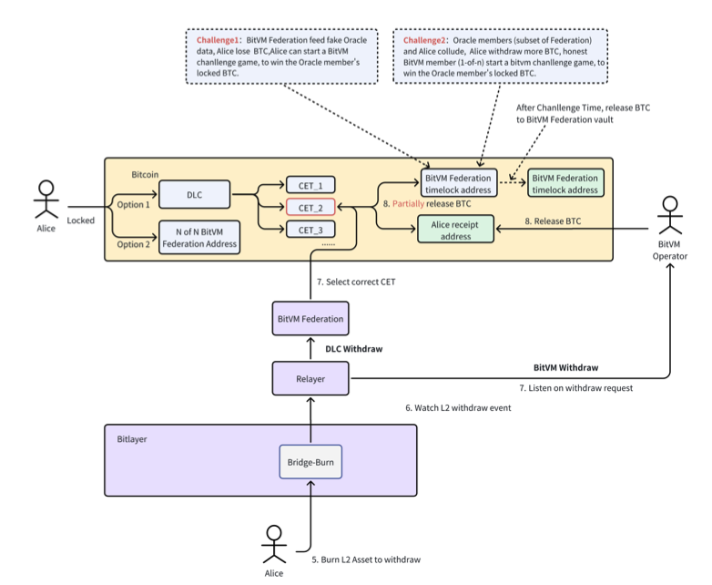

当用户发起Layer2 提款时 ，首先在L2上销毁指定数量的 BTC。然后，她有两种选择，以上图为例：

1. 通过 BitVM 桥直接取款。
2. 使用 OP-DLC+BitVM 桥的联合取款机制，其中 OP-DLC 处理主要取款，而 BitVM 用于较小金额或找零。

如果 Alice 最初通过 OP-DLC 通道存入 BTC，她可以选择任一取款选项。但是如果她的初始存款是通过 BitVM 桥存的，或者如果她是没有存款交易的原始L2用户，则她的取款仅限于 BitVM 桥。

relayer节点将监控Bitlayer网络的任何取款活动。根据不同的取款方式，请求BitVM Federation节点进行下一步操作。(步骤6，7)

如果Alice选择通过 BitVM 桥直接提取，BitVM桥Operator将首先为Alice支付提取金额，让她在L1上收到等值的 BTC。在提供资金后，BitVM 桥Operator可以定期从 BitVM Federation的多签（n/n）地址中收回预付的 BTC。这个收回请求必须成功通过 BitVM 挑战流程。如果 BitVM 桥Operator作恶，将无法通过挑战流程并失去其存款。

如果选择通过 OP-DLC+BitVM 桥进行联合提取，前提必须在比特币上有之前存款锁定的一个 DLC 合约。提取金额应等于或大于某个预生成的 CET 输出。提款将包括 OP-DLC 部分和 BitVM 找零部分，后者将像标准的 BitVM 提取一样处理。

收到 OP-DLC 提款请求后，BitVM Federation节点将从 CET 管理器中选择一个匹配的 CET 输出，并且 t 个 BitVM Federation节点作为预言机将联合对提款数额进行签名来花费CET。当该CET上链后，Alice 可以立即从一个 CET 输出中收到相应的 BTC。发送到 BitVM Federation地址的 BTC 首先会被锁在时间锁脚本，允许 Alice 挑战 BitVM Federation的预言机签名数据。只有在挑战期结束后，BitVM Federation地址才会收到相应的 BTC。

### 提款安全保障

对于BitVM桥，如果operator是诚实的，通过在比特币网络上向用户预付指定的 BTC 金额，然后从 BitVM Federation的多重签名地址中收回相同金额，系统能保证安全性。如果operator作恶，试图收回超过预付 BTC 金额，就会出现争议。只要BitVM Federation有一个诚实节点识别出争议并发起 BitVM 挑战，就可以获取恶意节点的质押BTC 并处以罚款。通过这种方式保证节点不作恶。

对于OP-DLC桥，如果参与预言机的 BitVM Federation成员签署不正确的数据，导致 Alice 收到的 BTC 少于她应得的，Alice 有权发起 BitVM 挑战。通过此挑战，她可以获得锁定在时间锁地址中的btc。如果参与作为预言机的 BitVM 联合会成员与 Alice 串通，导致她收到的 BTC 多于她应得的，损害整个 BitVM Federation的利益，BitVM Federation的诚实节点会对串通的成员发起挑战，获取串通节点的质押BTC。

当L2出现问题时，Alice想发起强制提款，可以使用DA数据重建L2状态。如果通过BitVM桥提款，她需要 1 个诚实的BitVM Federation节点来帮助她，如果通过OP-DLC ，她需要t个预言机节点的提款数额签名来花费CET。

### 提款流动性问题

如果所有人都用DLC存入资金，用bitVM桥提出资金，会造成bitvm桥产生流动性风险，假设DLC合约的存款人迟迟不提款，或者在L2上把资金转给了其他人，这时DLC合约的资金便无法提取。

针对这些问题，首先若用户使用了DLC存款，在提款时，可以鼓励其用DLC提款。同时，为避免资金沉淀在DLC中，可以在构造CET时创建关闭DLC通道的交易，根据需要设置一个合理长度的时间锁lock_time，该交易会将所有资产转入Bitvm桥中，同时可以通过分发代币作为奖励之类的措施，鼓励用户设置较短的时间锁，减少资金沉淀在DLC中的时间，假如用户一直没有发起提款行为，lock_time过后，bitlayer会提交关闭DLC通道的交易，所有资金进入bitvm桥，为bitvm桥注入流动性，用户只能走BitVM桥提款。

### 可用性分析

存款的情况，只要有一个relayer正常运行，就能够保证OP-DLC 和 BitVM 桥均可用，鉴于relayer是开源且无许可的，基于欺诈证明的挑战机制，BitVM Federation只要有一个诚实节点，该节点同时运行realyer就可以确保系统的可用性。

提款的情况，BitVM桥和OP-DLC桥可用性不同。BitVM桥与存款情况类似，BitVM Federation只要有一个诚实节点，此诚实节点既可以充当relayer，又可以充当桥Operator，就确保系统的可用性。

OP-DLC桥则需要至少 t(t ≤ n) 个BitVM Federation的诚实节点处于可用状态。由于预言机网络需要 t 个节点签署有效签名，因此只有在有足够 t 个节点运行时，系统才能实现可用。

## 存取款全流程示例

假设现在Alice通过OP-DLC桥向L2存款1btc，然后通过OP-DLC BitVM桥联合提款0.6btc。

首先根据两步交易机制，生成一个DLC的pre-fund交易:

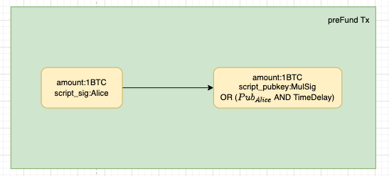

BitVM Federation需要配合Alice完成多签地址的花费，生成DLC的fund交易，如果不配合，Alice可以取回资金：

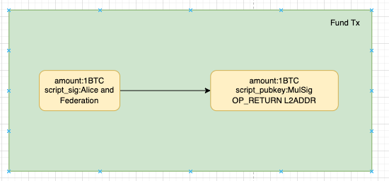

此时资金锁定在由Alice和BitVM Federation联合控制的多签地址中。同时Alice构造多个CET以满足未来提款需求(实际可以构造更多的CET，满足更细粒度的提款金额)：

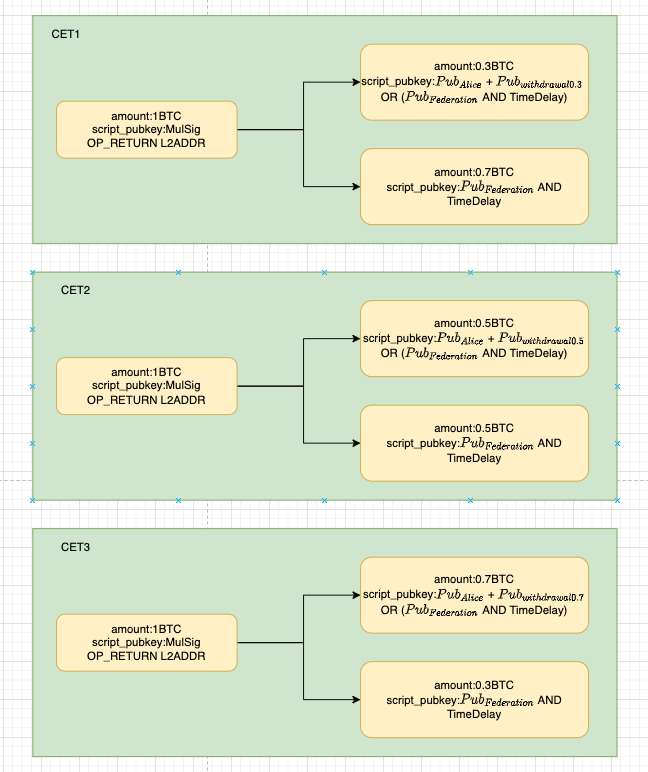

当fund交易经过多个区块确认后，Alice可以用Layer 2桥合约提交SPV证明，并在L2上mint1btc。

提款0.6btc时，BitVM Federation判断提款方式后，选择金额合适的CET，可以看到CET2满足，此时预言机节点生成withdrawal0.5的签名消息，并将CET2上链，Alice即可花费CET2的第一个output，这样就通过OP-DLC提取了0.5btc，剩余0.1btc则通过bitvm桥提取。如果此时仍然想提取剩余的0.4BTC，由于之前一次的DLC提取导致DLC合约已经解锁，此时只能通过bitvm桥提取剩余的0.4btc。

## 与2/2多签对比

首先通过fund交易，其实资产已经锁定在双方的多签地址上，如果不使用DLC的CET方式，可以通过用户和桥协商签名，直接花费这个utxo，将资产转移双方。为了防止之后任意一方不配合签名，需要用户和桥双方提前在链下创建好消费这笔多签utxo的交易，但是一旦创建，任意一方便有能力直接将这个交易上链，取走资产。

而使用DLC的cet，相当于多了一步中转交易步骤，CET交易完成了从用户和桥的多签地址首先转移到用户和预言机的多签地址，然后有了预言机的结果签名，用户才能再次发起消费CETutxo的交易，从而提取资产。

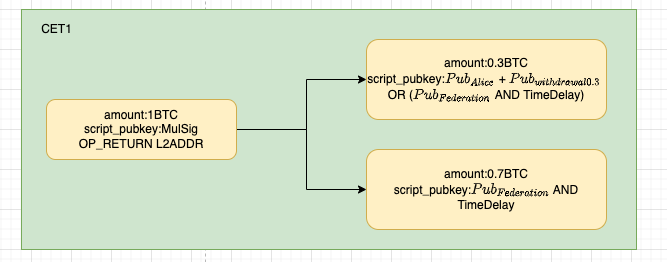

(在桥和预言机是同一方的情况下，这个流程的本质是从一开始fund交易的资产锁定在用户和桥的多签地址，变成多个CET中资产仍然锁定在用户和桥(预言机就是桥)的多个多签地址，然后桥有能力构造任意一个多签地址的结果签名，执行并花费任意一个CET(桥可以控制预言机签名)，桥作恶的场景白皮书的解决方案是， 用户如果收到的 BTC 少于应得的，有权发起 BitVM 挑战来解决。)

## bitvm2

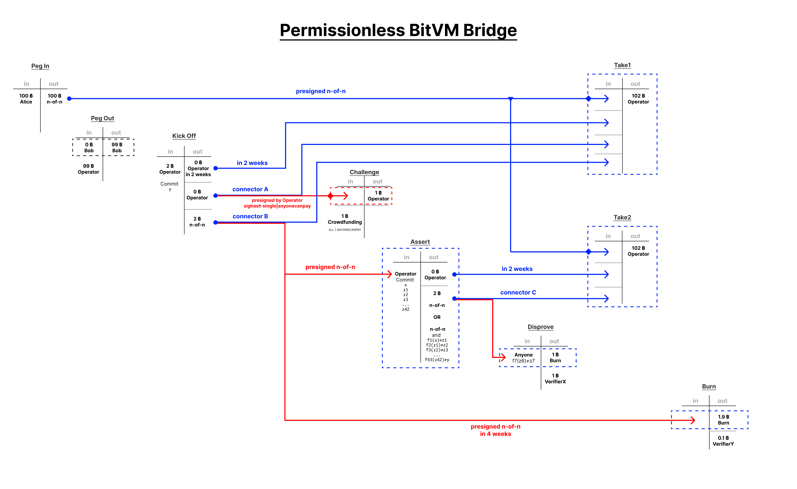

bitvm2模式为了解决一个场景，operator在L1支付给用户金额后，需要从fed赎回相应的金额。通过在这里引入一个挑战机制，operator想要赎回金额，不仅需要fed的多签，还需要成功通过挑战，而这个挑战可以由任何人发起。

operator只能构造take1 take2两笔交易从pegin里赎回资金，通过改变take交易里input的来源，实现任何人可以发起挑战，并且强制operator去应对挑战，否则他无法赎回资产。其中take1是未被挑战的情况，take2是被挑战的情况。

1.为了构造take1交易，operator首先构造kickoff交易，该交易包含一个承诺y，表示他在L1上给用户支付了跨链交易的证明。

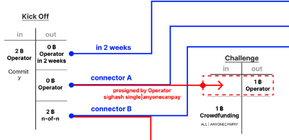

质押2btc，并提交提款状态承诺y，output1金额为0锁定给自己并附加时间锁，output2金额为0锁定给自己，同时预签一笔SIGHASH_SINGLE | SIGHASH_ANYONECANPAY的challenge交易。

SIGHASH_SINGLE | SIGHASH_ANYONECANPAY意味着可以对所有输出进行更改，但不能对与当前输入匹配索引的输出进行更改。所有其他输入都可以修改、添加和/或删除。这提供了一个任何人都可以发起这个挑战的机制，挑战者支付挑战费用，花费掉这个output，使得后续的take1交易无法花费(因为take1以这个output作为输入)(挑战者想花这个Output2发起挑战，必须发起一个SIGHASH_ALL | SIGHASH_ANYONECANPAY交易，自己质押1个btc，如下图，input0和output0不能改，output0的金额为1，挑战者必须自己支付)

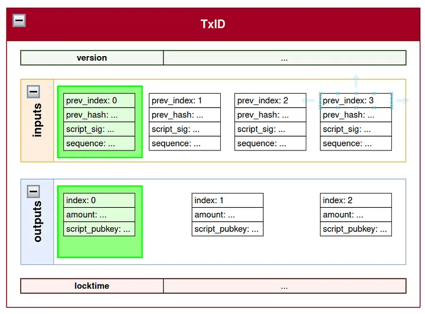

output3金额为质押金额，锁定在bitvm桥多签地址。

2.根据kickoff交易构造take1交易

有了kickoff交易，operator可以构造出take1交易，并发送给bitvm桥，让其对take1的input1及input4签名。此时take1能否花费由input2和input3决定，分别对应kickoff的时间锁output和挑战output，如果有人挑战，导致input3无法花费，take1交易失效，如果无人挑战，则input2的时间锁到期后即可花费，完成赎回

3.根据kickoff交易构造take2交易

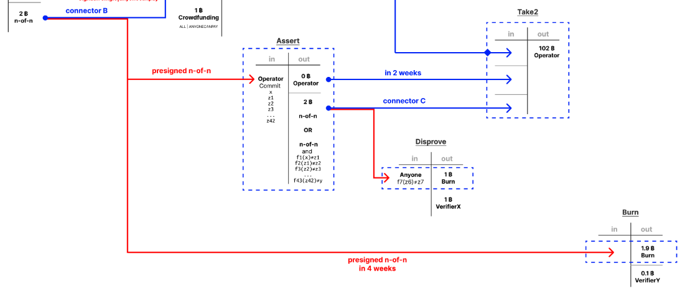

为了应对挑战，operator需要再构造assert交易，在input中提交提款所有的中间状态的证明，output1金额为0锁定给自己并附加时间锁，output2金额为2锁定到n/n或者一系列反驳中间状态的脚本，然后operator可以构造take2，最后operator将assert和take2发给bitvm桥，让其预签assert的input，take2的input1和Input3。此时take2能否花费由input2和input3决定，分别对应assert的时间锁output和挑战output，如果有人挑战成功，导致input3无法花费，take2交易失效，如果无人能挑战成功，则input2的时间锁到期后即可花费。

此时operator已经构造好了kickoff，assert，take1，take2四笔交易，并让fed完成了签名。

4.operator将kickoff交易上链，如果没有人发起challege交易，2周后，它可以将take1交易上链，完成赎回，如果有人发起challege交易，那take1交易的input3失效，他无法提交take1交易。

5.如果有人发起challege交易，operator可以将Assert交易上链，如果没有人反驳，2周后，它可以将take2交易上链，赎回资产，如果有人提交disaprove反驳交易，则take2的input3失效，operator无法赎回资产，并且失去质押的2btc。